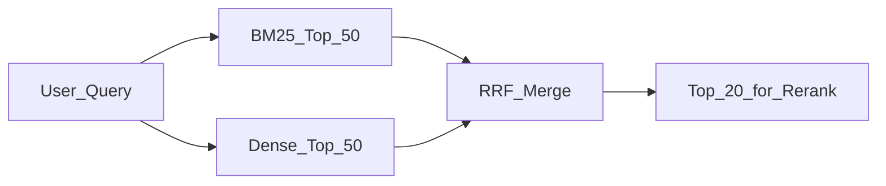

# Hybrid Search and RRF

> Week 3 Theory · Day 3 · [← README](../README.md) · Prev: [vector-databases](vector-databases.md) · Next: [reranking](reranking.md)

**Dense retrieval** finds paraphrases; **BM25** finds exact keywords like SKUs, error codes, and policy numbers. **Hybrid search** runs both and merges results — in Week 3 we use **Reciprocal Rank Fusion (RRF)** because it works without tuning score scales.

---

## Concepts

### What problem are we solving?

Pure embedding search misses queries when the user uses **exact terms** not paraphrased in the doc:

- Error code `ERR_AUTH_4012`
- Product SKU `WB-STREAM-PRO`
- Legal phrase "force majeure"

Pure BM25 misses **semantic** queries:

- "How do I work from home?" vs doc saying "remote work policy"

Hybrid search aims for **both** recall profiles in one retriever.

### A concrete example

Corpus chunk: *"Remote employees may claim a $500 equipment stipend annually."*

| Query | BM25 rank | Dense rank | Hybrid winner? |
|-------|-----------|------------|----------------|
| "equipment stipend remote" | **#1** | #3 | Yes — both in top-5 |
| "WFH laptop allowance" | #12 | **#1** | Yes — dense saves it |
| "ERR_STIPEND_404" | **#1** | #40 | BM25 saves exact token |

Without hybrid, the third query fails dense-only; the second fails BM25-only.

### BM25 (lexical) in one paragraph

BM25 scores term frequency and inverse document frequency — classic keyword search. No embeddings. Fast, interpretable, weak on synonyms.

Week 3 uses `rank-bm25` over the same chunk texts you embedded.

### Dense (semantic) search

Embed query; cosine similarity against chunk vectors (Day 2). Strong on meaning, weak on rare exact tokens.

### Reciprocal Rank Fusion (RRF)

You cannot average BM25 score (0–15) with cosine (0–1). **RRF** merges **ranks** only:

```
RRF_score(d) = Σ  1 / (k + rank_i(d))
```

- `rank_i(d)` = rank of document `d` in list `i` (BM25 list, dense list, …)
- `k` = constant, typically **60** (smoothing — rank #1 is not infinitely better than #2)

Example with k=60:

| Chunk | BM25 rank | Dense rank | RRF score |
|-------|-----------|------------|-----------|
| A | 1 | 3 | 1/61 + 1/63 = 0.0323 |
| B | 8 | 1 | 1/68 + 1/61 = 0.0311 |
| C | 2 | 20 | 1/62 + 1/80 = 0.0286 |

Chunk A wins — strong in both lists.



### Retrieval pipeline (Week 3)

1. BM25 top-50 + dense top-50
2. RRF → merged top-20
3. Cross-encoder rerank → top-5 for LLM (Day 4)

### AI engineer takeaway

RRF is the 2026 default for hybrid RAG because it is **simple, robust, and score-scale agnostic**. In interviews, contrast with weighted linear combination (needs tuning) and with enterprise search (Elasticsearch hybrid).

---

## Tradeoffs

| Fusion method | Tuning | Robustness |
|---------------|--------|------------|
| RRF | Low (k≈60) | High |
| Weighted sum α·dense + (1-α)·BM25 | Needs dev set | Medium |
| Cascade (BM25 filter then dense) | Medium | Can miss semantic matches |

---

## Best Practices

1. Retrieve **more** candidates pre-fusion (50+50) than you send to reranker (20).
2. Dedupe by `chunk_id` before RRF — same chunk in both lists should not double-count ranks incorrectly (use one merged entity).
3. Log both rank lists for debugging failed queries.
4. Evaluate hybrid vs dense-only on golden set — expect 5–15% recall lift on keyword-heavy questions.

---

## Common Mistakes

| Mistake | Symptom | Fix |
|---------|---------|-----|
| Normalizing BM25 to 0–1 badly | Worse than RRF | Use RRF instead |
| Too few candidates | Hybrid ≈ single method | Increase top-K per channel |
| BM25 on raw HTML | Token noise | Clean text at ingestion |
| Skipping hybrid because "embeddings are enough" | Misses IDs and codes | Add BM25 for production RAG |

---

## Checkpoint

1. Why can't you average BM25 and cosine scores directly?
2. What does the `k=60` constant do in RRF?
3. Name a query type where BM25 outperforms dense search.

---

## Go Deeper

| Resource | Why |
|----------|-----|
| [Cormack et al. RRF paper](https://plg.uwaterloo.ca/~gvcormac/cormacksigir09-rrf.pdf) | Original RRF rationale |
| [Elasticsearch hybrid](https://www.elastic.co/search-labs/blog/hybrid-search-elasticsearch) | Industry parallel |
| [Lab 3](../labs/lab-03-hybrid-search.md) | Implement RRF on your index |

---

## Next

**→ [Day 4 playbook](../daily/day-04.md)** · [reranking.md](reranking.md) · Lab: [Lab 3](../labs/lab-03-hybrid-search.md)
