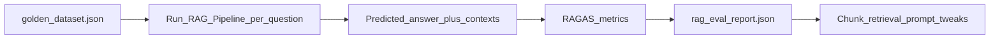

# RAG Evaluation with RAGAS

> Week 3 Theory · Day 5 · [← README](../README.md) · Prev: [context-assembly-citations](context-assembly-citations.md) · Next: [rag-failure-modes](rag-failure-modes.md)

You cannot improve RAG by vibe alone. **RAGAS** (Retrieval Augmented Generation Assessment) scores faithfulness, context precision/recall, and answer relevancy using LLM judges — Week 3's standard for measuring whether Doc Q&A Studio actually works.

---

## Concepts

### What problem are we solving?

"My chatbot feels fine" hides:

- Answers that **sound** right but aren't in the docs (unfaithful)
- Retrieval that **misses** the right chunk (low context recall)
- Verbose answers that **ignore** the question (low answer relevancy)

You need a **golden dataset** (question + ground-truth answer + source references) and automated metrics before shipping.

### A concrete example

Golden pair:

```json
{
  "question": "What is the remote work equipment stipend?",
  "ground_truth_answer": "$500 annually for eligible remote employees.",
  "ground_truth_contexts": [
    "Equipment stipend: $500 annually for remote employees who..."
  ],
  "source_doc": "handbook.pdf",
  "source_page": 13
}
```

Run pipeline → RAGAS scores (illustrative):

| Metric | Score | Meaning |
|--------|-------|---------|
| **Faithfulness** | 0.92 | Answer claims supported by retrieved context |
| **Context precision** | 0.85 | Retrieved chunks are relevant (low noise) |
| **Context recall** | 0.78 | Ground-truth info was retrieved |
| **Answer relevancy** | 0.88 | Answer addresses the question |

Faithfulness 0.92 → safe to show users. Faithfulness 0.4 → fix before prod.

### Golden dataset design (50+ pairs)

| Field | Required | Notes |
|-------|----------|-------|
| `question` | Yes | Realistic user phrasing |
| `ground_truth_answer` | Yes | Short factual answer |
| `ground_truth_contexts` | Yes | Exact or paraphrased supporting text |
| `source_doc` / `page` | Recommended | Enables manual audit |
| `difficulty` | Optional | easy / keyword / semantic / multi-hop |

**Coverage rules for Week 3:**

- ≥ 50 pairs across your indexed documents
- Mix keyword queries ("$500 stipend") and paraphrases ("laptop allowance")
- Include 5 **negative** questions (answer not in corpus) — expect "don't know"

Build 10 pairs/day on Days 5–7; do not one-shot all 50 without reading chunks.

### RAGAS metrics (plain English)

| Metric | Question it answers |
|--------|---------------------|
| **Faithfulness** | Is the answer grounded in retrieved context? |
| **Context precision** | Are the retrieved chunks on-topic? |
| **Context recall** | Did retrieval find the ground-truth information? |
| **Answer relevancy** | Does the answer match the question? |

RAGAS uses judge LLMs — budget ~$2–4 for 50 pairs with GPT-4o Mini.

### Eval pipeline



Output `rag_eval_report.json`:

```json
{
  "run_id": "2026-07-25T18:00:00Z",
  "pipeline_version": "hybrid_rrf_rerank_v1",
  "num_samples": 52,
  "metrics": {
    "faithfulness": 0.81,
    "context_precision": 0.76,
    "context_recall": 0.72,
    "answer_relevancy": 0.79
  },
  "per_sample": []
}
```

**Week 3 gate:** `faithfulness >= 0.75` on ≥ 50 samples.

### AI engineer takeaway

Ship RAG with a **regression eval set** — same idea as Week 6 Promptfoo but RAG-specific. Interview answer: *"Golden set + RAGAS in CI; block deploy if faithfulness drops."*

---

## Tradeoffs

| Approach | Pros | Cons |
|----------|------|------|
| RAGAS (LLM judge) | Fast to adopt | Judge bias, cost |
| Human eval | Gold standard | Slow |
| Exact match on answer | Cheap | Too brittle for paraphrases |
| Retrieval-only metrics (MRR, hit@k) | No generation cost | Ignores hallucinations |

Use retrieval metrics **and** faithfulness.

---

## Best Practices

1. Version golden set in git (`eval/golden_dataset.json`) — no secrets.
2. Log `pipeline_version`, chunk size, embed model with every eval run.
3. Slice metrics by `difficulty` tag — find where hybrid helps.
4. Re-run eval after any retrieval or prompt change.

---

## Common Mistakes

| Mistake | Symptom | Fix |
|---------|---------|-----|
| Golden answers copied from LLM | Circular eval | Write from source docs |
| 5 easy questions only | False confidence | 50+ diverse pairs |
| Ignore context recall | "Faithful" wrong docs | Fix retrieval first |
| No negative tests | Hallucinates on OOD | Add unanswerable questions |

---

## Checkpoint

1. What is the difference between faithfulness and answer relevancy?
2. Why include questions whose answers are NOT in the corpus?
3. What file is the Week 3 capstone eval deliverable?

---

## Go Deeper

| Resource | Why |
|----------|-----|
| [RAGAS docs](https://docs.ragas.io/) | Metric definitions, API |
| [project/eval-spec.md](../project/eval-spec.md) | Doc Q&A Studio eval contract |
| [Lab 5](../labs/lab-05-ragas-eval.md) | Run eval on your pipeline |

---

## Next

**→ [rag-failure-modes.md](rag-failure-modes.md)** · Lab: [Lab 5](../labs/lab-05-ragas-eval.md)
