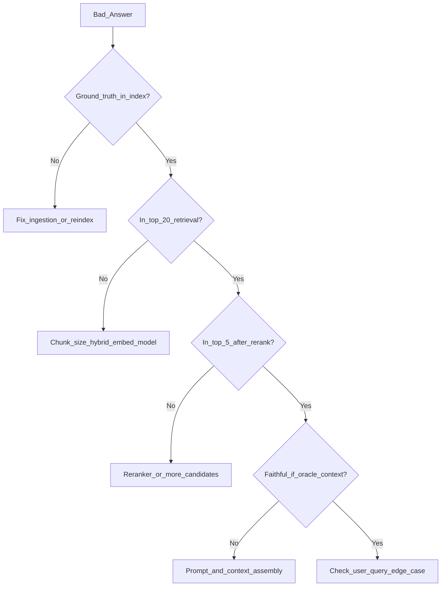

# RAG Failure Modes and Debugging

> Week 3 Theory · Day 5 · [← README](../README.md) · Prev: [rag-evaluation-ragas](rag-evaluation-ragas.md) · Next: [agentic-rag-preview](agentic-rag-preview.md)

RAG systems fail in predictable ways. Learning to **symptom → layer → fix** separates engineers who tune prompts from those who fix retrieval, chunking, and eval pipelines.

---

## Concepts

### What problem are we solving?

User reports: *"The bot said 30 PTO days but the handbook says 15."*  
Is it chunking? Retrieval? The LLM ignoring context? Without a debug checklist, you random-walk fixes.

### Failure mode catalog

| Symptom | Likely layer | First check |
|---------|--------------|-------------|
| Wrong fact, confident tone | Generation / faithfulness | Retrieved context contain truth? |
| "I don't know" for obvious doc | Retrieval | BM25 + dense hit@5 on golden query |
| Answer from wrong document | Rerank / precision | Top-5 chunks relevant? |
| Cut-off mid-policy | Chunking | Boundary split the rule |
| Outdated info | Ingestion / index staleness | Re-index date, doc version |
| Slow responses | Infra | Embed vs rerank vs LLM latency |
| Citations don't match text | Assembly / prompt | SOURCE labels vs model output |

### Worked debug scenario

**Report:** Query *"force majeure clause"* returns generic legal advice not in contract PDF.

| Step | Finding | Action |
|------|---------|--------|
| 1. Log retrieved chunks | None mention "force majeure" | Retrieval failure |
| 2. BM25 alone | **Hit** — term in doc | Dense missed; hybrid fixes |
| 3. After hybrid | Chunk in top-5 | Enable hybrid if not already |
| 4. Rerank drops chunk | Low cross-encoder score | Truncate less aggressively |
| 5. LLM still wrong | Context has clause | Tighten "ONLY use sources" prompt |

### Debug instrumentation (minimum)

Log per request:

```json
{
  "query": "...",
  "retrieval": {"bm25_top": [], "dense_top": [], "rrf_top": []},
  "rerank_top": [],
  "context_tokens": 842,
  "faithfulness_estimate": null,
  "latency_ms": {"retrieve": 45, "rerank": 120, "llm": 1100}
}
```

Reuse Week 2 observability envelope — add retrieval fields.

### Tuning order (don't skip steps)



1. Ingestion / index  
2. Chunking  
3. Retrieval (hybrid)  
4. Reranking  
5. Prompt / generation  

Changing the system prompt before fixing retrieval wastes time.

### AI engineer takeaway

In incidents, paste **retrieved chunks** into the ticket. Stakeholders care about answers; you fix the chunk list first — same discipline as debugging SQL before blaming the UI.

---

## Common Root Causes (Week 3 labs)

| Root cause | Lab where you catch it |
|------------|------------------------|
| Bad PDF parse | Lab 1 |
| Wrong chunk size | Lab 1 + Day 5 eval |
| Embed model mismatch | Lab 2 |
| Dense-only misses keywords | Lab 3 |
| Rerank over-truncation | Lab 4 |
| No golden set | Lab 5 |

---

## Best Practices

1. Keep a **failure query notebook** — 10 queries that broke each week.
2. Compare pipelines A/B on same golden row (dense vs hybrid vs +rerank).
3. Set rerank score floor — refuse below threshold.
4. Schedule re-index on doc updates (checksum change).

---

## Checkpoint

1. If faithfulness is low but context recall is high, which layer do you suspect?
2. Why check BM25 and dense lists separately before blaming the LLM?
3. What is the first step in the tuning order diagram?

---

## Go Deeper

| Resource | Why |
|----------|-----|
| [RAGAS — diagnose with metrics](https://docs.ragas.io/en/stable/concepts/metrics/) | Metric-driven debug |
| [Week 2 guardrails](../../week-02/theory/guardrails.md) | Refuse when context weak |
| [Lab 5](../labs/lab-05-ragas-eval.md) | Quantify failure modes |

---

## Next

**→ [Day 6 playbook](../daily/day-06.md)** · [agentic-rag-preview.md](agentic-rag-preview.md)
