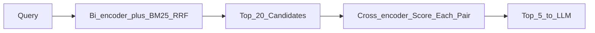

# Cross-Encoder Reranking

> Week 3 Theory · Day 4 · [← README](../README.md) · Prev: [hybrid-search-rrf](hybrid-search-rrf.md) · Next: [context-assembly-citations](context-assembly-citations.md)

Bi-encoder retrieval is fast but approximate. A **cross-encoder reranker** reads the query and each candidate chunk **together** and outputs a relevance score — slower, but much better at ordering the top results before they hit the LLM context window.

---

## Concepts

### What problem are we solving?

Hybrid search returns 20 plausible chunks. Your LLM context budget fits **5**. If chunk #7 is the only one with the correct answer but bi-encoder ranked it low, the user gets a hallucination or "I don't know."

**Reranking** is the precision layer: expensive scoring on a small set only.

### A concrete example

Query: *"What is the annual equipment stipend for remote workers?"*

| Rank after RRF | Chunk snippet (truncated) | Cross-encoder score |
|----------------|---------------------------|---------------------|
| 1 | "Core hours 10am–3pm for remote staff..." | 0.31 |
| 2 | "Equipment stipend: $500 annually for remote..." | **0.94** |
| 3 | "Dental plan covers..." | 0.08 |

After rerank, chunk 2 moves to #1 — correct answer reaches the LLM.

Timeline (illustrative):

| Stage | Latency |
|-------|---------|
| Hybrid retrieve top-20 | 40 ms |
| Rerank 20 pairs | 180 ms (local BGE) |
| LLM generate | 1200 ms |

Rerank adds ~15% to retrieval time but cuts wrong-context answers significantly.

### Two-stage retrieve → rerank



**Rule:** Never rerank the whole corpus — only top-N from stage 1 (N=20–50).

### Reranker options (Week 3)

| Option | Model | Cost | Notes |
|--------|-------|------|-------|
| **Local cross-encoder** | `BAAI/bge-reranker-base` via sentence-transformers | $0, needs CPU/GPU | Lab 4 default |
| **Cohere Rerank** | `rerank-english-v3.0` API | Per search | Set `COHERE_API_KEY` |
| **Open-source API** | Self-host TEI | Infra cost | Week 5+ territory |

Input format (typical):

```python
pairs = [(query, chunk_text) for chunk_text in candidates]
scores = model.predict(pairs)  # higher = more relevant
```

### When reranking helps most

| Scenario | Lift |
|----------|------|
| Many similar chunks (policy docs) | High |
| Short queries, long chunks | High |
| Unique SKU lookup | Low — BM25 already #1 |

Measure on golden set: compare MRR@5 with and without rerank (Day 5).

### AI engineer takeaway

Production RAG in 2026 is **three stages**: hybrid recall → cross-encoder precision → LLM generation. Say this in system design interviews; draw the latency budget per stage.

---

## Tradeoffs

| | Skip rerank | Add rerank |
|---|-------------|------------|
| Latency | Lower | +100–300 ms |
| Precision@5 | Baseline | Often +10–25% |
| Cost | $0 extra | API $ or GPU |
| Complexity | Simpler | Another model to version |

---

## Best Practices

1. Rerank **after** dedupe and metadata filters.
2. Truncate chunk text to reranker max length (often 512 tokens) — keep full text for LLM context separately.
3. Cache rerank scores only for identical query+chunk pairs (optional — Week 5 caching).
4. Log pre- and post-rerank order for debugging.

---

## Common Mistakes

| Mistake | Symptom | Fix |
|---------|---------|-----|
| Rerank 500 chunks | Timeouts | Cap at 20–50 |
| Use reranker for initial retrieval | Cannot scale | Bi-encoder first |
| Different tokenizer truncation | Scores unstable | Use model's max_length |
| Skip eval | "Feels better" | Measure MRR on golden set |

---

## Checkpoint

1. Why is cross-encoder scoring too slow for the full index?
2. What changes in the example table after reranking?
3. Name one hosted and one local reranker option.

---

## Go Deeper

| Resource | Why |
|----------|-----|
| [Cohere Rerank docs](https://docs.cohere.com/docs/rerank-2) | Hosted API |
| [BGE reranker](https://huggingface.co/BAAI/bge-reranker-base) | Local default |
| [Lab 4](../labs/lab-04-reranking.md) | Before/after comparison JSON |

---

## Next

**→ [context-assembly-citations.md](context-assembly-citations.md)** · Lab: [Lab 4](../labs/lab-04-reranking.md)
