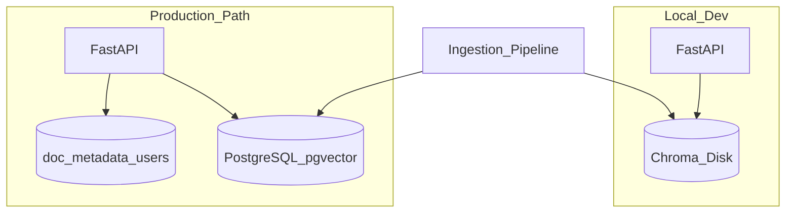

# Vector Databases

> Week 3 Theory · Day 2 · [← README](../README.md) · Prev: [embeddings-retrieval](embeddings-retrieval.md) · Next: [hybrid-search-rrf](hybrid-search-rrf.md)

A **vector database** stores embedding vectors and runs similarity search at scale. Week 3 uses **Chroma** locally for fast iteration and **PostgreSQL + pgvector** as the production path — same Postgres skills from [Week 2](../week-02/project/docker.md).

---

## Concepts

### What problem are we solving?

You have 10,000 chunk vectors. Brute-force cosine similarity over all 10,000 on every query works in a lab — it fails in production. Vector DBs use **approximate nearest neighbor (ANN)** indexes (HNSW, IVF) to trade a tiny accuracy loss for 100× speed.

### A concrete example

Doc Q&A Studio index stats after ingesting 8 PDFs:

| Metric | Value |
|--------|-------|
| Documents | 8 |
| Chunks | 1,247 |
| Embedding dims | 1536 |
| Index size (Chroma) | ~45 MB on disk |
| Query p95 | 25 ms (local) |

User query returns top-20 chunk IDs in under 30 ms — fast enough for interactive chat.

### Chroma (local dev)

| Feature | Detail |
|---------|--------|
| **Deploy** | Embedded library, `persist_directory` on disk |
| **Best for** | Labs, prototypes, single developer |
| **Metadata filters** | `where={"source": "handbook.pdf"}` |
| **Limitation** | Not multi-tenant HA out of the box |

```python
# Illustrative — Lab 2
collection.add(
    ids=chunk_ids,
    embeddings=vectors,
    documents=texts,
    metadatas=[{"page": 12, "doc_id": "handbook"} for _ in texts],
)
results = collection.query(query_embeddings=[q_vec], n_results=20)
```

### pgvector (production path)

Extension for PostgreSQL — store vectors in a normal row alongside app metadata.

```sql
CREATE EXTENSION vector;
CREATE TABLE document_chunks (
    id UUID PRIMARY KEY,
    doc_id TEXT NOT NULL,
    chunk_text TEXT NOT NULL,
    embedding vector(1536),
    metadata JSONB,
    created_at TIMESTAMPTZ DEFAULT now()
);
CREATE INDEX ON document_chunks USING hnsw (embedding vector_cosine_ops);
```

| Why pgvector | Benefit |
|--------------|---------|
| Same DB as users, ACLs, audit | One backup story |
| SQL + joins | Filter by `team_id` before vector search |
| Week 2 familiarity | Reuse Docker Postgres patterns |

### Chroma vs pgvector decision table

| Criterion | Chroma | pgvector |
|-----------|--------|----------|
| Time to first index | Minutes | Hours (schema, migrations) |
| Multi-user ACL | DIY | Row-level security |
| Ops complexity | Low | Medium (DBA basics) |
| Week 3 requirement | **Required** (Labs 1–5) | **Production path** (Lab 6 optional) |

### Architecture placement



Use the **same chunk schema** in both stores so switching is a connector change, not a rewrite.

### AI engineer takeaway

Interview answer: *"Chroma for dev velocity; pgvector when you need ACLs, backups, and SQL filters in one database."* Never store only vectors — always persist chunk text and metadata.

---

## Tradeoffs

| Index type | Build time | Query speed | Recall |
|------------|------------|-------------|--------|
| Flat (exact) | None | Slow | 100% |
| HNSW | Medium | Fast | ~98–99% |
| IVF | Faster build | Fast at scale | Tunable |

Start with HNSW defaults; tune `ef_search` only if eval shows recall gaps.

---

## Best Practices

1. **Unique chunk IDs** — `{doc_id}_{chunk_index}` or UUID.
2. **Metadata for filtering** — `doc_id`, `page`, `tenant_id` before ANN when possible.
3. **Migration scripts** — Alembic for pgvector schema (Week 2 pattern).
4. **Delete on re-index** — drop collection or `DELETE WHERE doc_id=` before re-ingest.

---

## Common Mistakes

| Mistake | Symptom | Fix |
|---------|---------|-----|
| Vector dim mismatch | Insert error or garbage scores | Match model dims to column |
| Storing vectors only | Cannot display citation text | Store `chunk_text` column |
| No index on pgvector | Sequential scan timeout | Create HNSW/IVFFlat index |
| Chroma in prod with no backup | Disk loss = re-embed everything | Persist + backup or use pgvector |

---

## Checkpoint

1. Why use ANN instead of exact search at 100K vectors?
2. Name one reason pgvector beats Chroma for multi-tenant SaaS.
3. What must match between your embedding model and pgvector column definition?

---

## Go Deeper

| Resource | Why |
|----------|-----|
| [Chroma docs](https://docs.trychroma.com/) | Collections, persistence |
| [pgvector GitHub](https://github.com/pgvector/pgvector) | Index types, operators |
| [Lab 6](../labs/lab-06-pgvector.md) | Optional production migration |

---

## Next

**→ [Day 3 playbook](../daily/day-03.md)** · [hybrid-search-rrf.md](hybrid-search-rrf.md) · Lab: [Lab 2](../labs/lab-02-embeddings-chroma.md)
