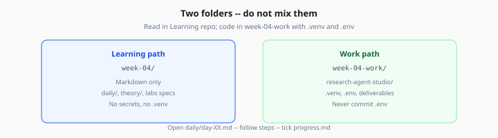

# Week 4 — Start Here

> One-time orientation · then live in [daily/day-01.md](daily/day-01.md)

**Prerequisite:** Complete [Week 3 exit criteria](../week-03/checkpoints/exit-criteria.md) — you should understand RAG retrieval, chunking, and citation patterns from your document Q&A chatbot.

---

## 1. Setup (once)

```bash
cd Learning/week-04
chmod +x scripts/setup-work.sh
./scripts/setup-work.sh
```

Add to `.env` in your work dir:

- `OPENAI_API_KEY` (required)
- `TAVILY_API_KEY` (recommended for web search labs; DuckDuckGo works as fallback)

Never commit `.env`.

Optional: copy Week 3 retrieval helpers as a head start (see [README](README.md#migrate-from-week-3-recommended)).

---

## 2. Your two folders

| | Where | What you do |
|---|--------|-------------|
| **Learning path** | `Learning/week-04/` | Read playbooks, theory, lab specs |
| **Work path** | `week-04-work/` or `~/ai-learning/week-04-work/` | Python, deliverables, `research-agent-studio/` |



*Figure: Read curriculum in `week-04/`; code and secrets live in `week-04-work/`.*

---

## 3. Every study session

```
Open daily/day-XX.md  →  follow steps 1…N  →  tick progress.md  →  Tomorrow link
```

Do **not** read all 11 theory files before Day 1. The daily playbook links only what you need that day.

---

## 4. What you are building

**Research Agent Studio** — an autonomous research agent that:

- Searches the web and your document index (Week 3 RAG)
- Plans sub-questions, reflects on gaps, and synthesizes answers
- Cites sources with URLs and document IDs
- Pauses for human approval on high-risk tool calls (HITL)
- Checkpoints state so a crashed run can resume

Primary framework: **LangGraph**. You also touch **OpenAI Agents SDK**, **Pydantic AI**, and a custom **MCP** tool server.

---

## 5. First step

**→ [Day 1 playbook](daily/day-01.md)**
