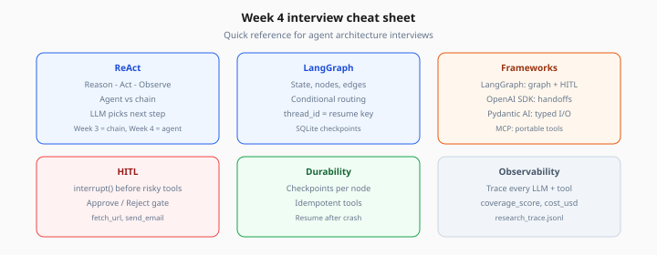

# Week 4 Interview Cheat Sheet

> [← README](../README.md)

*Figure: Quick reference for agent architecture interviews — frameworks, durability, and tracing.*

## ReAct

`Reason → Act (tool) → Observe → repeat`

## Agent vs chain

| Chain | Agent |
|-------|-------|
| Fixed steps | LLM picks next step |
| Week 3 RAG | Week 4 research |

## LangGraph

- **State** — shared TypedDict
- **Node** — function updating state
- **Conditional edge** — route on tool_calls / reflection
- **thread_id** — checkpoint resume key

## Framework pick

| LangGraph | OpenAI Agents SDK | Pydantic AI |
|-----------|-------------------|-------------|
| Graph + HITL + checkpoints | Handoffs + guardrails | Typed I/O |

## MCP

`Client → list_tools / call_tool → Server → APIs`

Security: SSRF block, HITL, least privilege

## Memory

- **Short-term:** messages
- **Working:** plan + findings
- **Long-term:** optional cross-session

## Reflection

`coverage_score` → continue research or write

## HITL

Interrupt **before** high-risk tool; timeout → reject

## Idempotency

Cache `web_search(query)`; idempotency-key for email

## Trace (minimum)

`thread_id`, `node`, `tool`, `latency_ms`, `cost_usd`

## Capstone

Research Agent Studio — web + doc tools, citations, HITL, checkpoints

## Red flags

- Model executes tools
- No max_rounds
- Full HTML in prompts
- No trace on multi-step runs
