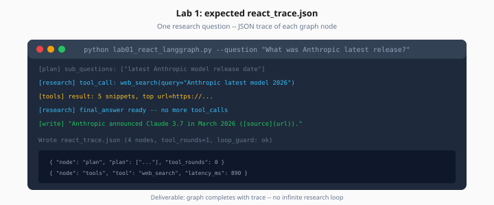

# Lab 1: ReAct Loop with LangGraph

> Week 4 Labs · [← README](README.md) · [ReAct Theory](../theory/react-loop-agent-vs-chain.md) · [LangGraph](../theory/langgraph.md)

> **Work dir:** `~/ai-learning/week-04-work/`

**Estimated cost:** $0.10–0.30

**Goal:** When it works, you run one research-style question and see a JSON trace of each graph node — plan, tool call, observe, final answer — without an infinite loop.



*Figure: Deliverable is a JSON trace of each graph node — no infinite research loop.*

---

## Graph shape

```
plan → research ↔ tools → write → END
```

Start with **one tool** (`calculate` for deterministic testing, or `web_search` if keys are set).

---

## State schema

```python
from typing import TypedDict, Annotated
from langgraph.graph.message import add_messages

class AgentState(TypedDict):
    question: str
    messages: Annotated[list, add_messages]
    plan: list[str]
    tool_rounds: int
    final_answer: str | None
```

---

## Key files (work dir)

| File | Purpose |
|------|---------|
| `lab01_react_langgraph.py` | CLI entry |
| `app/graph/research_graph.py` | Graph builder |
| `app/graph/nodes.py` | plan, research, tools, write |
| `app/tools/calculate.py` | Deterministic test tool |

---

## Sample run

```bash
cd ~/ai-learning/week-04-work
source .venv/bin/activate
python lab01_react_langgraph.py --question "What is 847 * 293? Use the calculator."
```

---

## Trace logging

Append to list after each node:

```python
trace.append({
    "step": len(trace) + 1,
    "node": "tools",
    "event": "tool_call",
    "tool": "calculate",
    "args": {"expression": "847 * 293"},
    "latency_ms": 12,
})
```

Save as `react_trace.json` on completion.

---

## Expected output (excerpt)

```json
{
  "question": "What is 847 * 293? Use the calculator.",
  "steps": [
    {"node": "plan", "event": "plan_created", "sub_questions": ["Compute 847 * 293"]},
    {"node": "research", "event": "tool_requested", "tool": "calculate"},
    {"node": "tools", "event": "tool_result", "result": "248171"},
    {"node": "write", "event": "final_answer", "text": "847 × 293 = 248,171."}
  ],
  "tool_rounds": 1
}
```

---

## Guards

- `tool_rounds` increment in tools node; route to `write` if `>= MAX_TOOL_ROUNDS` (default 8)
- Conditional edge: if LLM returns tool calls → `tools`, else → `write`

---

## Acceptance

- [ ] Graph completes sample question
- [ ] `react_trace.json` has ≥ 4 steps
- [ ] No infinite research ↔ tools loop
- [ ] `tool_rounds` logged

---

## Next

→ Mark Day 1 done → [Day 2 playbook](../daily/day-02.md)
