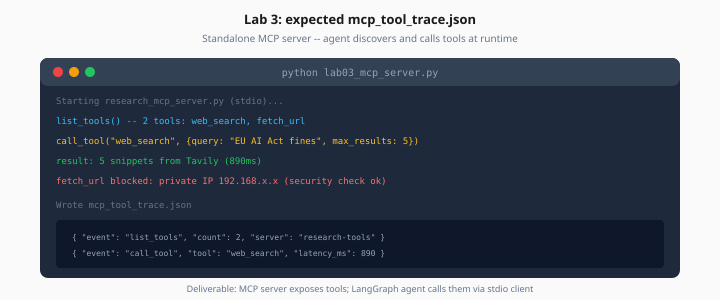

# Lab 3: MCP Research Tools Server

> Week 4 Labs · [← README](README.md) · [MCP Protocol](../theory/mcp-protocol.md)

> **Work dir:** `~/ai-learning/week-04-work/`

**Estimated cost:** $0.10–0.40 (Tavily searches)

**Goal:** A standalone MCP server exposes `web_search` and `fetch_url`; your LangGraph agent discovers and calls them — trace in `mcp_tool_trace.json`.



*Figure: MCP server exposes tools; LangGraph client discovers and calls them at runtime.*

---

## Server tools

| Tool | Args | Notes |
|------|------|-------|
| `web_search` | `query`, `max_results` | Tavily or DuckDuckGo |
| `fetch_url` | `url` | Public HTTPS only in lab; block private IPs |

---

## Server file

`research_mcp_server.py` using `mcp` Python SDK:

```python
from mcp.server import Server
from mcp.server.stdio import stdio_server

server = Server("research-tools")

@server.list_tools()
async def list_tools():
    return [web_search_schema, fetch_url_schema]

@server.call_tool()
async def call_tool(name: str, arguments: dict):
    ...
```

Run via stdio (LangGraph client spawns subprocess).

---

## Security checks (required)

In `fetch_url`:

```python
BLOCKED = ("localhost", "127.0.0.1", "10.", "192.168.", "172.16.")
if any(host.startswith(b) for b in BLOCKED):
    raise ValueError("Blocked internal URL")
```

---

## Client: `lab03_mcp_client.py`

1. Start MCP session (stdio)
2. `list_tools()` → register with LangGraph tool node
3. Run question: *"What did OpenAI announce about agents in 2026? Cite one URL."*
4. Log MCP protocol events

---

## Deliverable: `mcp_tool_trace.json`

```json
{
  "events": [
    {"event": "list_tools", "count": 2},
    {"event": "call_tool", "name": "web_search", "args": {"query": "..."}},
    {"event": "tool_result", "snippet_count": 5},
    {"event": "call_tool", "name": "fetch_url", "args": {"url": "https://..."}}
  ]
}
```

---

## Acceptance

- [ ] MCP server lists 2 tools
- [ ] Client completes question using MCP tools
- [ ] Internal URL blocked in `fetch_url`
- [ ] Trace file saved

---

## Next

→ [Day 4](../daily/day-04.md) · [Lab 4](lab-04-memory-reflection.md)
