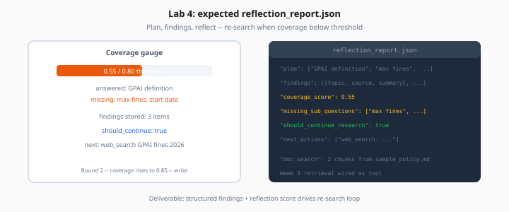

# Lab 4: Memory, Planning & Reflection

> Week 4 Labs · [← README](README.md) · [Memory](../theory/agent-memory-planning.md) · [Reflection](../theory/reflection-self-correction.md)

> **Work dir:** `~/ai-learning/week-04-work/`

**Estimated cost:** $0.30–0.80

**Goal:** Agent plans sub-questions, stores structured `findings`, reflects with a coverage score, and re-searches when gaps remain.



*Figure: Coverage gauge drives re-search — structured findings survive context trims.*

---

## Extend graph

Add nodes to Lab 1 graph:

```
plan → research ↔ tools → summarize → reflect → (research | write)
```

---

## Working memory

```python
class Finding(TypedDict):
    topic: str
    source: str  # URL or doc:chunk_id
    summary: str

# In state:
findings: list[Finding]
plan: list[str]
reflections: list[dict]
```

---

## Week 3 integration

Wire `doc_search` tool — reuse Week 3 retrieval module:

```python
async def doc_search(query: str, top_k: int = 5) -> list[dict]:
    """Returns [{chunk_id, text, score}] from Chroma index."""
```

Place sample policy doc in `data/sample_policy.md` if Week 3 index unavailable.

---

## Reflect node (Pydantic AI)

```python
class Reflection(BaseModel):
    coverage_score: float
    missing_sub_questions: list[str]
    should_continue_research: bool
```

Route: `should_continue_research` → `research`, else → `write`.

---

## Test question

*"Compare EU AI Act high-risk requirements with section 3 of our sample AI policy. Cite web and internal doc."*

Expected: plan with ≥ 2 sub-questions, web + doc findings, ≥ 1 reflection, final answer with both source types.

---

## Deliverable: `reflection_report.json`

```json
{
  "question": "...",
  "plan": ["...", "..."],
  "findings": [{"topic": "...", "source": "https://...", "summary": "..."}],
  "reflections": [{"coverage_score": 0.55, "should_continue_research": true}],
  "final_coverage_score": 0.85,
  "tool_rounds": 4
}
```

---

## Acceptance

- [ ] Plan node outputs sub_questions
- [ ] findinds include web + doc sources
- [ ] Reflection triggered; re-search when score low
- [ ] `reflection_report.json` saved

---

## Next

→ [Day 5](../daily/day-05.md) · [Lab 5](lab-05-hitl-interrupts.md)
