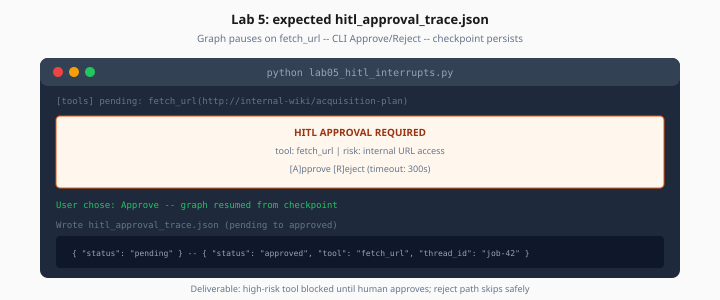

# Lab 5: Human-in-the-Loop Interrupts

> Week 4 Labs · [← README](README.md) · [HITL Theory](../theory/human-in-the-loop.md)

> **Work dir:** `~/ai-learning/week-04-work/`

**Estimated cost:** $0.15–0.40

**Goal:** When the agent calls a high-risk tool, the graph pauses, CLI asks Approve/Reject, checkpoint persists, and the run continues or skips safely.



*Figure: Graph pauses on fetch_url — human approves or rejects before tool executes.*

---

## Risk config

Read from `.env`:

```
HITL_REQUIRE_APPROVAL_FOR=fetch_url,send_email
HITL_APPROVAL_TIMEOUT_SEC=300
```

---

## Interrupt in tools node

```python
from langgraph.types import interrupt

HITL_TOOLS = set(os.getenv("HITL_REQUIRE_APPROVAL_FOR", "").split(","))

def tools_node(state):
    for call in pending_calls(state):
        if call.name in HITL_TOOLS:
            decision = interrupt({
                "tool": call.name,
                "args": call.args,
                "risk": describe_risk(call),
            })
            if decision.get("action") != "approve":
                record_rejection(state, call)
                continue
        execute(call)
    return state
```

---

## CLI approval handler

`lab05_hitl_interrupts.py`:

```bash
python lab05_hitl_interrupts.py --demo-risky-url
# Prompt: Approve fetch_url to http://10.0.0.5/admin? [y/N]
```

Also demo **approve** path with public URL.

---

## Checkpoint resume

1. Start run with `thread_id=hitl-demo-1`
2. Interrupt fires — exit process without answering
3. Re-run with `--resume --thread-id hitl-demo-1`
4. Complete approval — tool executes once only

---

## Deliverable: `hitl_approval_trace.json`

Must include three scenarios:

| Scenario | Expected |
|----------|----------|
| Rejected risky URL | Tool skipped; agent acknowledges |
| Approved public URL | Tool runs; result in state |
| Timeout (optional mock) | Default reject |

---

## Acceptance

- [ ] Interrupt before high-risk tool executes
- [ ] Reject path does not call tool
- [ ] Approve path calls tool exactly once
- [ ] Resume from checkpoint works
- [ ] Trace file saved

---

## Next

→ [Day 6](../daily/day-06.md) · [Lab 6](lab-06-multi-agent.md)
