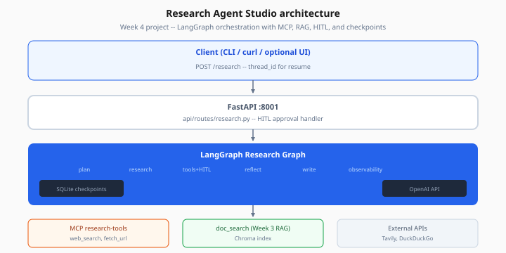
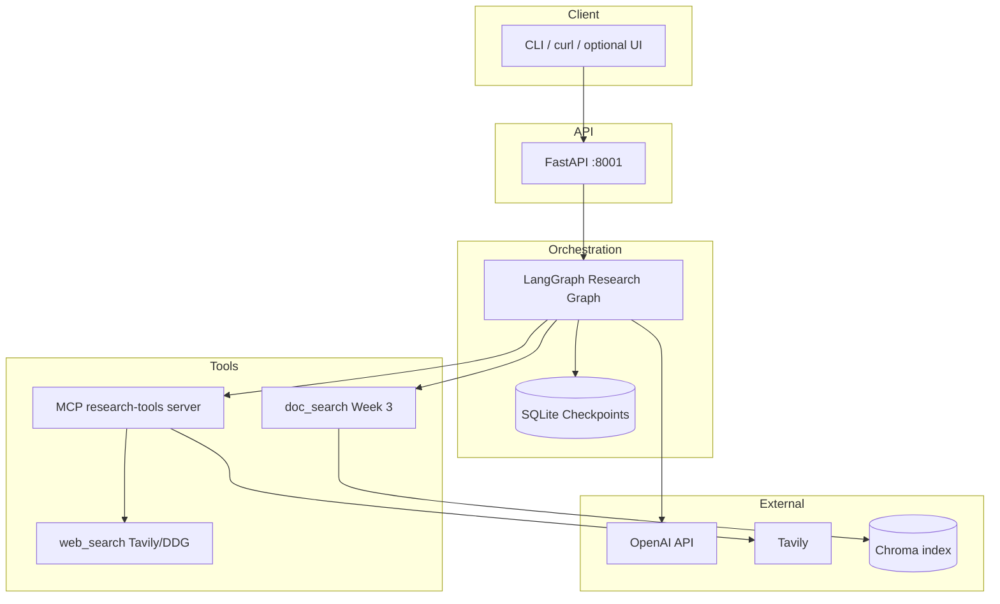

# Research Agent Studio — Architecture

> Week 4 Project · [← Overview](overview.md) · [Backend](backend.md)



*Figure: LangGraph orchestrates plan → research → tools (with HITL) → reflect → write; MCP and Week 3 RAG sit below.*

## System diagram



## Graph nodes

| Node | Responsibility |
|------|----------------|
| `plan` | Sub-questions + tool strategy |
| `research` | LLM selects tools |
| `tools` | Execute + HITL gate |
| `summarize` | Compress tool output → findings |
| `reflect` | Coverage score; re-route |
| `write` | Final report + Pydantic citations |

## Folder structure (work dir)

```
research-agent-studio/
├── backend/
│   ├── app/
│   │   ├── main.py
│   │   ├── api/routes/research.py
│   │   ├── graph/
│   │   │   ├── research_graph.py
│   │   │   ├── nodes.py
│   │   │   └── state.py
│   │   ├── tools/
│   │   │   ├── mcp_client.py
│   │   │   └── doc_search.py
│   │   ├── hitl/
│   │   │   └── approval.py
│   │   ├── observability/
│   │   │   └── trace.py
│   │   └── agents/
│   │       └── citation_extractor.py
│   └── tests/
├── research_mcp_server.py      # sibling or backend/mcp/
└── data/
    ├── checkpoints.sqlite
    ├── chroma/
    └── sample_policy.md
```

## Data flow (one request)

1. `POST /api/v1/research` → create `thread_id`
2. Graph runs plan → research/tools loops
3. HITL interrupt → API returns `status: awaiting_approval` + `interrupt_id`
4. `POST /api/v1/research/{thread_id}/approve` → resume
5. reflect → write → `research_report.json` schema returned

## Trace schema

JSONL events — see [agent-observability.md](../theory/agent-observability.md).

## Security boundaries

- MCP server: public URLs only unless HITL approved
- API keys only in work dir `.env`
- No tool executes without schema validation
