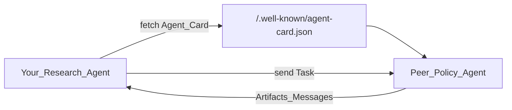

# A2A — Agent-to-Agent Protocol

> Week 4 Theory · Day 6 *(optional)* · [← README](../README.md) · **Optional — not required for Week 4 exit criteria**

> Prev: [multi-agent-patterns](multi-agent-patterns.md) · Related: [agent-skills-and-harness](agent-skills-and-harness.md) · Week 7: [mcp-production-patterns](../../week-07/theory/mcp-production-patterns.md)

**A2A (Agent-to-Agent)** is an open protocol so **independent** agent systems — different teams, frameworks, or vendors — can discover each other and exchange tasks over HTTP. Week 4 multi-agent patterns coordinate specialists **inside one process**. A2A is how those specialists talk when they live on **different servers**.

---

## Concepts

### What problem are we solving?

Your Research Agent Studio can hand off to a Web Researcher node in the same LangGraph. That fails when Legal's "policy reviewer" agent runs in another cloud, owned by another team, built with another SDK. You need a **shared wire format**: who are you, what can you do, how do I send a task, how do I get artifacts back?

### In-process multi-agent vs A2A

| | Week 4 multi-agent | A2A |
|--|--------------------|-----|
| Where agents live | Same app / same graph | Separate services |
| Discovery | Hardcoded handoffs / supervisor map | **Agent Card** at a well-known URL |
| Messages | Shared state object (`findings`) | Tasks, messages, artifacts over HTTP |
| Best for | One product, one deploy | Cross-team / cross-vendor collaboration |



### Worked scenario: discover → task → artifact

**You need:** *"Does this research memo violate our public disclosure policy?"*  
**Peer agent:** Policy Reviewer owned by Compliance (separate service).

**1. Discovery — Agent Card** (illustrative JSON):

```json
{
  "name": "Policy Reviewer",
  "description": "Checks drafts against disclosure and brand policies.",
  "version": "1.0.0",
  "url": "https://compliance.example.com/a2a",
  "defaultInputModes": ["text/plain", "application/json"],
  "defaultOutputModes": ["application/json"],
  "skills": [
    {
      "id": "disclosure-check",
      "name": "Disclosure check",
      "description": "Flag unapproved product claims and embargo risks."
    }
  ]
}
```

Cards are commonly published at `/.well-known/agent-card.json` so clients can fetch them without a custom registry (registries are optional).

**2. Exchange** — your agent sends a **task** (the memo + question); the peer returns **messages** (status, questions) and **artifacts** (annotated findings JSON).

**3. Your graph continues** — merge the artifact into `findings`, then write the final report (still your LangGraph / HITL rules).

### A2A "skills" vs Week 4 agent skills

| Term | Meaning |
|------|---------|
| **Agent skill (playbook)** | Instruction pack you load into *your* agent — see [agent-skills-and-harness](agent-skills-and-harness.md) |
| **A2A skill (on a card)** | Advertised capability for **discovery** — "this remote agent is good at X" |

Same English word; different layer. In interviews, say **"A2A Agent Card skills"** vs **"local skill playbooks."**

### MCP vs A2A

| | MCP | A2A |
|--|-----|-----|
| Primary job | Plug **tools and data** into an agent | Let **agents** talk to **agents** |
| Typical peer | Tool server (search, DB, fetch) | Another LLM agent service |
| Analogy | USB-C for tools | HTTP API contract between products |

You can use both: your agent calls MCP tools locally, and delegates a whole sub-job to a remote A2A peer.

### AI engineer takeaway

Use **LangGraph multi-agent** inside one product; use **A2A** when agents must interoperate across trust boundaries. Do not rebuild A2A for Week 4 exit — know the comparison for system design.

---

## Tradeoffs

| Pros | Cons |
|------|------|
| Vendor/framework independent | Spec and ecosystem still evolving |
| Clear discovery via Agent Cards | Auth, authz, and abuse controls are on you |
| Fits enterprise "agent marketplace" stories | Latency and failure modes across networks |

---

## Best Practices

1. **Auth on every task** — Agent Cards declare security; never call open endpoints in prod.
2. **Timeouts and idempotent task IDs** — remote agents fail; your graph must resume.
3. **Treat remote artifacts like untrusted input** — validate schema; apply HITL before acting on them.
4. **Prefer MCP for tools you own**; prefer A2A for **other teams' agents**.

---

## Common Mistakes

| Mistake | Fix |
|---------|-----|
| Calling LangGraph handoffs "A2A" | A2A is a **protocol between services**, not in-process routing |
| Skipping Agent Cards | Without discovery metadata, clients hardcode brittle URLs |
| Trusting remote agent output blindly | Same as any tool result — validate + cite |

---

## Checkpoint (optional)

1. Multi-agent vs A2A — where does each live?
2. What is an Agent Card for?
3. MCP vs A2A in one sentence each?
4. Is implementing A2A required for Week 4?

---

## Go Deeper

| Resource | Why |
|----------|-----|
| [A2A protocol specification](https://a2a-protocol.org/latest/specification/) | Official overview and message model |
| [multi-agent-patterns.md](multi-agent-patterns.md) | In-process supervisor / handoff (required Week 4 path) |
| [agent-skills-and-harness.md](agent-skills-and-harness.md) | Local skill playbooks vs card skills |
| [mcp-production-patterns.md](../../week-07/theory/mcp-production-patterns.md) | Hardening tool servers (Week 7) |

---

## Next

→ Required path: [checkpointing-idempotency.md](checkpointing-idempotency.md) · [Day 6 playbook](../daily/day-06.md) · Optional revisit in Week 7 after production MCP
