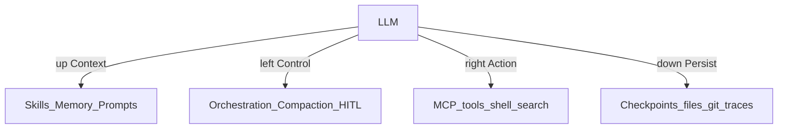

# Agent Skills & Harness

> Week 4 Theory · Day 6 *(optional)* · [← README](../README.md) · **Optional — not required for Week 4 exit criteria**

> Prev: [multi-agent-patterns](multi-agent-patterns.md) · Related: [a2a-protocol](a2a-protocol.md) · [mcp-protocol](mcp-protocol.md)

An **agent skill** is a reusable playbook you attach to an agent — name, when to use it, rules, and steps — so the same capability ships across projects without rewriting prompts. An **agent harness** is the runtime shell around the LLM that injects context, controls the loop, runs actions, and persists progress. Both matter in interviews and product design; neither is required to finish Week 4.

---

## Concepts

### What problem are we solving?

Week 4 already builds tools (MCP), memory, orchestration (LangGraph), and reflection. Teams still ask: *"How do we package a repeatable research workflow so Cursor, a CLI agent, and our Research Agent Studio all follow the same rules?"* Skills answer packaging. Harness names the runtime layers you already wired.

### Skills — reusable agent capabilities

Think of a skill as a **versioned instruction card**, not a Python function. Tools do work; skills tell the agent *when* and *how* to use those tools for a job.

**Worked example — `competitive-research` skill card:**

```yaml
name: competitive-research
description: Compare a competitor against an internal roadmap doc with citations.
trigger: User asks for competitive analysis, gap analysis, or "vs" competitor research.
rules:
  - Prefer web for public competitor facts; prefer doc_search for internal roadmap.
  - Never invent URLs or cite without a source in findings.
  - Cap tool rounds at 8; escalate to HITL before fetching internal-only hosts.
  - Avoid: dumping raw HTML into the final report.
steps:
  - Identify competitor name and internal doc path from the user request.
  - Plan sub-questions (products, pricing signals, roadmap overlap).
  - Execute web_search + doc_search; store structured findings.
  - Reflect on coverage_score; re-search only if below threshold.
  - Deliver a cited report with web and doc sources.
```

| Piece | Role |
|-------|------|
| **name / description** | Discovery — agent or IDE decides if this skill applies |
| **trigger** | When to load the skill into context |
| **rules** | Hard constraints (safety, citation, cost) |
| **steps** | Ordered playbook the agent should follow |

**Skills vs MCP tools vs prompts**

| | Skills | MCP tools | One-off system prompt |
|--|--------|-----------|------------------------|
| What it is | Playbook / capability pack | Executable function | Ad-hoc instructions |
| Reuse | Across agents and products | Across clients that speak MCP | Copy-paste fragile |
| Example | `competitive-research` | `web_search`, `doc_search` | "You are a helpful researcher…" |

Skills **call** tools; they do not replace them. A skill without tools is a fancy prompt. Tools without skills still work — you just re-explain the workflow every time.

**Before / after**

| Before | After |
|--------|-------|
| Paste a 40-line research prompt into every agent | Load `competitive-research` when the trigger matches |
| Drift between CLI and Studio prompts | One skill file, shared version |

### Harness — what makes an LLM actually do things

The model alone only predicts tokens. The **harness** is everything around it that turns those tokens into a reliable agent:



| Direction (infographic map) | What it means | Where you already learned it |
|----------------------------|---------------|------------------------------|
| **Context injection** | Skills, memory, system prompts, retrieved docs | [agent-memory-planning](agent-memory-planning.md), skills above, Week 3 RAG |
| **Control** | Orchestration, compaction/trimming, approvals | [langgraph](langgraph.md), [human-in-the-loop](human-in-the-loop.md), Week 2 context trim |
| **Action** | Tool calls that change the world | [mcp-protocol](mcp-protocol.md), Week 2 function calling |
| **Persist** | Survive crashes; audit later | [checkpointing-idempotency](checkpointing-idempotency.md), [agent-observability](agent-observability.md) |

**Note:** In Week 6, "eval harness" means a **test runner** for scoring outputs. Here, "agent harness" means the **production runtime** around the model. Same word, different job — say which one you mean in interviews.

### AI engineer takeaway

Ship **tools once (MCP)**, package **workflows as skills**, and treat LangGraph + memory + checkpoints + HITL as the **harness** — not as disconnected features.

---

## Tradeoffs

| Pros | Cons |
|------|------|
| Skills reduce prompt drift across surfaces | Extra packaging and versioning work |
| Harness language helps system-design answers | Over-engineering a single-script agent |
| Clear split: playbook vs tool vs runtime | "Skill" also means resume keywords — disambiguate |

---

## Best Practices

1. Keep skills **short and versioned** (`competitive-research@1.2`).
2. Put **safety rules in the skill**; put **execution** in MCP tools.
3. Load skills **on trigger**, not every turn (context budget).
4. Trace which skill was active on each run for debugging.

---

## Common Mistakes

| Mistake | Fix |
|---------|-----|
| Stuffing tool implementations inside a skill markdown file | Skill = instructions; MCP/server = code |
| One mega-skill for the whole product | Narrow skills with clear triggers |
| Calling the agent loop an "eval harness" in interviews | Say **agent harness** vs **eval harness** |

---

## Checkpoint (optional)

1. Skill vs MCP tool — one sentence each?
2. Name the four harness layers (context, control, action, persist).
3. Why not load every skill on every request?
4. Is this page required for Week 4 exit?

---

## Go Deeper

| Resource | Why |
|----------|-----|
| [a2a-protocol.md](a2a-protocol.md) | Cross-agent discovery uses "skills" on **Agent Cards** (different meaning) |
| [mcp-protocol.md](mcp-protocol.md) | Tools skills depend on |
| [multi-agent-patterns.md](multi-agent-patterns.md) | Specialists often map 1:1 to a skill |
| [Anthropic — Agent Skills](https://docs.anthropic.com/en/docs/agents-and-tools/agent-skills/overview) | Vendor packaging pattern (ecosystem evolving) |

---

## Next

→ Optional: [a2a-protocol.md](a2a-protocol.md) · Required path: [checkpointing-idempotency.md](checkpointing-idempotency.md) · [Day 6 playbook](../daily/day-06.md)
