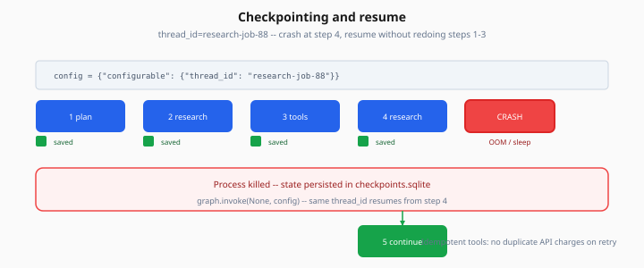

# Checkpointing & Idempotency

> Week 4 Theory · Day 6 · [← README](../README.md) · [Multi-Agent](multi-agent-patterns.md) · [Observability](agent-observability.md)

**Checkpointing** saves agent state after each graph step so a process crash, deploy, or HITL wait can **resume** without restarting research from scratch. **Idempotency** ensures re-running a step (after retry or resume) does not double-charge APIs or duplicate side effects.

---

## Concepts

### What problem are we solving?

A 12-step research run fails at step 11 (OOM, timeout, laptop sleep). Without checkpoints, the user pays again and waits through 10 redundant searches.

With checkpoints + idempotent tools, step 11 continues from saved state.



*Figure: SQLite checkpoints save state per node — same thread_id resumes from last saved step.*

### Worked example: resume after crash

**Run:** `thread_id = "research-job-88"`

| Step | Node | Checkpoint saved? |
|------|------|-------------------|
| 1 | plan | ✓ |
| 2 | research → web_search | ✓ |
| 3 | tools | ✓ |
| 4 | research → doc_search | ✓ |
| **CRASH** | | |
| 5 | research (resume) | continues from step 4 state |

```python
config = {"configurable": {"thread_id": "research-job-88"}}
# First invoke — crash mid-run
graph.invoke(state, config)
# Restart process — same config
graph.invoke(None, config)  # resumes from checkpoint
```

Capstone demo: kill process after 3 steps, restart, verify no duplicate search IDs in trace.

### Idempotent tools

**Idempotent:** calling twice with same args has same effect as once.

| Tool | Idempotent strategy |
|------|---------------------|
| `web_search` | Cache by `(query, max_results)` hash for 1h |
| `doc_search` | Read-only — safe to repeat |
| `fetch_url` | Cache response body by URL + etag |
| `send_email` | **Not idempotent** — use idempotency key header |
| `write_file` | Use temp path until finalize |

```python
def web_search_idempotent(query: str, max_results: int) -> list:
    key = hashlib.sha256(f"{query}:{max_results}".encode()).hexdigest()
    if cached := cache.get(key):
        return cached
    result = tavily_search(query, max_results)
    cache.set(key, result, ttl=3600)
    return result
```

### Checkpoint storage options

| Backend | Week 4 use |
|---------|------------|
| **SQLite** | Default dev (`langgraph-checkpoint-sqlite`) |
| **Postgres** | Production path (Week 5) |
| **Memory** | Tests only — no resume |

Env: `CHECKPOINT_DB_PATH=./data/checkpoints.sqlite`

### HITL + checkpoint interaction

When human approval takes 10 minutes:

1. Graph interrupts before tool
2. Checkpoint persists `pending_tool_call`
3. Process can exit — no memory leak
4. User approves via API
5. New process resumes with same `thread_id`

### Side-effect ledger (optional pattern)

Track executed tool calls in state:

```python
executed: list[str]  # ["web_search:abc123", "doc_search:def456"]
```

Before execute: skip if fingerprint already in `executed`.

**AI engineer takeaway:** Production agents need durable state and safe retries — checkpointing and idempotency are as important as prompt quality.

---

## Tradeoffs

| Pros | Cons |
|------|------|
| Resilient long runs | Storage growth — prune old threads |
| Safe HITL waits | Stale checkpoint if code version changes |
| Cheaper retries | Cache invalidation complexity |

---

## Best Practices

- One `thread_id` per user job / research request
- Version graph schema; migrate or invalidate old checkpoints on breaking changes
- Read-only tools first; idempotency keys for writes
- Expose `GET /runs/{thread_id}/state` for debugging (project API)

---

## Common Mistakes

| Mistake | Fix |
|---------|-----|
| In-memory checkpointer in prod | SQLite minimum; Postgres in Week 5 |
| Non-idempotent email on retry | Idempotency-Key per intended send |
| Reusing thread_id across users | User-scoped IDs |
| Huge state in checkpoint | Summarize findings |

---

## Checkpoint

1. What is `thread_id` used for?
2. Why is `send_email` not naturally idempotent?
3. Name one idempotency strategy for `web_search`.
4. How do checkpoints help HITL?
5. What checkpoint backend is Week 4 default?

---

## Go Deeper

| Resource | Why |
|----------|-----|
| [LangGraph persistence](https://langchain-ai.github.io/langgraph/concepts/persistence/) | Official guide |
| [human-in-the-loop.md](human-in-the-loop.md) | Interrupt + resume |
| Week 5 production topics | Postgres checkpointer |

---

## Next

→ Project wiring Day 6 · [agent-observability.md](agent-observability.md) · Day 7 capstone
