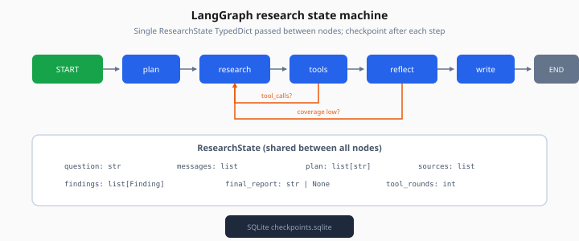
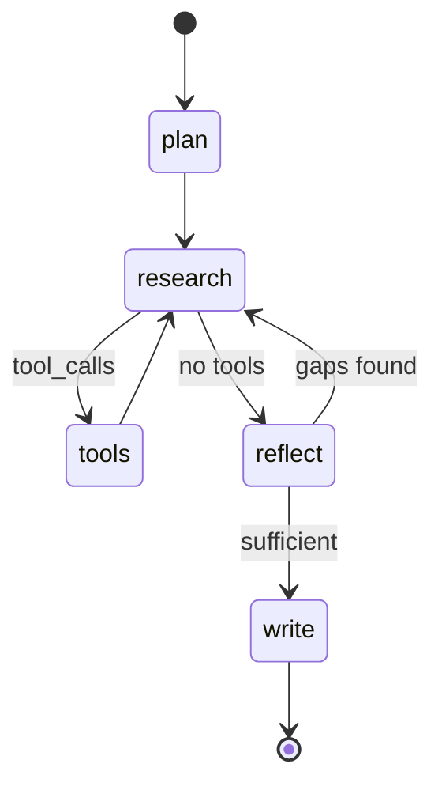

# LangGraph

> Week 4 Theory · Day 1 · [← README](../README.md) · [ReAct Loop](react-loop-agent-vs-chain.md) · [OpenAI Agents SDK](openai-agents-sdk.md)

**LangGraph** models an agent as a **state graph**: nodes are functions (call LLM, run tools, reflect), edges define what runs next, and **checkpoints** save state so a crashed run can resume. It is the primary framework for Research Agent Studio this week.

---

## Concepts

### What problem are we solving?

Plain Python `while` loops for agents become spaghetti: nested if/else for tool results, HITL pauses, retry logic, and "where were we when the pod restarted?"

LangGraph gives you a **visible graph** and a **single state object** passed between nodes — like a state machine with LLM steps inside.



*Figure: Nodes are functions; edges route on tool_calls and reflection scores; SQLite saves state after each step.*

### Worked example: minimal research graph

**State** (TypedDict or Pydantic):

```python
class ResearchState(TypedDict):
    question: str
    messages: list
    sources: list[dict]
    plan: list[str]
    final_report: str | None
```

**Nodes:**

| Node | Does |
|------|------|
| `plan` | LLM breaks question into sub-questions |
| `research` | LLM picks tool: `web_search` or `doc_search` |
| `tools` | Executes tool calls, appends results to `messages` |
| `reflect` | LLM checks coverage gaps |
| `write` | Produces cited `final_report` |

**Edges:** `plan → research → (tools ↔ research)* → reflect → write → END`

When it works, Lab 1 prints a Mermaid-style trace and saves `react_trace.json`.

### State graph diagram



### Conditional edges

After `research`, route based on LLM output:

```python
def route_after_llm(state: ResearchState) -> str:
    last = state["messages"][-1]
    if last.tool_calls:
        return "tools"
    if state.get("needs_reflection"):
        return "reflect"
    return "write"
```

This replaces fragile `if tool_calls:` scattered in application code.

### Checkpoints (preview — Day 6 deep dive)

```python
from langgraph.checkpoint.sqlite import SqliteSaver

checkpointer = SqliteSaver.from_conn_string("./data/checkpoints.sqlite")
graph = builder.compile(checkpointer=checkpointer)

config = {"configurable": {"thread_id": "research-run-42"}}
graph.invoke(initial_state, config)
```

Same `thread_id` on restart → continues from last checkpoint.

### Sample invoke timeline (illustrative)

| Time | Node | Event |
|------|------|-------|
| 0ms | `plan` | 3 sub-questions generated |
| 800ms | `research` | tool_call `web_search` |
| 1200ms | `tools` | 5 snippets returned |
| 2100ms | `research` | tool_call `doc_search` |
| 2800ms | `tools` | 3 chunks from Week 3 index |
| 3600ms | `reflect` | "Missing enforcement date" |
| 4400ms | `research` | second web search |
| 6200ms | `write` | final report + citations |

**AI engineer takeaway:** LangGraph is how you ship agents with operability — explicit flow, resumable state, and testable nodes.

---

## Tradeoffs

| LangGraph strengths | LangGraph costs |
|--------------------|-----------------|
| Fine-grained control, HITL, checkpoints | More boilerplate than SDK wrappers |
| Same graph in dev and prod | Learning curve vs simple chains |
| LangSmith/Langfuse integration | Tied to LangChain ecosystem |

---

## Best Practices

- Keep state **small** — store source IDs, not full HTML pages
- One responsibility per node (don't plan + search + write in one node)
- Unit-test nodes with **fixed state fixtures**
- Use `thread_id` per user session or research job

---

## Common Mistakes

| Mistake | Fix |
|---------|-----|
| Mutating state without returning updates | Return partial state dict from each node |
| Infinite `research ↔ tools` loop | `max_tool_rounds` in state + conditional edge to `reflect` |
| Giant `messages` list | Trim or summarize old tool outputs |
| No checkpoint on long runs | Always compile with checkpointer for capstone |

---

## Checkpoint

1. What is stored in LangGraph **state** vs what is a **node**?
2. What does a conditional edge decide?
3. Why use `thread_id` in the config?
4. Name two nodes in the research graph example.
5. How does LangGraph relate to the ReAct loop?

---

## Go Deeper

| Resource | Why |
|----------|-----|
| [LangGraph tutorials](https://langchain-ai.github.io/langgraph/tutorials/) | Official patterns |
| [checkpointing-idempotency.md](checkpointing-idempotency.md) | Resume after crash |
| [human-in-the-loop.md](human-in-the-loop.md) | `interrupt_before` nodes |

---

## Next

→ [Lab 1](../labs/lab-01-react-langgraph.md) · Day 2 → [openai-agents-sdk.md](openai-agents-sdk.md)
