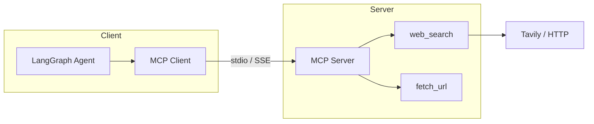

# Model Context Protocol (MCP)

> Week 4 Theory · Day 3 · [← README](../README.md) · [Pydantic AI](pydantic-ai.md) · [Memory & Planning](agent-memory-planning.md)

The **Model Context Protocol (MCP)** is an open standard for connecting AI applications to **tools**, **resources**, and **prompts** through a **server** your agent talks to over a defined transport. Instead of hardcoding every tool inside your app, you run an MCP server (e.g. "research tools") that any MCP-compatible client can discover and call.

---

## Concepts

### What problem are we solving?

Every agent framework defines tools differently. Moving `web_search` from LangGraph to Cursor to a CLI means rewriting adapters.

MCP standardizes: **list tools → call tool → get structured result** — like USB-C for agent tools.

### Worked example: research MCP server

Your **Research Agent Studio** runs:

1. **MCP server** (`research-tools`) exposing:
   - `web_search(query, max_results)`
   - `fetch_url(url)` — read page text
   - `cite_source(title, url, snippet)`

2. **LangGraph agent** as MCP **client** — discovers tools at startup, registers them with the LLM.

**Client flow:**

```
Agent startup → MCP list_tools() → 3 tools registered
User question → LLM → call_tool("web_search", {query: "EU AI Act fines"})
MCP server → Tavily API → returns JSON snippets
LLM → synthesize with citations
```

Lab 3 saves `mcp_tool_trace.json`.

### MCP building blocks

| Piece | Role | Example |
|-------|------|---------|
| **Server** | Exposes capabilities | `research_mcp_server.py` |
| **Tools** | Callable functions with JSON schema | `web_search` |
| **Resources** | Readable data (optional) | `file://docs/policy.pdf` |
| **Prompts** | Reusable prompt templates (optional) | `research_brief` |
| **Transport** | How client talks to server | stdio (local) or SSE (remote) |

### Architecture



### Security (non-negotiable)

MCP tools run **real code** with **real side effects**. Treat every server like a public API:

| Risk | Mitigation |
|------|------------|
| Unauthorized server | Allowlist server paths; no arbitrary user-supplied commands |
| Over-privileged tools | Separate read vs write tools; scope API keys per server |
| Prompt injection → tool abuse | Input guardrails; HITL on `fetch_url` to internal URLs |
| Data exfiltration | Block SSRF on `fetch_url`; network egress rules |
| Secret leakage in logs | Redact API keys in tool traces |

**High-risk tools** in Research Agent Studio: `fetch_url` (internal network), `send_email`, `delete_file` → require HITL (Day 5).

### Sample tool schema (MCP)

```json
{
  "name": "web_search",
  "description": "Search the public web for current information.",
  "inputSchema": {
    "type": "object",
    "properties": {
      "query": {"type": "string"},
      "max_results": {"type": "integer", "default": 5}
    },
    "required": ["query"]
  }
}
```

**AI engineer takeaway:** MCP lets you ship tools once and reuse them across agents and IDEs — but security moves to the server boundary, so design servers with least privilege.

---

## Tradeoffs

| Pros | Cons |
|------|------|
| Portable tools across clients | Extra process to deploy and monitor |
| Clear discovery contract | Network/stdio failures need retries |
| Ecosystem growing (Cursor, Claude Desktop) | New standard — patterns still evolving |

---

## Best Practices

- One MCP server per **domain** (research, CRM, git) — not one mega-server
- Version tools; deprecate instead of breaking schemas
- Timeouts on every `call_tool`
- Health check endpoint for remote SSE servers

---

## Common Mistakes

| Mistake | Fix |
|---------|-----|
| MCP server with shell access | Explicit tool list only |
| Returning megabyte HTML to LLM | Summarize in server before return |
| No auth on remote MCP | mTLS or token on SSE transport |
| Duplicating LangGraph tools and MCP tools | MCP is source of truth for shared tools |

---

## Checkpoint

1. What is the difference between an MCP **tool** and **resource**?
2. Why use stdio transport for local dev?
3. Name two security risks of `fetch_url`.
4. Who executes the tool — client or server?
5. What deliverable does Lab 3 produce?

---

## Go Deeper

| Resource | Why |
|----------|-----|
| [MCP specification](https://modelcontextprotocol.io/) | Official protocol |
| [project/mcp-server.md](../project/mcp-server.md) | Capstone server spec |
| [human-in-the-loop.md](human-in-the-loop.md) | Approve risky MCP calls |

---

## Next

→ [Lab 3](../labs/lab-03-mcp-server.md) · Day 4 → [agent-memory-planning.md](agent-memory-planning.md)
