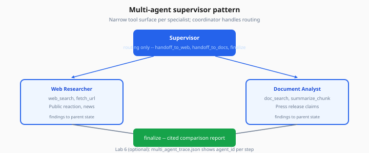
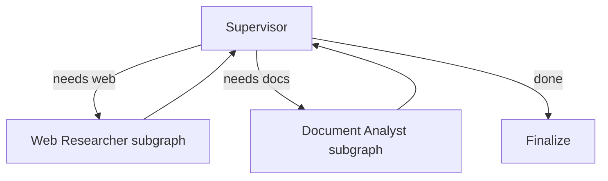

# Multi-Agent Patterns

> Week 4 Theory · Day 6 · [← README](../README.md) · [Human-in-the-Loop](human-in-the-loop.md) · [Checkpointing](checkpointing-idempotency.md)

When one agent juggles too many tools and instructions, **multi-agent** designs split work across specialists coordinated by a **supervisor** or **handoff** chain. Research Agent Studio uses a supervisor that routes to **Web Researcher** and **Document Analyst** agents.

---

## Concepts

### What problem are we solving?

A single agent with 12 tools and a 2,000-token system prompt confuses the model: wrong tool choice, ignored instructions, higher cost.

Specialists narrow the tool surface; a coordinator handles routing.



*Figure: Supervisor coordinates specialists — each has a narrow tool set; findings merge in parent state.*

### Worked example: supervisor routing

**User:** *"Compare public reaction to our product launch (web) with claims in our press release (doc)."*

| Agent | Tools | Job |
|-------|-------|-----|
| **Supervisor** | `handoff_to_web`, `handoff_to_docs`, `finalize` | Pick specialist per sub-task |
| **Web Researcher** | `web_search`, `fetch_url` | Public reaction, news |
| **Document Analyst** | `doc_search`, `summarize_chunk` | Press release claims |

**Flow:**

```
Supervisor → Web Researcher → findings → Supervisor
Supervisor → Document Analyst → findings → Supervisor
Supervisor → finalize → cited comparison report
```

Lab 6 (optional) exports `multi_agent_trace.json`.

### Pattern comparison

| Pattern | Control | Best when |
|---------|---------|-----------|
| **Supervisor** | Central router picks worker | Dynamic task mix |
| **Handoff** | Agent A passes baton to B | OpenAI Agents SDK style |
| **Sequential pipeline** | Fixed A → B → C | Stable ETL-like flows |
| **Parallel fan-out** | Same task to N specialists | Diverse perspectives (optional) |

Week 4 capstone minimum: supervisor **or** handoff (Lab 6 demonstrates both).

### Supervisor in LangGraph



Each subgraph is a compiled LangGraph with its own tools — supervisor sees summarized `findings` only.

### Handoff in OpenAI Agents SDK

From Day 2: `triage` agent with `handoffs=[research, writer]`. Same idea, less explicit graph.

**Context passing:** pass structured payload, not full message history:

```json
{
  "handoff_reason": "Need internal doc claims",
  "sub_question": "What metrics are in press release v2?",
  "prior_findings": ["..."]
}
```

### Multi-agent risks

| Risk | Mitigation |
|------|------------|
| Ping-pong handoffs | Max handoffs per run (e.g. 6) |
| Duplicated searches | Shared `findings` store in parent state |
| Cost explosion | Smaller models for specialists |
| Debugging complexity | Trace `agent_id` on every step |

**AI engineer takeaway:** Multi-agent is an organizational pattern — use it when tool/instruction splitting improves reliability, not as default complexity.

---

## Tradeoffs

| Pros | Cons |
|------|------|
| Clearer tool sets per agent | More moving parts |
| Parallel specialization possible | Handoff context loss |
| Maps to team roles in interviews | Harder unit tests |

---

## Best Practices

- Shared **findings** bus in parent state
- Supervisor system prompt lists specialists and when to use each
- Cap handoffs and tool rounds globally
- One trace ID across all agents

---

## Common Mistakes

| Mistake | Fix |
|---------|-----|
| Every agent has all tools | Strict tool allowlists |
| Full history on every handoff | Structured summary payload |
| No global stop condition | Parent graph owns `max_rounds` |
| Identical instructions on all agents | Different personas and tools |

---

## Checkpoint

1. Supervisor vs handoff — one difference?
2. Why pass structured handoff payload?
3. Name two specialists in the example.
4. What does Lab 6 produce?
5. Is multi-agent required for Week 4 exit?

---

## Go Deeper

| Resource | Why |
|----------|-----|
| [openai-agents-sdk.md](openai-agents-sdk.md) | Handoffs API |
| [langgraph.md](langgraph.md) | Subgraphs |
| [agent-observability.md](agent-observability.md) | Trace per agent |

---

## Next

→ [Lab 6](../labs/lab-06-multi-agent.md) *(optional)* · [checkpointing-idempotency.md](checkpointing-idempotency.md)
