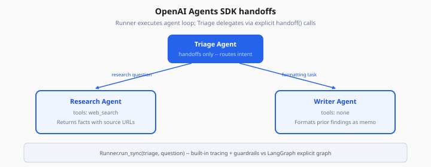

# OpenAI Agents SDK

> Week 4 Theory · Day 2 · [← README](../README.md) · [LangGraph](langgraph.md) · [Pydantic AI](pydantic-ai.md)

The **OpenAI Agents SDK** is a Python library for building multi-step agents with **handoffs** (one agent delegates to another), **guardrails**, **sessions**, and built-in **tracing**. You use it in Lab 2 to compare a higher-level API against LangGraph's explicit graphs.

---

## Concepts

### What problem are we solving?

Hand-rolling agent orchestration means reimplementing: which agent speaks next, how context passes on handoff, input/output validation, and trace IDs for debugging.

The SDK wraps OpenAI's tool-calling models with a **Runner** that executes agent loops and routes to specialist agents when configured.



*Figure: Triage routes by intent — research questions go to Research (with tools); formatting goes to Writer.*

### Worked example: triage → research handoff

**User:** *"Find GDPR fines related to AI training data and summarize for legal."*

| Agent | Role | Action |
|-------|------|--------|
| **Triage** | Routes intent | Handoff to `ResearchAgent` with extracted topic |
| **ResearchAgent** | Web + tools | Calls `web_search`, returns bullet findings |
| **WriterAgent** | Format for legal | Produces structured memo |

Handoff is explicit in code:

```python
from agents import Agent, Runner, handoff

research = Agent(name="Research", instructions="Search and cite sources.", tools=[web_search])
writer = Agent(name="Writer", instructions="Format as legal memo.")

triage = Agent(
    name="Triage",
    instructions="Route research questions to Research, formatting to Writer.",
    handoffs=[handoff(research), handoff(writer)],
)

result = Runner.run_sync(triage, "GDPR AI training fines summary for legal")
```

Lab 2 saves `agents_sdk_handoff.json` with trace steps.

### SDK vs LangGraph (decision table)

| Question | OpenAI Agents SDK | LangGraph |
|----------|-------------------|-----------|
| Need explicit graph diagram in code? | No — convention-based | Yes — first-class |
| Multi-agent handoffs quickly? | Strong | Build supervisor node |
| Checkpoint / HITL mid-node? | Sessions; less granular | Native interrupts |
| Vendor coupling | OpenAI-centric | Model-agnostic nodes |

**Week 4 rule:** LangGraph for the capstone; SDK for learning handoffs and guardrails patterns you can port to LangGraph.

### Guardrails (input/output)

```python
from agents import input_guardrail

@input_guardrail
def block_pii(text: str) -> str | None:
    if re.search(r"\b\d{3}-\d{2}-\d{4}\b", text):
        return "Please remove SSN-like data before continuing."
    return None
```

Guardrail returns an error message → run stops before tools execute.

### Sessions

Sessions keep conversation history across runs for the same user:

```python
from agents import SQLiteSession

session = SQLiteSession("user-123")
Runner.run_sync(triage, "Follow up on yesterday's GDPR query", session=session)
```

**AI engineer takeaway:** Use the SDK to prototype agent teams fast; migrate critical paths to LangGraph when you need checkpointing, custom branching, or non-OpenAI models in the same graph.

---

## Tradeoffs

| Pros | Cons |
|------|------|
| Fast multi-agent setup | Less visible control flow than LangGraph |
| Built-in tracing hooks | Primarily OpenAI models |
| Guardrails as decorators | Production HITL may still need custom UI |

---

## Best Practices

- Keep specialist agents **narrow** (one job, few tools)
- Log handoff reason in trace metadata
- Apply input guardrails **before** any tool runs
- Mirror SDK patterns in LangGraph for interview consistency

---

## Common Mistakes

| Mistake | Fix |
|---------|-----|
| One mega-agent with 20 tools | Split specialists + handoffs |
| No trace export | Enable tracing; save JSON for Lab 2 |
| Handoff without context summary | Pass structured handoff payload |
| Skipping guardrails on internal tools | PII can appear in search queries too |

---

## Checkpoint

1. What is an agent **handoff**?
2. Name two features the SDK provides beyond raw chat completions.
3. When would you pick LangGraph over the SDK for Research Agent Studio?
4. Where do input guardrails run in the lifecycle?
5. What file does Lab 2 produce?

---

## Go Deeper

| Resource | Why |
|----------|-----|
| [OpenAI Agents SDK docs](https://openai.github.io/openai-agents-python/) | API reference |
| [multi-agent-patterns.md](multi-agent-patterns.md) | Supervisor vs handoff |
| [guardrails (Week 2)](../week-02/theory/guardrails.md) | Shared safety concepts |

---

## Next

→ [Lab 2](../labs/lab-02-openai-agents-sdk.md) · [pydantic-ai.md](pydantic-ai.md)
