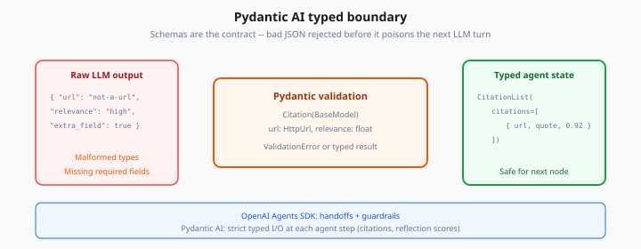

# Pydantic AI

> Week 4 Theory · Day 2 · [← README](../README.md) · [OpenAI Agents SDK](openai-agents-sdk.md) · [MCP Protocol](mcp-protocol.md)

**Pydantic AI** builds LLM agents where **tool inputs and outputs are Pydantic models** — the framework validates arguments before your code runs and validates structured results before they enter agent state. Use it for typed, strict steps inside Research Agent Studio (e.g. reflection scores, citation objects).

---

## Concepts

### What problem are we solving?

Raw tool JSON from models can be malformed: wrong field types, missing URLs, or extra keys. Without validation, bad data poisons the next LLM turn or crashes your pipeline.

Pydantic AI treats the agent as a **typed boundary**: schemas are the contract.



*Figure: Raw tool JSON passes through Pydantic models — bad types and missing fields rejected before the next LLM turn.*

### Worked example: citation extractor agent

**Goal:** After research, extract structured citations — not free-form markdown.

```python
from pydantic import BaseModel, HttpUrl
from pydantic_ai import Agent

class Citation(BaseModel):
    title: str
    url: HttpUrl
    quote: str
    relevance: float  # 0–1

class CitationList(BaseModel):
    citations: list[Citation]

citation_agent = Agent(
    "openai:gpt-4o-mini",
    result_type=CitationList,
    system_prompt="Extract citations from the research notes. URLs must be real.",
)

result = citation_agent.run_sync("Notes: ...")
for c in result.data.citations:
    print(c.title, c.url)
```

If the model returns invalid JSON, Pydantic AI retries with validation errors — similar to Week 1's structured output ladder, but agent-native.

### Before / after: untyped vs typed tool

**Untyped:**

```python
def web_search(args: dict) -> dict:
    q = args.get("query")  # might be missing
    ...
```

**Pydantic AI tool:**

```python
from pydantic_ai import RunContext

class SearchArgs(BaseModel):
    query: str = Field(min_length=3, max_length=200)
    max_results: int = Field(default=5, le=10)

@agent.tool
async def web_search(ctx: RunContext[None], args: SearchArgs) -> list[dict]:
    return await tavily_search(args.query, args.max_results)
```

Invalid `max_results=999` fails **before** hitting the API.

### Where Pydantic AI fits in Week 4

| Use Pydantic AI | Use LangGraph instead |
|-----------------|----------------------|
| Single-step structured extraction | Full ReAct loop + HITL |
| Typed tool definitions | Graph routing and checkpoints |
| Reflection score object | Multi-node orchestration |

**Pattern:** LangGraph node calls a Pydantic AI agent for one typed subtask.

### Sample reflection output

```json
{
  "coverage_score": 0.72,
  "missing_topics": ["enforcement timeline", "penalty amounts"],
  "should_continue_research": true
}
```

Downstream LangGraph edge: if `should_continue_research` → back to `research` node.

**AI engineer takeaway:** Pydantic AI is your **type system for agent I/O** — use it anywhere bad JSON would be expensive to recover from.

---

## Tradeoffs

| Pros | Cons |
|------|------|
| Strong validation, clear schemas | Another abstraction to learn |
| Good for extraction/reflection nodes | Not a full graph framework |
| Works with multiple model providers | Smaller ecosystem than LangChain |

---

## Best Practices

- Keep `result_type` models **small** (5–8 fields max)
- Use `Field(description=...)` — models read them as tool docs
- Log validation failures to observability (Week 4 Day 7)
- Don't nest entire agent loops inside Pydantic AI unless necessary

---

## Common Mistakes

| Mistake | Fix |
|---------|-----|
| Giant result_type with 30 fields | Split into pipeline steps |
| Using Pydantic AI for all orchestration | LangGraph owns the graph |
| Ignoring retry limits | Set max retries; fail to HITL |
| HttpUrl on broken model URLs | Fallback: str + manual validate |

---

## Checkpoint

1. What does `result_type` enforce?
2. Why validate tool args before execution?
3. Name one LangGraph node that fits Pydantic AI well.
4. How is this related to Week 2 structured outputs?
5. What happens when validation fails?

---

## Go Deeper

| Resource | Why |
|----------|-----|
| [Pydantic AI docs](https://ai.pydantic.dev/) | Tools, agents, deps |
| [structured-outputs-engineering (Week 2)](../week-02/theory/structured-outputs-engineering.md) | Cross-provider patterns |
| [reflection-self-correction.md](reflection-self-correction.md) | Typed reflection objects |

---

## Next

→ [Lab 2](../labs/lab-02-openai-agents-sdk.md) (compare patterns) · Day 3 → [mcp-protocol.md](mcp-protocol.md)
