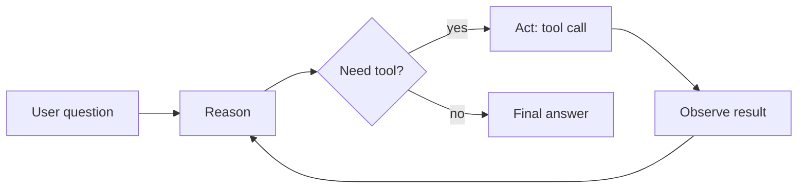

# ReAct Loop — Agent vs Chain

> Week 4 Theory · Day 1 · [← README](../README.md) · [LangGraph](langgraph.md)

A **chain** runs a fixed recipe: retrieve → prompt → answer. An **agent** decides the next step at runtime — search again, call a calculator, or stop — using a **ReAct** loop: **Reason** (think), **Act** (tool), **Observe** (read result), repeat.

---

## Concepts

### What problem are we solving?

**User:** *"Compare EU AI Act enforcement timelines with our internal policy doc and cite both."*

A **chain** might always: (1) embed question, (2) retrieve top-5 chunks, (3) one LLM call. That fails when the question needs **web search first**, then **targeted doc retrieval**, then **synthesis**.

An **agent** can plan dynamically: search web → notice gap → query doc index → reflect → write cited summary.

### Worked example: one ReAct turn

**Question:** *"What was Anthropic's latest model release date?"*

| Step | Type | Content |
|------|------|---------|
| 1 Reason | LLM thought | "I need current info — training data may be stale. Use web_search." |
| 2 Act | Tool call | `web_search(query="Anthropic latest model release 2026")` |
| 3 Observe | Tool result | `[{title: "...", url: "...", snippet: "Claude 3.7 ... March 2026"}]` |
| 4 Reason | LLM thought | "Snippet has date. Answer with citation." |
| 5 Act | Final answer | "Anthropic announced Claude 3.7 in March 2026 ([source](url))." |

Lab 1 logs each step to `react_trace.json`.

### Chain vs workflow vs agent

| Pattern | Who decides next step? | Example |
|---------|------------------------|---------|
| **Chain** | Developer (fixed order) | RAG: retrieve → generate |
| **Workflow** | Developer (graph, no LLM routing) | Ingest pipeline: parse → chunk → embed |
| **Agent** | LLM at each step | Research: search → read → maybe search again → write |

Use a **chain** when steps are always the same and cheap. Use an **agent** when the path depends on intermediate results.

### The ReAct loop



**Critical rule:** Your app executes tools. The model only *requests* them (same as Week 2 function calling).

### Before / after: fixed chain vs agent

**Chain (Week 3 RAG only):**

```
User → retrieve(docs) → LLM → answer
```

Misses: live web data, multi-hop reasoning, self-correction.

**Agent (Week 4):**

```
User → LLM → web_search → LLM → retrieve(docs) → LLM → reflect → LLM → answer
```

Costs more tokens and latency — but completes tasks chains cannot.

### When NOT to use an agent

- Single retrieval + answer (stay with RAG chain)
- Strict latency SLA under 2s
- Fully deterministic ETL (use workflow code, not LLM routing)
- No tool budget / guardrails yet

**AI engineer takeaway:** Agents trade cost and complexity for flexibility. Start with the simplest chain that works; add agent loops only where dynamic tool use is required.

---

## Architecture note

ReAct is a **pattern**, not a library. Week 4 implements it in:

- **LangGraph** — explicit graph nodes (`reason`, `tools`, `reflect`)
- **OpenAI Agents SDK** — higher-level runner with handoffs
- **Pydantic AI** — typed tool I/O inside one agent node

---

## Tradeoffs

| Pros | Cons |
|------|------|
| Handles multi-step, ambiguous tasks | Higher token cost (many LLM calls) |
| Can recover from bad tool results | Harder to test without trace fixtures |
| Composes with Week 3 RAG as one tool | Runaway loops without `max_rounds` |

---

## Best Practices

- Set **`max_tool_rounds`** (e.g. 12) and **`max_cost_usd_per_run`**
- Log every reason/act/observe step with timestamps
- Make tools **idempotent** where possible (Week 4 Day 6)
- Keep tool descriptions short and action-oriented

---

## Common Mistakes

| Mistake | Fix |
|---------|-----|
| Agent for every endpoint | Use chain for FAQ-style RAG |
| No stop condition | `max_rounds` + "if done, respond without tools" system prompt |
| Tool output too large | Summarize or truncate before next LLM call |
| Trusting model arithmetic | Force `calculate` tool for math |

---

## Checkpoint

1. Name the three ReAct phases in order.
2. Who executes a tool call — the model or your application?
3. Give one task better suited to a chain vs an agent.
4. What happens if you omit `max_tool_rounds`?
5. How does Week 3 RAG fit into a Week 4 agent?

---

## Go Deeper

| Resource | Why |
|----------|-----|
| [ReAct paper (Yao et al.)](https://arxiv.org/abs/2210.03629) | Original pattern |
| [LangGraph docs](https://langchain-ai.github.io/langgraph/) | Production graphs |
| [Week 2 function calling](../week-02/theory/function-calling.md) | Tool loop foundation |

---

## Next

→ [Lab 1](../labs/lab-01-react-langgraph.md) · mark Day 1 done → [Day 2 playbook](../daily/day-02.md) → [langgraph.md](langgraph.md)
