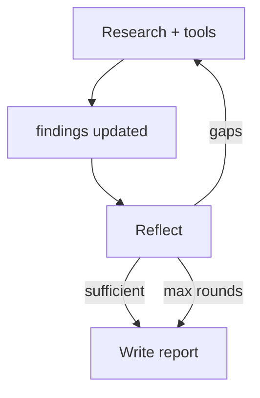

# Reflection & Self-Correction

> Week 4 Theory · Day 4 · [← README](../README.md) · [Memory & Planning](agent-memory-planning.md) · [Human-in-the-Loop](human-in-the-loop.md)

**Reflection** is a dedicated step where the agent evaluates its own progress: Did we answer the question? What's missing? Should we search again? **Self-correction** means acting on that evaluation — not just admitting gaps in the final paragraph.

---

## Concepts

### What problem are we solving?

Agents often **sound confident** with incomplete evidence. One-pass RAG or single search yields shallow answers. Reflection inserts a **critic** turn before the final write.

### Worked example: coverage check

**Question:** *"What are EU AI Act penalties for GPAI providers?"*

After two tool rounds, **reflect node** (Pydantic AI typed output):

```json
{
  "coverage_score": 0.55,
  "answered_sub_questions": ["definition of GPAI"],
  "missing_sub_questions": ["maximum fine amounts", "enforcement start date"],
  "contradictions": [],
  "should_continue_research": true,
  "next_actions": ["web_search: EU AI Act GPAI fines maximum 2026"]
}
```

LangGraph routes `should_continue_research=true` → back to `research` (not to `write`).

Lab 4 saves this in `reflection_report.json`.

### Reflection vs final answer

| | Reflection node | Write node |
|---|-----------------|------------|
| **Audience** | Internal orchestration | End user |
| **Output** | Structured scores + next actions | Cited report |
| **Model** | Can be same or cheaper model | Primary model |
| **Visible to user?** | Optional debug panel | Yes |

### Self-correction patterns

| Pattern | Mechanism |
|---------|-----------|
| **Gap-driven re-search** | Missing topics → new tool calls |
| **Contradiction resolve** | Conflicting sources → extra fetch |
| **Quality threshold** | `coverage_score < 0.7` → continue |
| **Max rounds cap** | After 3 reflections, write with disclaimer |

### Before / after: no reflection

**Without reflection:**

> "GPAI providers face significant fines under the EU AI Act." *(no numbers, no dates)*

**With reflection loop:**

> "GPAI providers may be fined up to €35M or 7% of global turnover for prohibited practices (Art. 99). Enforcement for GPAI obligations begins August 2026 ([EUR-Lex](url))." 

### Mermaid: reflect loop



**AI engineer takeaway:** Reflection is cheap insurance against shallow agent answers — implement it as an explicit graph node with structured output, not a vague "think harder" prompt.

---

## Tradeoffs

| Pros | Cons |
|------|------|
| Higher answer completeness | +1–3 LLM calls per run |
| Easier to test (JSON thresholds) | Can loop if threshold never met |
| Surfaces contradictions early | Reflection model may be overly harsh |

---

## Best Practices

- Use **structured** reflection (Pydantic AI) — not free-text only
- Set `max_reflection_rounds` (e.g. 3)
- Pass **plan sub_questions** into reflect prompt for checklist scoring
- Log `coverage_score` for Week 6 eval metrics

---

## Common Mistakes

| Mistake | Fix |
|---------|-----|
| Reflection merged into write node | Separate nodes |
| Never terminating | max rounds + forced write with gaps listed |
| Reflecting on raw HTML | Reflect on `findings` summaries |
| Ignoring contradictions field | Route to extra search |

---

## Checkpoint

1. What does `coverage_score` represent in the example?
2. How does reflection connect to the planning sub_questions?
3. Name one routing decision after reflection.
4. Why use structured JSON for reflection?
5. What file does Lab 4 deliver?

---

## Go Deeper

| Resource | Why |
|----------|-----|
| [pydantic-ai.md](pydantic-ai.md) | Typed reflection objects |
| [agent-observability.md](agent-observability.md) | Log coverage scores |
| Reflexion paper (optional) | Research lineage |

---

## Next

→ [Lab 4](../labs/lab-04-memory-reflection.md) · Day 5 → [human-in-the-loop.md](human-in-the-loop.md)
