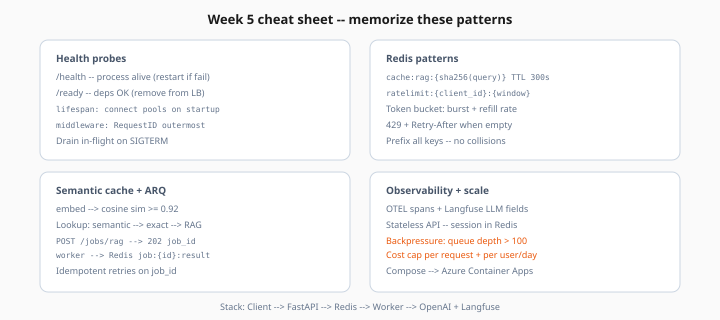

# Week 5 Interview Cheat Sheet

> [← README](../README.md) · [Concepts](concepts.md)



*Figure: One-page review — stack diagram, probe semantics, cache lookup order, and backpressure signals.*

## One-page review (30 min before interview)

### Stack at a glance

```
Client → FastAPI (stateless) → Redis (cache + rate + queue)
                              → Qdrant (vectors)
                              → Worker (ARQ) → OpenAI
                              → Langfuse (traces)
```

### Health probes

| Endpoint | Pass | Fail action |
|----------|------|-------------|
| `/health` | Process up | Restart pod |
| `/ready` | Redis/Qdrant OK | Remove from LB |

### Cache order

`semantic (embed + sim)` → `exact (hash)` → `RAG (full pipeline)`

### Redis keys

```
cache:rag:{hash}
semantic:entry:{uuid}
ratelimit:{client}:{window}
job:{id}:status / job:{id}:result
session:{session_id}
```

### Rate limit

Token bucket or sliding window → **429** + `Retry-After`

### Semantic cache

- Model: `text-embedding-3-small`
- Threshold: **0.92** default
- Risk: false positive → raise threshold + category scope

### ARQ flow

`POST → enqueue → 202 job_id → worker → Redis result → GET poll`

### Observability

- **Logs:** structlog JSON + `request_id`
- **Traces:** OTEL spans per step
- **Langfuse:** LLM prompts, tokens, cost, scores

### Cost formula (GPT-4o Mini illustrative)

```
cost = (input_tokens × $0.15/1M) + (output_tokens × $0.60/1M)
```

### Backpressure triggers

- Queue depth > max → **503**
- Daily budget exceeded → **402**
- OpenAI 429 → retry with backoff in worker

### Scale

- API: horizontal replicas (stateless)
- Worker: separate pool
- Redis: managed cluster in prod

### Azure path

Compose → ACR image → Container Apps (API external, worker internal) → Azure Cache for Redis

### Common mistakes (say these proactively)

- `localhost` Redis inside container → use service name
- Caching without TTL → stale answers
- Tracing `/health` → noise
- Non-idempotent job retry → double LLM cost

### Your Week 5 proof points

- [ ] `cache_report.json` semantic hit
- [ ] Langfuse trace screenshot
- [ ] `docker compose ps` healthy
- [ ] Load smoke p95 number
