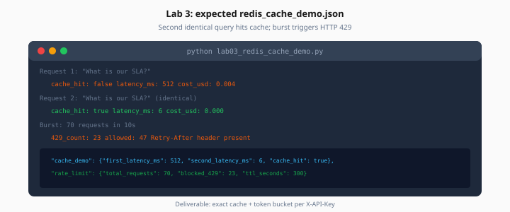

# Lab 3: Redis Cache and Rate Limits

> Week 5 Labs · [← README](README.md) · [Redis Theory](../theory/redis-patterns.md)

> **Learning path:** This file — specs only.  
> **Work dir:** `~/ai-learning/week-05-work/`

## Setup

```bash
cd ~/ai-learning/week-05-work
source .venv/bin/activate
docker compose -f production-ai-stack/docker-compose.yml up -d
```

**Estimated cost:** $0.01–0.05 (two RAG calls if no stub)

**Goal:** Second identical query returns `"cache_hit": true` in under 10ms; burst traffic triggers HTTP 429.



*Figure: First query misses cache; second identical query hits in ~6ms; burst triggers 429.*

---

## Task

1. Add `app/core/redis.py` — async Redis pool from lifespan
2. Add `app/services/exact_cache.py` — get/set with TTL 300s
3. Add `app/middleware/rate_limit.py` — token bucket per `X-API-Key` or IP
4. Wire cache into `POST /api/v1/rag/query` *(stub RAG OK: sleep 0.5s + fixed answer)*

Create `lab03_redis_cache_demo.py`:

```python
# Pseudocode flow
# 1. POST same query twice → record cache_hit, latency_ms
# 2. Fire 70 requests in 10s → count 429 responses
# 3. Write redis_cache_demo.json
```

### Expected output shape

```json
{
  "cache_test": {
    "query": "What is our SLA?",
    "first_call": {"cache_hit": false, "latency_ms": 520, "status": 200},
    "second_call": {"cache_hit": true, "latency_ms": 4, "status": 200}
  },
  "rate_limit_test": {
    "requests_sent": 70,
    "status_429_count": 8,
    "limit_per_minute": 60
  }
}
```

---

## Rate limit hint (sliding window)

```python
key = f"ratelimit:{client_id}:{minute_bucket}"
count = await redis.incr(key)
if count == 1:
    await redis.expire(key, 60)
if count > RATE_LIMIT_REQUESTS_PER_MINUTE:
    raise HTTPException(429, headers={"Retry-After": "60"})
```

---

## Acceptance

- [ ] Cache hit on second identical query
- [ ] At least one 429 under burst test
- [ ] `redis_cache_demo.json` in work dir

---

## Next

Mark [Day 3](../daily/day-03.md) done → [Day 4 playbook](../daily/day-04.md)
