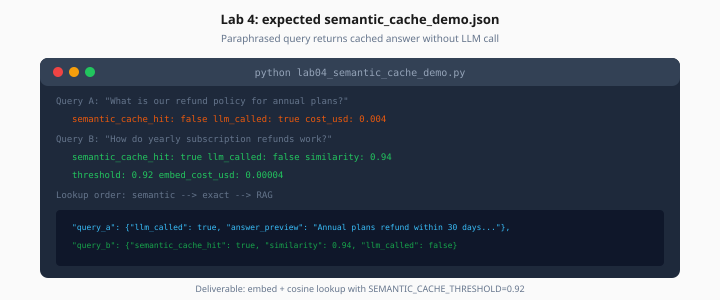

# Lab 4: Semantic Cache

> Week 5 Labs · [← README](README.md) · [Semantic Caching Theory](../theory/semantic-caching.md)

> **Learning path:** This file — specs only.  
> **Work dir:** `~/ai-learning/week-05-work/`

## Setup

```bash
cd ~/ai-learning/week-05-work
source .venv/bin/activate
# OPENAI_API_KEY required for embeddings
docker compose -f production-ai-stack/docker-compose.yml up -d
```

**Estimated cost:** $0.05–0.20 (embeddings + one LLM call)

**Goal:** Paraphrased query returns cached answer with `"semantic_cache_hit": true` and `"llm_called": false`.



*Figure: Query B paraphrases Query A — semantic hit at 0.94 with no LLM call on second request.*

---

## Task

Implement `app/services/semantic_cache.py`:

1. `embed(text)` — OpenAI `text-embedding-3-small`
2. `lookup(embedding)` — scan stored entries, return best if `similarity >= SEMANTIC_CACHE_THRESHOLD`
3. `store(embedding, query, response)` — persist to Redis

Integrate lookup order: semantic → exact → RAG.

Create `lab04_semantic_cache_demo.py` with query pair:

| Call | Query |
|------|-------|
| A | `What is our refund policy for annual plans?` |
| B | `How do yearly subscription refunds work?` |

### Expected output shape

```json
{
  "query_a": {
    "llm_called": true,
    "semantic_cache_hit": false,
    "answer_preview": "Annual plans refunded within 30..."
  },
  "query_b": {
    "llm_called": false,
    "semantic_cache_hit": true,
    "similarity_score": 0.945,
    "matched_query": "What is our refund policy for annual plans?",
    "answer_preview": "Annual plans refunded within 30..."
  },
  "threshold": 0.92
}
```

---

## Storage format (lab scale)

Redis key `semantic:entry:{uuid}`:

```json
{
  "query": "What is our refund policy...",
  "embedding": [0.012, -0.034, ...],
  "response": {"answer": "...", "citations": []},
  "created_at": "2026-07-25T12:00:00Z"
}
```

Maintain index set `semantic:ids` for scan. Prod: migrate to vector index.

---

## Acceptance

- [ ] Query B similarity ≥ threshold
- [ ] Query B does not call LLM
- [ ] Answers match (same `answer_preview`)
- [ ] `cache_report.json` written

---

## Next

Mark [Day 4](../daily/day-04.md) done → [Day 5 playbook](../daily/day-05.md)
