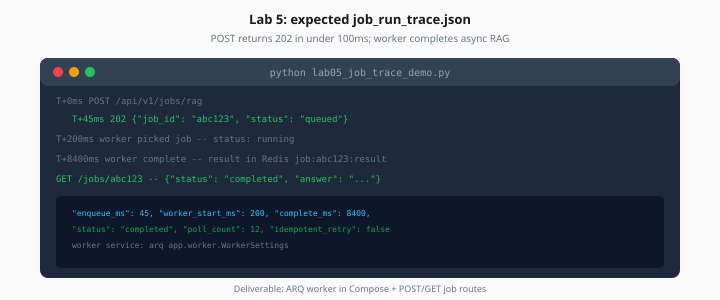

# Lab 5: Background Jobs with ARQ

> Week 5 Labs · [← README](README.md) · [Background Queues Theory](../theory/background-queues.md)

> **Learning path:** This file — specs only.  
> **Work dir:** `~/ai-learning/week-05-work/`

## Setup

```bash
cd ~/ai-learning/week-05-work
source .venv/bin/activate
docker compose -f production-ai-stack/docker-compose.yml up -d
# Must include worker service
```

**Estimated cost:** $0.01–0.05 per job

**Goal:** POST enqueue returns in < 100ms; worker completes job; GET status shows result.



*Figure: Enqueue in ~45ms; worker completes RAG async; client polls until status completed.*

---

## Task

1. Create `app/worker.py` with `WorkerSettings` and `run_rag_async`
2. Add `worker` service to Compose: `command: arq app.worker.WorkerSettings`
3. API routes:
   - `POST /api/v1/jobs/rag` → `202 {"job_id": "...", "status": "queued"}`
   - `GET /api/v1/jobs/{job_id}` → status + result when complete

Create `lab05_job_trace_demo.py`:

```python
# 1. POST job
# 2. Poll GET every 500ms until completed or 60s timeout
# 3. Record timestamps → job_run_trace.json
```

### Expected output shape

```json
{
  "job_id": "job_a1b2c3d4",
  "enqueued_at": "2026-07-25T14:00:00.100Z",
  "started_at": "2026-07-25T14:00:00.350Z",
  "completed_at": "2026-07-25T14:00:08.200Z",
  "duration_ms": 7850,
  "enqueue_latency_ms": 42,
  "status": "completed",
  "result_preview": "Based on the documents..."
}
```

---

## Worker skeleton

```python
async def run_rag_async(ctx, job_id: str, query: str, request_id: str | None = None):
    redis = ctx["redis"]
    await redis.set(f"job:{job_id}:status", "running")
    try:
        result = await rag_answer(query)  # reuse Week 3/4
        await redis.setex(f"job:{job_id}:result", 3600, json.dumps(result))
        await redis.set(f"job:{job_id}:status", "completed")
    except Exception as e:
        await redis.set(f"job:{job_id}:status", "failed")
        await redis.set(f"job:{job_id}:error", str(e))
        raise
```

---

## Acceptance

- [ ] Worker container running in Compose
- [ ] Job completes without blocking HTTP thread > 100ms on POST
- [ ] Idempotent: re-fetch completed job returns same result
- [ ] `job_run_trace.json` written

---

## Next

Mark [Day 5](../daily/day-05.md) done → [Day 6 playbook](../daily/day-06.md)
