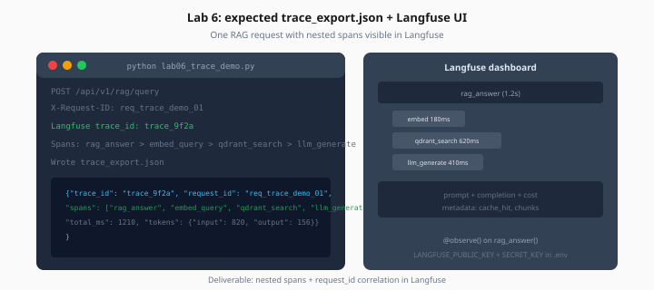

# Lab 6: OpenTelemetry + Langfuse

> Week 5 Labs · [← README](README.md) · [Observability Theory](../theory/observability.md)

> **Learning path:** This file — specs only.  
> **Work dir:** `~/ai-learning/week-05-work/`  
> **Optional:** Skip if behind — minimum Day 6 deliverable is Langfuse on one RAG route.

## Setup

```bash
cd ~/ai-learning/week-05-work
source .venv/bin/activate
# Add LANGFUSE_PUBLIC_KEY, LANGFUSE_SECRET_KEY to .env
docker compose -f production-ai-stack/docker-compose.yml up -d
```

**Estimated cost:** $0.01 (one traced RAG call) · Langfuse free tier

**Goal:** One RAG request appears in Langfuse with nested spans; `trace_export.json` captures trace ID and span names.



*Figure: One traced RAG request — rag_answer parent span with embed, retrieve, and generate children.*

---

## Task

1. Install and configure Langfuse SDK (see [requirements.txt](../requirements.txt))
2. Add `@observe()` to `rag_answer()` with child observations for embed, retrieve, generate
3. *(Optional)* FastAPI OTEL instrumentation exporting to `OTEL_EXPORTER_OTLP_ENDPOINT`
4. Pass `request_id` from middleware into Langfuse metadata

Create `lab06_trace_demo.py`:

```python
# 1. POST one RAG query with X-Request-ID header
# 2. Flush Langfuse client
# 3. Export trace metadata to trace_export.json
```

### Expected output shape

```json
{
  "request_id": "req_demo_001",
  "langfuse_trace_id": "trace_abc123",
  "trace_url_hint": "https://cloud.langfuse.com/project/.../traces/trace_abc123",
  "spans": [
    {"name": "rag_answer", "duration_ms": 920},
    {"name": "embed_query", "duration_ms": 150},
    {"name": "qdrant_search", "duration_ms": 45},
    {"name": "llm_generate", "duration_ms": 680}
  ],
  "total_latency_ms": 920,
  "metadata": {
    "cache_hit": false,
    "cost_usd": 0.0032,
    "model_id": "gpt-4o-mini"
  }
}
```

---

## Langfuse quick start

```python
from langfuse.decorators import observe, langfuse_context

@observe(name="llm_generate")
async def generate(prompt: str, chunks: list):
    response = await client.chat.completions.create(...)
    langfuse_context.update_current_observation(
        model="gpt-4o-mini",
        usage={"input": response.usage.prompt_tokens, "output": response.usage.completion_tokens},
    )
    return response
```

Ensure `langfuse_context.flush()` on shutdown (lifespan).

---

## Acceptance

- [ ] Trace visible in Langfuse UI
- [ ] At least 3 nested spans
- [ ] `request_id` in trace metadata
- [ ] `trace_export.json` written

---

## Next

Mark [Day 6](../daily/day-06.md) done → [Day 7 playbook](../daily/day-07.md)
