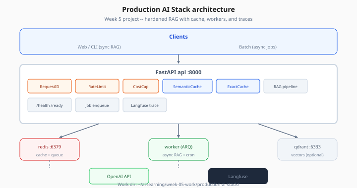
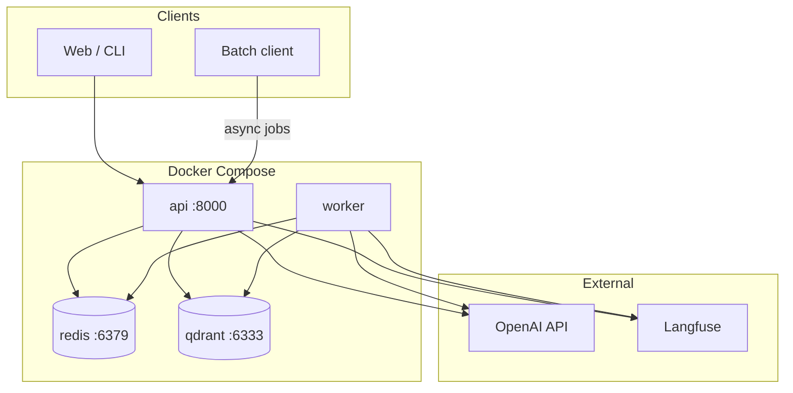

# Production AI Stack — Architecture

> Week 5 Project · [← Overview](overview.md) · [Backend](backend.md)

## System diagram



*Figure: Sync RAG hits middleware and cache layers; async jobs enqueue to ARQ worker via shared Redis.*



## Request path (sync RAG)

```
POST /api/v1/rag/query
  → RequestId middleware
  → Rate limit (Redis)
  → Cost estimate middleware
  → Semantic cache lookup
  → Exact cache lookup
  → RAG pipeline (embed → retrieve → generate)
  → Store caches
  → Langfuse trace flush
  → JSON response
```

## Async job path

```
POST /api/v1/jobs/rag → enqueue ARQ → 202 job_id
Worker dequeues → rag_answer() → Redis job:{id}:result
GET /api/v1/jobs/{id} → poll status
```

## Folder structure

```
production-ai-stack/
├── docker-compose.yml
├── .env                    # work dir only — never commit
├── backend/
│   ├── Dockerfile
│   ├── requirements.txt    # copy from week-05 curriculum
│   └── app/
│       ├── main.py
│       ├── worker.py
│       ├── core/
│       │   ├── config.py
│       │   ├── redis.py
│       │   └── logging.py
│       ├── middleware/
│       │   ├── request_id.py
│       │   ├── rate_limit.py
│       │   └── cost_cap.py
│       ├── services/
│       │   ├── exact_cache.py
│       │   ├── semantic_cache.py
│       │   └── rag_pipeline.py   # Week 3 carry-over
│       ├── routes/
│       │   ├── health.py
│       │   ├── rag.py
│       │   └── jobs.py
│       └── schemas/
│           └── rag.py
└── tests/
    └── load_smoke.py       # Locust file
```

## Service responsibilities

| Service | Responsibility | Scales by |
|---------|----------------|-----------|
| **api** | HTTP, cache read, enqueue | Horizontal replicas |
| **worker** | Long RAG, reindex cron | Worker count |
| **redis** | Cache, rate limit, ARQ broker, job status | Vertical / managed Redis |
| **qdrant** | Vector retrieval | Qdrant cluster *(optional)* |

## Environment matrix

| Variable | Used by | Example |
|----------|---------|---------|
| `REDIS_URL` | api, worker | `redis://redis:6379/0` |
| `OPENAI_API_KEY` | api, worker | secret |
| `LANGFUSE_*` | api, worker | secret |
| `SEMANTIC_CACHE_THRESHOLD` | api | `0.92` |
| `MAX_COST_USD_PER_REQUEST` | api | `0.10` |

## Next

[Backend modules](backend.md) · [Docker Compose](docker.md)
