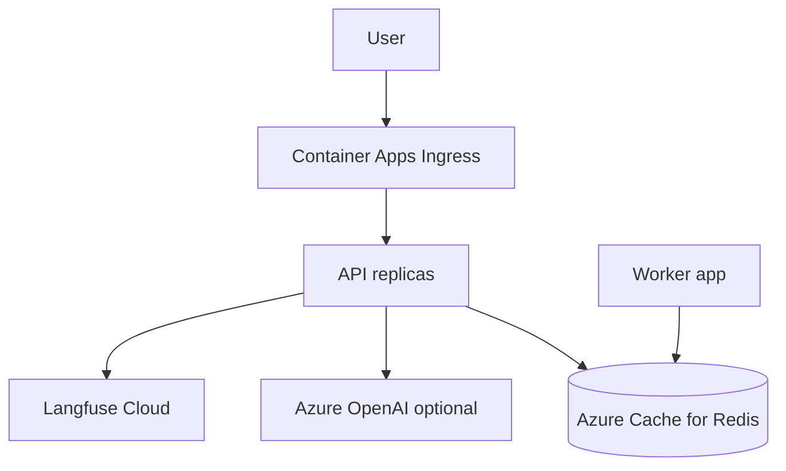

# Azure Deployment — Container Apps Path

> Week 5 Theory · Day 7 · **Optional** — not required for Week 5 exit · [← README](../README.md) · [Scaling & Cost](scaling-cost-backpressure.md)

Your Docker Compose stack maps cleanly to **Azure Container Apps** — managed containers with scale rules, internal networking, and no Kubernetes YAML unless you want it.

---

## Concepts

### What problem are we solving?

`docker compose up` proves the architecture locally. To demo to a hiring manager or run a pilot, you need a **URL on the internet** with HTTPS, secrets in a vault, and scale-to-zero for cost control — without operating a full Kubernetes cluster on day one.

### Worked scenario: Compose → Container Apps mapping

| Compose service | Container Apps resource |
|-----------------|-------------------------|
| `api` | Container App `production-ai-api` (ingress external) |
| `worker` | Container App `production-ai-worker` (ingress internal, min replicas 1) |
| `redis` | Azure Cache for Redis *(managed)* or Redis container in dev |
| `qdrant` | Azure Container Apps or Qdrant Cloud |

Environment variables from `.env` → Container Apps **secrets** + **env vars** references.

### Deployment path (high level)

```bash
# Prerequisites: az login, containerapp extension
az group create -n rg-production-ai -l eastus

az containerapp env create \
  -n cae-production-ai -g rg-production-ai -l eastus

# Build and push image to ACR
az acr build -r acrproductionai -t production-ai-api:latest ./backend

az containerapp create \
  -n production-ai-api -g rg-production-ai \
  --environment cae-production-ai \
  --image acrproductionai.azurecr.io/production-ai-api:latest \
  --target-port 8000 --ingress external \
  --min-replicas 1 --max-replicas 5 \
  --env-vars REDIS_URL=secretref:redis-url \
  --secrets redis-url="$REDIS_URL"
```

Exact commands in [project/azure.md](../project/azure.md).

### Scale rules (HTTP concurrency)

```yaml
# conceptual — az containerapp update --scale-rule-name http-scale
rules:
  - name: http-concurrency
    http:
      metadata:
        concurrentRequests: "50"
```

When concurrent requests > 50, Azure adds API replicas — same stateless pattern as theory.

### Optional Kubernetes (AKS) depth

**Optional — not required for Week 5 exit.**

Use AKS when you need:

- Custom sidecars (Envoy, service mesh)
- GPU node pools for self-hosted models
- Fine-grained PodDisruptionBudgets across many teams

For Week 5 deliverable, Container Apps is enough. AKS mapping:

| Compose | Kubernetes |
|---------|------------|
| `api` service | Deployment + Service + Ingress |
| `worker` | Deployment (no Service) |
| healthcheck | livenessProbe + readinessProbe |
| `depends_on` | init containers or startup probes |

### AI engineer takeaway

Lead interviews with **Container Apps for speed**, mention **AKS when org already standardizes on K8s**. Same containers from Compose — different orchestrator.

---

## Architecture



---

## Tradeoffs

| | Container Apps | AKS |
|---|----------------|-----|
| **Ops burden** | Low | High |
| **Scale rules** | Built-in HTTP/Kafka | HPA + custom metrics |
| **Cost at idle** | Scale to zero possible | Nodes always cost |
| **Week 5 fit** | **Recommended optional path** | Stretch reading |

---

## Best Practices

1. **Managed Redis** in Azure — persistence and SLA beat container Redis
2. **Key Vault** for OpenAI and Langfuse secrets
3. **Health probes** match `/health` and `/ready` from Week 5 API
4. **Tear down resource group** after demo — avoid orphaned spend
5. **Same image tag** locally and in cloud — CI builds once

---

## Common Mistakes

| Symptom | Cause | Fix |
|---------|-------|-----|
| API cannot reach Redis | Public Redis URL blocked | VNet integration + private endpoint |
| Cold start 30s | Scale to zero + heavy import | min replicas=1 for demos |
| Secrets in image | Baked `.env` in Dockerfile | Container Apps secrets |
| Worker not processing | Wrong Redis URL between apps | Shared secret ref |

---

## Checkpoint

1. What Azure service replaces Compose `api` with HTTPS ingress?
2. Why use Azure Cache for Redis instead of Redis in a container?
3. Name one reason to choose AKS over Container Apps.
4. What probes map to Week 5 `/health` and `/ready`?
5. Is Azure deploy required for Week 5 exit?

---

## Go Deeper

| Resource | Why |
|----------|-----|
| [Azure Container Apps docs](https://learn.microsoft.com/azure/container-apps/) | Official deploy guide |
| [AKS Automatic overview](https://learn.microsoft.com/azure/aks/aks-automatic-overview) | Optional K8s path |

---

## Next

**Project:** [azure.md](../project/azure.md) · **Capstone:** [Day 7 playbook](../daily/day-07.md) · [acceptance criteria](../project/acceptance-criteria.md)
