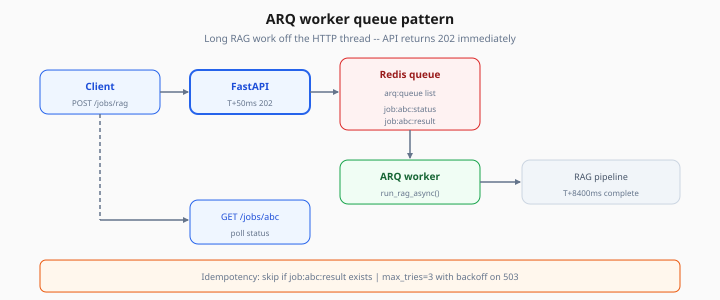
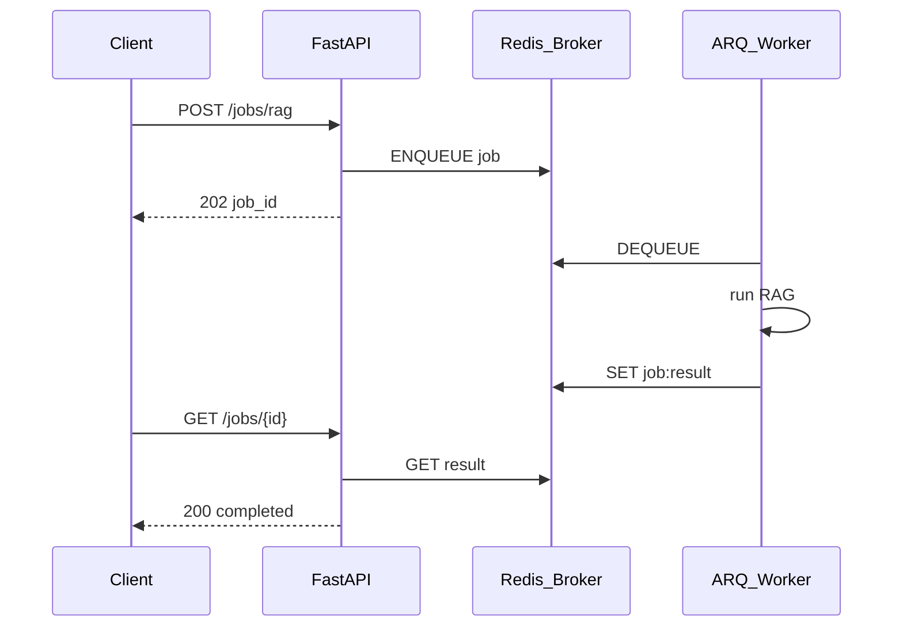

# Background Queues (ARQ Pattern)

> Week 5 Theory · Day 5 · [← README](../README.md) · [Semantic Caching](semantic-caching.md) · [Observability](observability.md)

Some AI work takes too long for a single HTTP request — re-indexing 10,000 documents, running multi-step agent research, or batch evaluation. **Background queues** move that work to worker processes while the API returns immediately.

---

## Concepts

### What problem are we solving?

User submits: *"Analyze all Q3 support tickets and summarize themes."*

- Synchronous API: client waits 4 minutes → timeouts, broken mobile apps, angry users
- Queue pattern: API returns `{ "job_id": "job_7x9k" }` in 50ms → worker runs 4 min → client polls or gets webhook

### Worked scenario: async RAG timeline

```
T+0ms     POST /api/v1/jobs/rag  {"query": "..."}
T+45ms    API enqueues ARQ job → Redis list
T+50ms    Response 202 {"job_id": "abc", "status": "queued"}

T+200ms   Worker picks job from Redis
T+250ms   Worker status → "running"
T+8400ms  RAG complete → result stored Redis job:abc
T+8500ms  GET /jobs/abc → {"status": "completed", "answer": "..."}
```

User sees progress; API thread never blocked 8 seconds.



*Figure: API returns 202 in ~50ms; worker processes RAG off the HTTP thread while client polls job status.*

### ARQ vs Celery (Week 5 picks ARQ)

| | ARQ | Celery |
|---|-----|--------|
| **Async native** | Built on asyncio + Redis | Sync-first; async extra setup |
| **FastAPI fit** | Same event loop patterns | Separate worker pool common |
| **Features** | Jobs, retries, cron | Ecosystem, chains, many brokers |
| **Week 5 choice** | **Default** | Optional — document if you know it |

Celery is fine in enterprise Python shops — the **pattern** (enqueue, worker, status store) is what interviews test.

### ARQ job definition

```python
from arq import cron
from arq.connections import RedisSettings

async def run_rag_async(ctx, job_id: str, query: str):
    redis = ctx["redis"]
    await redis.set(f"job:{job_id}:status", "running")
    result = await rag_pipeline(query)  # your Week 3 code
    await redis.setex(f"job:{job_id}:result", 3600, json.dumps(result))
    await redis.set(f"job:{job_id}:status", "completed")

class WorkerSettings:
    functions = [run_rag_async]
    redis_settings = RedisSettings.from_dsn(os.environ["REDIS_URL"])
    on_startup = startup
    cron_jobs = [
        cron(reindex_documents, hour=3, minute=0)  # 03:00 daily
    ]
```

Run worker: `arq app.worker.WorkerSettings`

### Idempotency and retries

**Problem:** Worker crashes after LLM call but before marking complete → retry doubles cost.

**Fix:** Idempotency key per `job_id`:

```python
if await redis.get(f"job:{job_id}:result"):
    return  # already done
```

ARQ `max_tries=3` with exponential backoff for transient OpenAI 503 errors.

### Dead letter pattern

After max retries, move job metadata to `job:{id}:failed` with error stack — ops can replay manually.

### AI engineer takeaway

Queues decouple **acceptance latency** from **processing duration**. Always expose job status and propagate `request_id` → `job_id` in logs and Langfuse.

---

## Architecture



---

## Tradeoffs

| Pattern | Pros | Cons |
|---------|------|------|
| Sync RAG in API | Simple | Timeouts under load |
| ARQ + Redis | Lightweight, asyncio | Redis single point of failure |
| Separate queue (SQS, Service Bus) | Managed durability | More cloud setup |

---

## Best Practices

1. **Return 202 Accepted** for async endpoints — not 200 with empty body
2. **Store job status in Redis** — `queued | running | completed | failed`
3. **TTL on results** — auto-expire after 1h unless user saves
4. **Limit concurrency** — `max_jobs=5` per worker to protect OpenAI quota
5. **Cron for reindex** — off-peak embedding refresh

---

## Common Mistakes

| Symptom | Cause | Fix |
|---------|-------|-----|
| Jobs never run | Worker not in Compose | Add `worker` service |
| Duplicate LLM charges | Non-idempotent retry | Check result key before work |
| Redis OOM | Unbounded job results | TTL + max payload size |
| Lost trace context | job_id not in logs | Pass request_id into job payload |

---

## Checkpoint

1. Why return `job_id` immediately instead of blocking?
2. What broker does ARQ use in Week 5?
3. Name one idempotency strategy for retried jobs.
4. When would you use a cron job vs on-demand enqueue?
5. ARQ vs Celery — one reason to pick each?

---

## Go Deeper

| Resource | Why |
|----------|-----|
| [ARQ documentation](https://arq-docs.helpmanual.io/) | Official worker setup |
| [Celery docs](https://docs.celeryq.dev/) | Optional comparison |

---

## Next

**Lab:** [Lab 5 — Background jobs](../labs/lab-05-background-jobs.md) → mark [Day 5](../daily/day-05.md) done → **[Day 6 playbook](../daily/day-06.md)** → [observability.md](observability.md)
