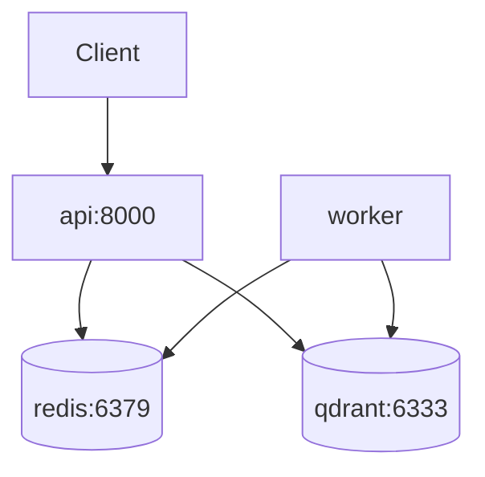

# Docker Compose Multi-Service

> Week 5 Theory · Day 2 · [← README](../README.md) · [FastAPI Production](fastapi-production.md) · [Redis Patterns](redis-patterns.md)

Docker Compose lets you run your **API, Redis, background worker, and vector database** with one command — the same topology you will later deploy to Azure Container Apps or Kubernetes, but on your laptop.

---

## Concepts

### What problem are we solving?

Week 3 RAG ran as `uvicorn` on localhost and you started Redis manually (or forgot). Production AI stacks are **multi-process**: the HTTP server, cache, queue broker, and worker are separate containers with explicit dependencies and health gates.

### Worked scenario: cold start Monday morning

```bash
cd production-ai-stack
docker compose up -d --build
# Expected within ~30s:
#   api      healthy  :8000
#   redis    healthy  :6379
#   worker   running  (no HTTP port)
#   qdrant   healthy  :6333  (optional Week 3 carry-over)
```

If `api` marks itself `healthy` before Redis accepts connections, the first RAG request crashes — Compose **healthchecks** and `depends_on: condition: service_healthy` prevent that.

### Service graph (Production AI Stack)



### Minimal compose excerpt

```yaml
services:
  redis:
    image: redis:7-alpine
    healthcheck:
      test: ["CMD", "redis-cli", "ping"]
      interval: 5s
      timeout: 3s
      retries: 5

  api:
    build: ./backend
    ports: ["8000:8000"]
    env_file: .env
    depends_on:
      redis:
        condition: service_healthy
    healthcheck:
      test: ["CMD", "curl", "-f", "http://localhost:8000/health"]
      interval: 10s
      timeout: 5s
      retries: 3
```

### Environment variables: three layers

| Layer | Example | Committed? |
|-------|---------|------------|
| `.env.example` | `REDIS_URL=redis://redis:6379/0` | Yes (placeholders) |
| `.env` | Real API keys | **Never** |
| Compose `environment:` | Override for container DNS (`redis` not `localhost`) | In repo OK without secrets |

Inside Docker, `REDIS_URL=redis://redis:6379/0` — hostname is the **service name**, not `localhost`.

### AI engineer takeaway

Treat Compose as **executable architecture documentation**. Interviewers ask "draw the production diagram" — your `docker-compose.yml` is the answer.

---

## Tradeoffs

| Approach | Pros | Cons |
|----------|------|------|
| Single container (API + worker) | Simpler | Cannot scale worker independently |
| Multi-service Compose | Matches prod topology | More moving parts locally |
| `docker compose watch` | Hot reload dev | Not identical to prod image |

---

## Best Practices

1. **Healthchecks on every critical service** — api, redis, qdrant
2. **Non-root user in Dockerfile** — `USER appuser` after copy
3. **Multi-stage build** — slim runtime image without build tools
4. **Named volumes** for Redis/Qdrant if you need data across restarts during dev
5. **`.dockerignore`** — exclude `.venv`, `__pycache__`, `.git`

---

## Common Mistakes

| Symptom | Cause | Fix |
|---------|-------|-----|
| API cannot reach Redis | `localhost` in `REDIS_URL` inside container | Use service name `redis` |
| Worker never starts jobs | Separate Redis DB index mismatch | Same `REDIS_URL` for api and worker |
| Slow rebuilds | No layer cache for `pip install` | Copy `requirements.txt` before app code |
| Healthcheck always failing | `curl` not in slim image | Use `wget` or Python one-liner |

---

## Checkpoint

1. Why use `depends_on: condition: service_healthy` instead of plain `depends_on`?
2. What hostname does the API use for Redis inside Compose?
3. Name two services beyond `api` required for Week 5 exit criteria.
4. What belongs in `.env` vs `.env.example`?
5. What is the difference between a container **running** and **healthy**?

---

## Go Deeper

| Resource | Why |
|----------|-----|
| [Compose specification](https://docs.docker.com/compose/compose-file/) | Full reference |
| [Docker multi-stage builds](https://docs.docker.com/build/building/multi-stage/) | Smaller API images |

---

## Next

**Lab:** [Lab 2 — Docker Compose](../labs/lab-02-docker-compose.md) → mark [Day 2](../daily/day-02.md) done → **[Day 3 playbook](../daily/day-03.md)** → [redis-patterns.md](redis-patterns.md)
