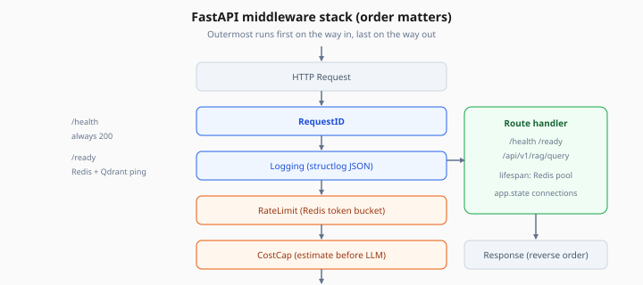
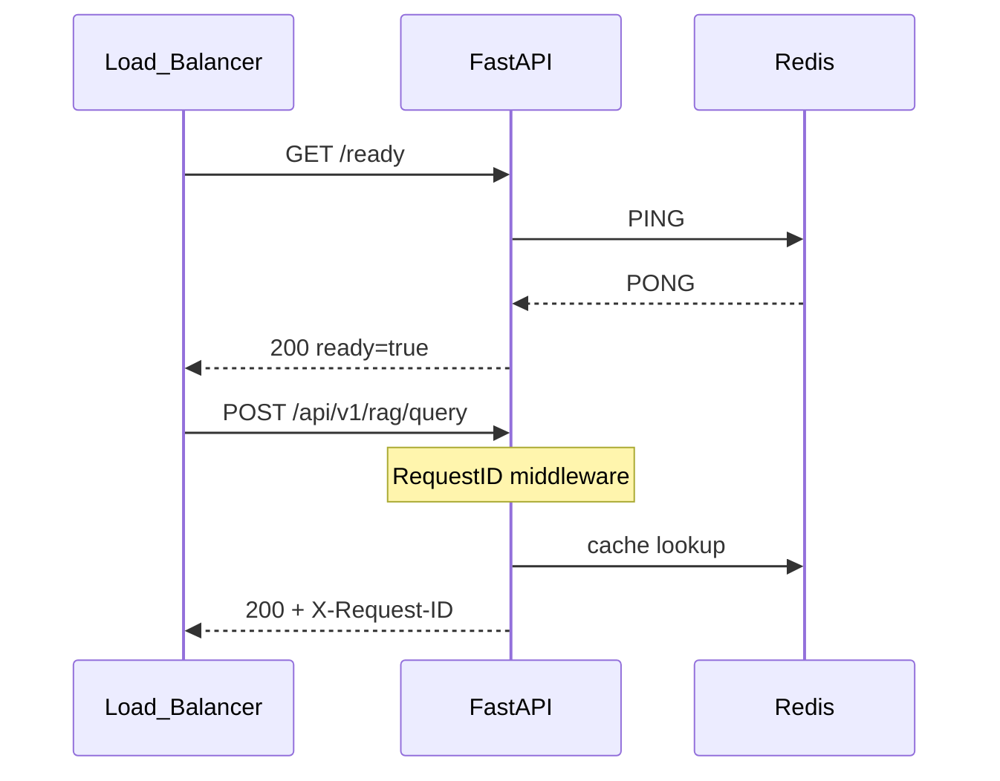

# FastAPI Production Patterns

> Week 5 Theory · Day 1 · [← README](../README.md) · [Docker Compose](docker-compose.md)

Week 1 gave you a working FastAPI app. Production means the service **starts cleanly, shuts down without dropping requests, tells load balancers when it is safe to receive traffic, and logs enough context to debug incidents at 2 a.m.**

---

## Concepts

### What problem are we solving?

A demo API runs until you Ctrl+C. A production API must:

- Connect to Redis, DB, and vector stores on startup — and release connections on shutdown
- Answer **"Are you alive?"** vs **"Can you serve traffic?"** differently
- Attach a **request ID** to every log line so you can trace one user complaint through the stack

### Worked scenario: deploy during traffic

```
09:00:00  Load balancer sends traffic to v1 pods
09:00:05  You deploy v2 — new pods start lifespan hook
09:00:06  v2 /ready returns 503 (Redis not connected yet)
09:00:08  v2 /ready returns 200 — LB adds v2 to pool
09:00:10  v1 receives SIGTERM — lifespan shutdown drains in-flight requests
09:00:15  v1 exits; no 502 errors in user-facing metrics
```

Without lifespan shutdown and `/ready`, users see random 502s during every deploy.

### Lifespan (startup / shutdown)

```python
from contextlib import asynccontextmanager
from fastapi import FastAPI

@asynccontextmanager
async def lifespan(app: FastAPI):
    app.state.redis = await create_redis_pool()  # startup
    yield
    await app.state.redis.close()                # shutdown

app = FastAPI(lifespan=lifespan)
```

**AI engineer takeaway:** Put connection pools in `app.state`, not global variables — tests can inject fakes.

### Health vs readiness

| Endpoint | Question | Typical checks | LB behavior |
|----------|----------|----------------|-------------|
| `GET /health` | Is the process running? | Return 200 if event loop alive | Restart pod if fails |
| `GET /ready` | Can this instance serve requests? | Redis ping, Qdrant ping, model API reachable | Remove from rotation if fails |

Sample `/ready` response when Redis is down:

```json
{
  "ready": false,
  "checks": {
    "redis": "connection refused",
    "qdrant": "ok"
  }
}
```

### Middleware stack (order matters)



*Figure: Outermost middleware runs first on the way in — RequestID before rate limits so every log line shares the same ID.*

Outermost runs first on the way **in**, last on the way **out**:

```
Request → RequestID → Logging → RateLimit → CostCap → Route handler → Response
```

Request ID middleware example — every log line includes the same ID:

```python
import uuid
from starlette.middleware.base import BaseHTTPMiddleware

class RequestIdMiddleware(BaseHTTPMiddleware):
    async def dispatch(self, request, call_next):
        request_id = request.headers.get("X-Request-ID", str(uuid.uuid4()))
        request.state.request_id = request_id
        response = await call_next(request)
        response.headers["X-Request-ID"] = request_id
        return response
```

### Structured logging

Plain `print()` breaks log aggregation. Use JSON logs with consistent fields:

```json
{
  "event": "rag_request_complete",
  "request_id": "a1b2c3d4",
  "latency_ms": 842,
  "cache_hit": false,
  "cost_usd": 0.0031,
  "level": "info"
}
```

Tools like Datadog, Azure Monitor, or CloudWatch can filter on `request_id` instantly.

---

## Architecture



---

## Tradeoffs

| Pattern | Pros | Cons |
|---------|------|------|
| Lifespan hooks | Clean pool management | Must handle partial startup failure |
| Separate `/ready` | Safe rolling deploys | More endpoints to monitor |
| JSON structlog | Searchable logs | Slightly noisier local dev |
| Sync middleware | Simple | Blocks event loop if you call sync I/O |

---

## Best Practices

1. **Fail `/ready` loudly** — return which dependency failed, not just `503`
2. **Timeout dependency checks** — Redis hang should not block readiness forever (2s cap)
3. **Propagate `X-Request-ID`** to worker jobs and Langfuse traces
4. **Version endpoint** — `GET /version` with git SHA helps incident correlation

---

## Common Mistakes

| Symptom | Cause | Fix |
|---------|-------|-----|
| 502 during deploy | No connection draining | Use lifespan shutdown + LB preStop hook |
| Logs impossible to correlate | No request ID | Middleware on every route |
| `/health` checks Redis | LB kills pod when Redis blips | Move dependency checks to `/ready` only |
| Global Redis client | Tests flaky, reload breaks | `app.state` via lifespan |

---

## Checkpoint

1. What is the difference between `/health` and `/ready`?
2. Why put Redis pool creation in lifespan instead of import time?
3. In what order does middleware run for an incoming request?
4. Name three fields you would log on every RAG request for incident debug.
5. What HTTP status should `/ready` return when Qdrant is unreachable?

---

## Go Deeper

| Resource | Why |
|----------|-----|
| [FastAPI lifespan events](https://fastapi.tiangolo.com/advanced/events/) | Official pattern |
| [Kubernetes probes](https://kubernetes.io/docs/tasks/configure-pod-container/configure-liveness-readiness-startup-probes/) | Maps to `/health` and `/ready` |
| [structlog](https://www.structlog.org/) | Production JSON logging |

---

## Next

**Lab:** [Lab 1 — FastAPI production](../labs/lab-01-fastapi-production.md) → mark [Day 1](../daily/day-01.md) done → **[Day 2 playbook](../daily/day-02.md)** → [docker-compose.md](docker-compose.md)
