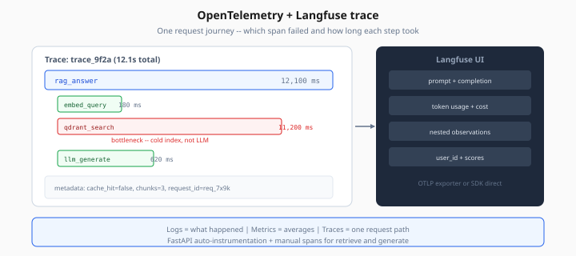
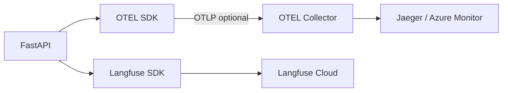

# Observability — OpenTelemetry + Langfuse

> Week 5 Theory · Day 6 · [← README](../README.md) · [Background Queues](background-queues.md) · [Scaling & Cost](scaling-cost-backpressure.md)

When a user says "the bot gave a wrong answer yesterday," you need **traces** — not just logs — to see retrieval chunks, model choice, latency, and cost for that exact request. Week 5 wires **OpenTelemetry** (distributed tracing standard) and **Langfuse** (LLM-specific trace UI).

---

## Concepts

### What problem are we solving?

Production AI failures are multi-step:

```
Embed query → Redis cache miss → Qdrant retrieve (3 chunks) → GPT-4o Mini generate
```

A single log line `"RAG error"` tells you nothing. Traces show **which span** failed and how long each step took.

### Three pillars (plain English)

| Pillar | Question | Week 5 tool |
|--------|----------|-------------|
| **Logs** | What happened in text? | structlog JSON |
| **Metrics** | How many / how fast on average? | Prometheus-style counters *(stretch)* |
| **Traces** | One request's full journey? | OpenTelemetry + Langfuse |

### Worked scenario: debug high latency

User report: *"Answer took 12 seconds."*

Langfuse trace `trace_9f2a`:

| Span | Duration |
|------|----------|
| `rag_answer` | 12,100 ms |
| ↳ `embed_query` | 180 ms |
| ↳ `qdrant_search` | 11,200 ms ← **bottleneck** |
| ↳ `llm_generate` | 620 ms |

Action: Qdrant index not loaded / cold start — not an LLM problem.



*Figure: Nested spans reveal which step failed — here qdrant_search dominates, not llm_generate.*

### OpenTelemetry basics

- **Trace** — one end-to-end request (has `trace_id`)
- **Span** — one operation inside a trace (has `span_id`, parent link)
- **Exporter** — sends spans to backend (OTLP HTTP → collector or Langfuse)

FastAPI auto-instrumentation creates `HTTP POST /api/v1/rag/query` span; you add child spans manually.

```python
from opentelemetry import trace

tracer = trace.get_tracer(__name__)

async def retrieve_chunks(query: str):
    with tracer.start_as_current_span("qdrant_search") as span:
        span.set_attribute("query.length", len(query))
        chunks = await qdrant.search(...)
        span.set_attribute("chunks.count", len(chunks))
        return chunks
```

### Langfuse for LLM calls

Langfuse adds LLM-native fields: prompt, completion, token usage, cost, scores.

```python
from langfuse.decorators import observe, langfuse_context

@observe(name="rag_answer")
async def rag_answer(query: str, user_id: str):
    langfuse_context.update_current_trace(user_id=user_id)
    chunks = await retrieve_chunks(query)
    response = await llm.generate(query, chunks)
    langfuse_context.update_current_observation(
        metadata={"cache_hit": False, "chunks": len(chunks)}
    )
    return response
```

One `@observe` trace shows nested retrieval + generation with dollar cost.

### Correlating request ID → trace

Middleware sets `request_id` → pass to Langfuse:

```python
langfuse_context.update_current_trace(
    session_id=session_id,
    metadata={"request_id": request.state.request_id}
)
```

Search Langfuse by `request_id` when user emails support.

### AI engineer takeaway

Observability is Week 6 eval's foundation — you cannot improve what you cannot measure. Ship Langfuse traces in the Week 5 capstone demo.

---

## Architecture



---

## Tradeoffs

| Approach | Pros | Cons |
|----------|------|------|
| Logs only | Simple | No latency breakdown |
| OTEL only | Vendor-neutral | Weak LLM prompt UI |
| Langfuse only | Great LLM UX | Less infra span detail |
| OTEL + Langfuse | Best of both | Two SDKs to configure |

Week 5: **Langfuse required**; OTEL recommended for HTTP spans.

---

## Best Practices

1. **Span per expensive step** — embed, retrieve, generate, cache lookup
2. **Never log full prompts with PII** in production — use Langfuse scrubbing or hash
3. **Sample high-volume health checks** — don't trace `/health`
4. **Attach cache_hit, cost_usd, model_id** on root span metadata
5. **Same trace across worker** — pass `trace_id` in ARQ job payload

---

## Common Mistakes

| Symptom | Cause | Fix |
|---------|-------|-----|
| Empty Langfuse dashboard | Wrong `LANGFUSE_HOST` or keys | Verify `.env`, flush on shutdown |
| Traces disconnected from HTTP | Missing `@observe` on entry | Decorate route handler |
| Span explosion | Tracing every cache GET | Sample or skip fast paths |
| PII in traces | Logging raw user query | Redact or use user hash |

---

## Checkpoint

1. Difference between a log and a trace?
2. Name three spans in a typical RAG trace.
3. What Langfuse adds beyond generic OTEL for LLM apps?
4. How do you link a user complaint email to a trace?
5. Why not trace `/health` at 100% sample rate?

---

## Go Deeper

| Resource | Why |
|----------|-----|
| [Langfuse FastAPI integration](https://langfuse.com/docs/integrations/fastapi) | Setup guide |
| [OpenTelemetry Python](https://opentelemetry.io/docs/languages/python/) | Instrumentation reference |
| [Week 6 eval preview](../../prompt.md) | Langfuse + RAGAS pipeline |

---

## Next

**Lab:** [Lab 6 — Observability](../labs/lab-06-observability.md) → mark [Day 6](../daily/day-06.md) done → **[Day 7 playbook](../daily/day-07.md)** → [scaling-cost-backpressure.md](scaling-cost-backpressure.md)
