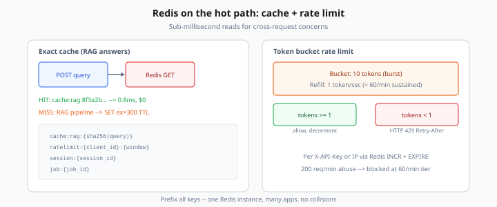
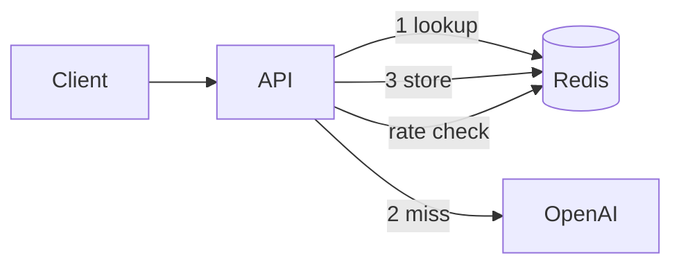

# Redis Patterns for AI Services

> Week 5 Theory · Day 3 · [← README](../README.md) · [Docker Compose](docker-compose.md) · [Semantic Caching](semantic-caching.md)

Redis is an in-memory data store fast enough to sit **on the hot path** of every RAG request — for caching answers, enforcing rate limits, and holding short-lived session state.

---

## Concepts

### What problem are we solving?

Without Redis:

- Identical RAG queries re-run retrieval + LLM ($0.003 each × 10,000/day = real money)
- One abusive client can exhaust your OpenAI quota in minutes
- Stateless APIs cannot remember conversation context without hitting Postgres every turn

Redis gives you **sub-millisecond reads** for these cross-request concerns.

### Worked scenario: repeat FAQ bot

```
Request 1: "What is our SLA?"  → cache MISS → LLM $0.004 → store key cache:rag:8f3a2b...
Request 2: "What is our SLA?"  → cache HIT  → Redis 0.8ms → $0.000
Request 3: (same, 6 minutes later, TTL=300s) → cache MISS again
```

Exact cache keys use a hash of normalized query text. Semantic cache (Day 4) handles paraphrases.



*Figure: Cache hits return in sub-millisecond; token bucket blocks abuse with HTTP 429 and Retry-After.*

### Key naming convention

```
cache:rag:{sha256(normalized_query)}     → JSON LLM response
ratelimit:{client_id}:{window}           → integer counter
session:{session_id}                       → JSON conversation state
job:{job_id}                             → async job result
semantic:vectors                         → embedding index (Day 4)
```

Prefix everything — one Redis instance, many apps, no collisions.

### Exact cache implementation sketch

```python
import hashlib, json

def cache_key(query: str) -> str:
    normalized = query.strip().lower()
    digest = hashlib.sha256(normalized.encode()).hexdigest()[:16]
    return f"cache:rag:{digest}"

async def get_cached(redis, query: str):
    raw = await redis.get(cache_key(query))
    return json.loads(raw) if raw else None

async def set_cached(redis, query: str, response: dict, ttl: int = 300):
    await redis.set(cache_key(query), json.dumps(response), ex=ttl)
```

### Rate limiting: token bucket

**Problem:** User sends 200 requests/minute; OpenAI tier allows 60.

```
Bucket capacity: 10 tokens (burst)
Refill rate: 1 token per second (= 60/minute sustained)

Request arrives → try consume 1 token
  tokens >= 1  → allow, decrement
  tokens < 1   → HTTP 429 Retry-After: 1
```

Redis `INCR` + `EXPIRE` or Lua script for atomic token bucket.

### Session store

For multi-turn RAG chat, store last N turns in Redis:

```json
{
  "session_id": "sess_abc123",
  "turns": [
    {"role": "user", "content": "Summarize doc X"},
    {"role": "assistant", "content": "..."}
  ],
  "updated_at": "2026-07-25T10:00:00Z"
}
```

TTL 24h — auto-expire abandoned sessions. Postgres remains source of truth for audit; Redis is **fast ephemeral state**.

### AI engineer takeaway

Redis is not "optional caching" in production AI — it is the **coordination layer** for rate limits, job status, semantic index, and session state at scale.

---

## Architecture



---

## Tradeoffs

| Pattern | Pros | Cons |
|---------|------|------|
| Exact cache | Simple, zero false positives | Misses paraphrases |
| Redis session | Fast reads | Lost on flush unless persisted |
| Token bucket | Smooth burst handling | Slightly complex Lua |
| In-process cache | No network hop | Not shared across API replicas |

---

## Best Practices

1. **Always set TTL** on cache keys — stale RAG answers poison UX
2. **Normalize before hash** — lowercase, strip whitespace
3. **Cache the full response envelope** — text + citations + token counts
4. **Separate Redis DB index** for ARQ (broker) vs cache if you want isolation — e.g. `/0` cache, `/1` queue
5. **Monitor memory** — `maxmemory-policy allkeys-lru` in prod

---

## Common Mistakes

| Symptom | Cause | Fix |
|---------|-------|-----|
| Cache never hits | Different whitespace per request | Normalize input |
| Rate limit too aggressive | Shared IP for corporate NAT | Key by API key not IP |
| Huge Redis memory | Caching raw PDF chunks | Cache final answers only |
| Stale policy answers | No TTL | Set `ex=300` or invalidate on doc update |

---

## Checkpoint

1. Write the Redis key for query `"  What is SLA?  "` after normalization.
2. Why use TTL on cache entries?
3. What HTTP status for rate limit exceeded?
4. Exact cache vs semantic cache — one tradeoff each.
5. Why store sessions in Redis instead of only Postgres?

---

## Go Deeper

| Resource | Why |
|----------|-----|
| [Redis rate limiting patterns](https://redis.io/docs/latest/develop/use/patterns/rate-limiting/) | Official recipes |
| [redis-py asyncio](https://redis.readthedocs.io/en/stable/examples/asyncio_examples.html) | FastAPI integration |

---

## Next

**Lab:** [Lab 3 — Redis](../labs/lab-03-redis.md) → mark [Day 3](../daily/day-03.md) done → **[Day 4 playbook](../daily/day-04.md)** → [semantic-caching.md](semantic-caching.md)
