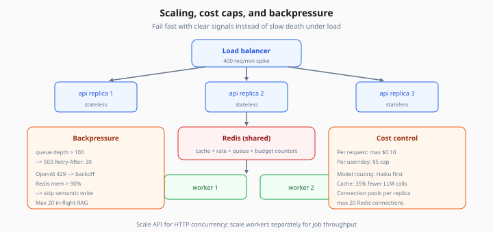
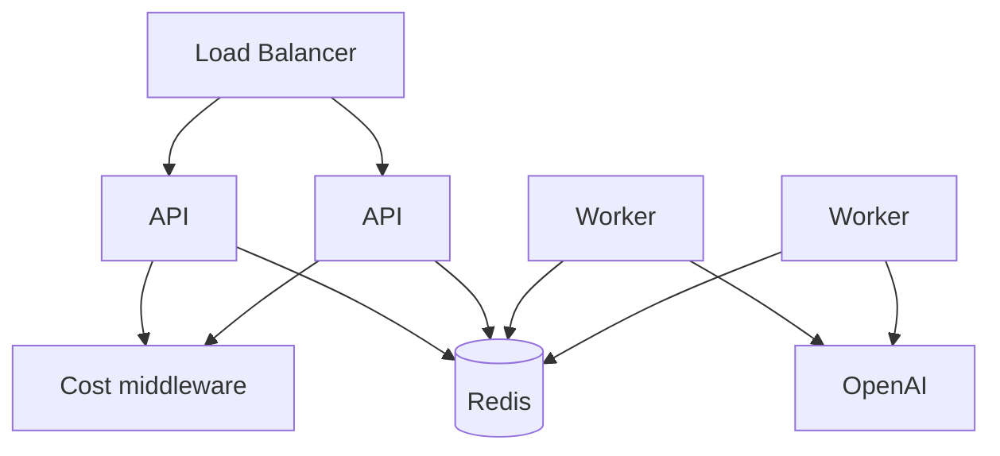

# Scaling, Cost Control, and Backpressure

> Week 5 Theory · Day 7 · [← README](../README.md) · [Observability](observability.md) · [Azure Deployment](azure-deployment.md)

Production AI systems fail in predictable ways: traffic spikes, runaway LLM bills, and queue backlogs that melt Redis. This page covers **how to scale horizontally**, **cap cost**, and **push back** when the system is saturated.

---

## Concepts

### What problem are we solving?

Launch day scenario:

```
09:00  Normal: 10 req/min, p95 800ms, $2/day
09:15  Product Hunt spike: 400 req/min
09:16  OpenAI rate limit errors, Redis memory alert, p95 18s
09:20  Daily budget blown without backpressure
```

You need **automatic scale-out**, **per-request cost caps**, and **graceful degradation** — not unbounded queues.

### Horizontal scaling (stateless API)

```
                    ┌─ api replica 1 ─┐
Load balancer ──────┼─ api replica 2 ─┼── Redis (shared cache + queue)
                    └─ api replica 3 ─┘
                              │
                         worker pool (scale separately)
```

API replicas stay **stateless** — session and cache in Redis. Scale API for HTTP concurrency; scale workers for job throughput.



*Figure: Fail fast when overloaded — queue depth, OpenAI 429, and Redis memory trigger 503 or degraded cache writes.*

### Connection pooling

Each replica must not open 500 new Redis/OpenAI connections per second.

| Resource | Pattern |
|----------|---------|
| Redis | Single async pool per replica (max 20 connections) |
| Postgres | SQLAlchemy pool `pool_size=10` |
| OpenAI | Reuse `AsyncOpenAI` client — HTTP/2 multiplexing |

### Cost control layers

| Layer | Mechanism | Example |
|-------|-----------|---------|
| **Per request** | Middleware estimate before LLM | Reject if estimated > `$0.10` |
| **Per user/day** | Redis counter `budget:{user_id}:{date}` | Block at `$5/day` |
| **Model routing** | Cheap model for draft, expensive for verify | Haiku first, Sonnet if low confidence |
| **Cache** | Semantic + exact hit rate | 35% fewer LLM calls |

Numeric walkthrough:

```
Request: 2k input tokens GPT-4o Mini @ $0.15/1M in, $0.60/1M out
Estimate: 2k × 0.15/1e6 + 500 × 0.60/1e6 = $0.0003 + $0.0003 = $0.0006
Under MAX_COST_USD_PER_REQUEST=0.10 → allow
```

### Backpressure

When the system is overloaded, **fail fast** with clear signals instead of slow death.

| Signal | Action |
|--------|--------|
| ARQ queue depth > 100 | `503` + `Retry-After: 30` on async enqueue |
| OpenAI 429 | Exponential backoff in worker; API returns `429` with message |
| Redis memory > 90% | Skip semantic cache write; exact cache only |
| Semaphore on concurrent RAG | Max 20 in-flight per replica |

```python
if await redis.llen("arq:queue") > MAX_QUEUE_DEPTH:
    raise HTTPException(503, detail="System busy", headers={"Retry-After": "30"})
```

### Worked scenario: load smoke results

After Locust 20 users × 60s:

```json
{
  "requests_total": 842,
  "failures_pct": 1.2,
  "p50_ms": 420,
  "p95_ms": 2100,
  "p99_ms": 4800,
  "rate_limited_count": 37,
  "cache_hit_rate": 0.28
}
```

Accept if `p95 < 3000ms` and `failures_pct < 5%` at 20 users — tune for your SLA.

### AI engineer takeaway

Interview answer framework: **scale stateless API**, **shared Redis**, **async workers**, **cache for cost**, **backpressure for survival**, **observability for tuning**.

---

## Architecture



---

## Tradeoffs

| Strategy | Pros | Cons |
|----------|------|------|
| Scale API only | Fast HTTP relief | Workers still bottleneck |
| Aggressive caching | Huge cost savings | Stale/wrong answers |
| Hard budget reject | Predictable bill | Angry power users |
| Queue everything | Never drop requests | Latency grows unbounded |

---

## Best Practices

1. **Dashboard cache hit rate + cost/day** before launch
2. **Load test in Compose** before Azure deploy
3. **Separate budgets** for dev/staging/prod API keys
4. **Alert on queue depth** and daily spend slope
5. **Document degradation modes** in runbook

---

## Common Mistakes

| Symptom | Cause | Fix |
|---------|-------|-----|
| Bill spike overnight | Cron reindex + no cap | Budget on worker; off-peak only |
| p95 explodes under load | Sync RAG in API | Move to ARQ; scale workers |
| All users blocked | Global daily budget | Per-user keys |
| OOM on Redis | Unbounded semantic index | LRU eviction + max entries |

---

## Checkpoint

1. Why must API replicas be stateless?
2. Name three backpressure triggers.
3. Write the formula for a simple per-request cost estimate.
4. When scale workers vs API replicas?
5. What metrics belong on a launch dashboard?

---

## Go Deeper

| Resource | Why |
|----------|-----|
| [Azure OpenAI quotas](https://learn.microsoft.com/azure/ai-services/openai/quotas-limits) | Rate limit planning |
| [Locust docs](https://docs.locust.io/) | Load smoke tests |

---

## Next

**Optional:** [azure-deployment.md](azure-deployment.md) · **Capstone:** [acceptance criteria](../project/acceptance-criteria.md) · [Day 7 playbook](../daily/day-07.md)
