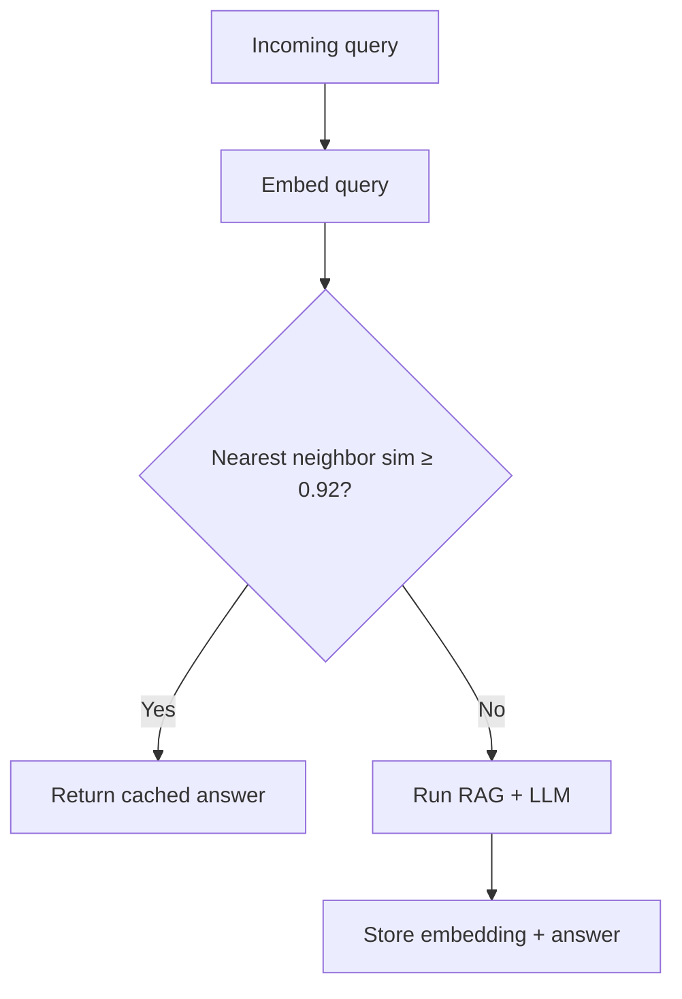

# Semantic Caching with Embeddings

> Week 5 Theory · Day 4 · [← README](../README.md) · [Redis Patterns](redis-patterns.md) · [Background Queues](background-queues.md)

Exact Redis cache only hits when the query string is identical. **Semantic caching** hits when the user's *meaning* is the same — even if they rephrase the question.

---

## Concepts

### What problem are we solving?

Support teams see the same question phrased ten ways:

| User query | Exact cache? |
|------------|--------------|
| "What is our refund policy for annual plans?" | — (first ask) |
| "How do yearly subscription refunds work?" | **Miss** (different string) |
| "Can I get money back on an annual plan?" | **Miss** |

Semantic cache embeds each query into a vector, finds the nearest stored query, and returns the cached answer if similarity is high enough — **no LLM call**.

### Worked scenario: before and after

**Before (exact cache only):**

```
10:00  Query A → LLM call → $0.004 → cache store
10:05  Query B (paraphrase) → LLM call → $0.004
Daily: 5,000 unique phrasings × $0.004 = $20/day
```

**After (semantic cache, threshold 0.92):**

```
10:00  Query A → LLM call → store (embedding + answer)
10:05  Query B → embed → cosine sim 0.94 with A → HIT → $0.00004 embed only
Daily: ~40% hit rate on FAQ-style traffic → ~$8/day saved (illustrative)
```

### How it works (step by step)

1. **Embed** incoming query → vector `q` (1536 dims for `text-embedding-3-small`)
2. **Search** stored vectors for nearest neighbor `q'`
3. **Compare** cosine similarity: `sim(q, q') >= threshold` (default **0.92**)
4. **Hit** → return cached answer linked to `q'`
5. **Miss** → run RAG, store `(embedding, answer, metadata)`

Cosine similarity intuition: 1.0 = identical direction; 0.0 = unrelated. FAQ paraphrases often land **0.90–0.97**.

```python
import numpy as np

def cosine_similarity(a: np.ndarray, b: np.ndarray) -> float:
    return float(np.dot(a, b) / (np.linalg.norm(a) * np.linalg.norm(b)))
```

### False positive risk

Threshold too low → wrong answer served confidently:

```
Query: "How do I cancel my subscription?"
Nearest cached: "How do I upgrade my subscription?"  (sim 0.88)
→ BAD HIT if threshold was 0.85
```

**Mitigation:** start conservative (0.92–0.95), log near-misses, add category tags so refunds only match refunds.

### Storage options (lab → prod)

| Scale | Storage | Lookup |
|-------|---------|--------|
| Lab (< 1k entries) | Redis hash + numpy scan | O(n) — fine for learning |
| Prod (100k+) | Redis Stack vector index / Qdrant / pgvector | HNSW approximate nearest neighbor |

Week 5 lab uses Redis + in-memory scan; note upgrade path in portfolio.

### Cache lookup order

```
1. Semantic cache (embedding similarity)
2. Exact cache (SHA256 of normalized text)
3. Full RAG pipeline
```

Semantic first catches paraphrases; exact catches identical repeats without embed cost.

### AI engineer takeaway

Semantic cache is a **cost and latency lever** — report hit rate in dashboards. Interview question: "How do you prevent wrong answers from cache?" → threshold tuning + domain scoping + human review of near-misses.

---

## Architecture



---

## Tradeoffs

| | Semantic cache | Exact cache |
|---|----------------|-------------|
| **Hits** | Paraphrases | Identical strings only |
| **Cost per lookup** | Embedding API call (~$0.00002) | Redis GET (~free) |
| **Risk** | False positives | Stale exact match |
| **Best for** | FAQ, support bots | Repeated API clients |

---

## Best Practices

1. **Log similarity score** on every hit for tuning
2. **Invalidate on doc update** — flush category or bump cache version key
3. **Do not semantic-cache agent tool plans** — high action risk
4. **Include model + index version** in cache metadata
5. **A/B threshold** in staging before lowering in prod

---

## Common Mistakes

| Symptom | Cause | Fix |
|---------|-------|-----|
| Never hits | Threshold 0.99 | Lower to 0.92; inspect score distribution |
| Wrong answers | Threshold too low | Raise threshold; add category filter |
| Embed cost > LLM savings | Cache too small / low traffic | Measure break-even hit rate |
| Memory blowup | Storing full chunk text | Store answer + citation IDs only |

---

## Checkpoint

1. Why check semantic cache before exact cache?
2. What similarity score might two paraphrases of the same FAQ show?
3. Name one false-positive scenario and mitigation.
4. What is stored on a cache miss after RAG completes?
5. When would you **not** use semantic caching?

---

## Go Deeper

| Resource | Why |
|----------|-----|
| [GPTCache architecture](https://github.com/zilliztech/GPTCache) | Open-source semantic cache patterns |
| [OpenAI embeddings guide](https://platform.openai.com/docs/guides/embeddings) | Model choice for cache keys |

---

## Next

**Lab:** [Lab 4 — Semantic cache](../labs/lab-04-semantic-cache.md) → mark [Day 4](../daily/day-04.md) done → **[Day 5 playbook](../daily/day-05.md)** → [background-queues.md](background-queues.md)
