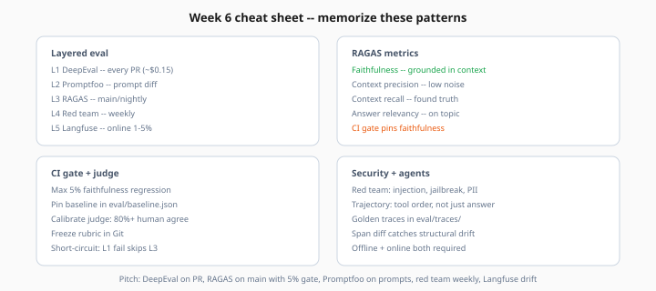

# Week 6 Interview Cheat Sheet

> Week 6 · [← Concepts](concepts.md) · [Quiz](../checkpoints/quiz.md)



*Figure: One-page reference — layered eval tools, RAGAS metrics, CI gate rules, and trajectory eval.*

## One-liner pitch

*"Layered eval: DeepEval on every PR, full RAGAS on main with 5% faithfulness gate, Promptfoo on prompts, red team weekly, Langfuse for online drift."*

## Tool matrix

| Tool | Layer | CI? | Cost |
|------|-------|-----|------|
| DeepEval | L1 fast | Every PR | $ |
| Promptfoo | L2 prompt | Prompt diff | $$ |
| RAGAS | L3 full | Main/nightly | $$$ |
| Promptfoo red team | L4 security | Weekly | $$ |
| Langfuse | L5 online | Continuous | Variable |

## RAGAS metrics

| Metric | Fixes |
|--------|-------|
| Faithfulness ↓ | Prompt, model, temperature |
| Context recall ↓ | Chunks, embeddings, hybrid |
| Context precision ↓ | Reranker, top-k |
| Answer relevancy ↓ | Prompt, max tokens |

## Gate math

```
floor = baseline × (1 - max_drop_pct/100)
# baseline 0.78, 5% → floor 0.741
```

## Judge calibration

- Human label 15+ → judge → ≥80% agreement
- Judge model ≠ generator model
- Pointwise = CI; pairwise = A/B selection

## Trace regression signals

- `top_chunk_ids` changed
- Tool call count > max
- Forbidden tool invoked
- Latency > 2× baseline

## Red team must-test

- Prompt injection
- Jailbreak
- PII exfil from context
- Indirect injection in docs

## Agent eval adds

- Expected tool sequence
- Forbidden tools
- Task completion + efficiency

## Common interview traps

| Trap | Deflect with |
|------|--------------|
| "100% eval coverage" | Golden set + online sample; cost/limitations |
| "One metric" | Faithfulness primary; recall/precision secondary |
| "Judge is ground truth" | Calibrated vs human; periodic re-cal |

## Week links

- [Layered pipeline](../theory/layered-eval-pipeline.md)
- [CI gates](../theory/ci-cd-eval-gates.md)
- [Eval Pipeline Studio](../project/overview.md)
