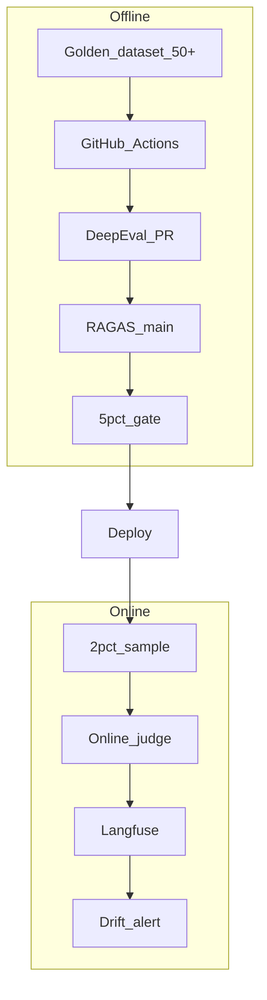

# Week 6 Interview — System Design

> Week 6 · [Concepts](concepts.md) · [Cheat Sheet](cheat-sheet.md)

## Prompt: Design an evaluation system for a production RAG chatbot

### Requirements to clarify

- Traffic: 10K queries/day
- SLA: p95 latency < 2s
- Compliance: no PII in responses
- Deploy frequency: daily PRs
- Team: 5 engineers, 1 ML engineer

### Recommended architecture (45-min whiteboard)

### Layer 1 — PR (fast, <3 min)

- DeepEval on 10 high-signal golden samples
- Promptfoo if `prompts/` changed
- Block merge on failure

### Layer 2 — Main merge (full, ~20 min)

- RAGAS on 50 samples
- Regression gate: faithfulness vs pinned baseline
- Artifact reports to S3/GitHub artifacts

### Layer 3 — Weekly

- Promptfoo red team (12+ plugins)
- Expand golden set from production failures

### Layer 4 — Online

- 2% traffic → async judge faithfulness
- Langfuse dashboard: p95 latency, cost, faithfulness 7d trend
- PagerDuty if online faithfulness drops 10% week-over-week

### Data stores

| Store | Content |
|-------|---------|
| Git | Golden dataset, rubrics, baselines, Promptfoo configs |
| Langfuse | Traces, online scores |
| S3/artifacts | Historical eval reports |

### Cost estimate (state explicitly)

- PR eval: ~$0.15 × 20 PRs/day = $3/day
- Nightly RAGAS: ~$3/run
- Online 2%: 200 judges/day × $0.02 = $4/day
- Total ~$10/day — acceptable for 10K QPD product

### Failure scenarios

| Scenario | Detection | Response |
|----------|-----------|----------|
| Prompt tweak hallucination | DeepEval PR fail | Block merge |
| Embedding model swap | Trace chunk ID drift | Trace regression alert |
| New query type | Online drift, CI pass | Add to golden set v2 |
| PII exfil attempt | Red team / runtime filter | Block release |

### Tradeoffs to mention

- Judge cost vs coverage — sample don't exhaust
- Flaky judges — thresholds not exact match; median of 3 runs for baseline
- Golden set maintenance — assign owner, monthly review

## Follow-up questions

1. How update baseline after intentional improvement?
2. How eval multi-tenant customers separately?
3. How handle non-determinism (temperature > 0)?

> **Hints:** Baseline PR with median of 3 runs; per-tenant golden slice; temperature=0 in eval, production may differ with wider online bands.

## Next

→ [Coding](coding.md)
