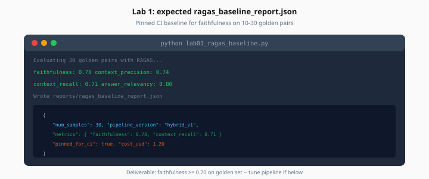

# Lab 1: RAGAS Baseline

> Week 6 Labs · [← README](README.md) · [Why Eval](../theory/why-eval-matters.md)

> **Work dir:** `~/ai-learning/week-06-work/`

**Estimated cost:** $1–3 for 10–30 samples

**Goal:** Produce `ragas_baseline_report.json` — your pinned CI baseline for faithfulness.

When it works: JSON shows aggregate faithfulness ≥ 0.70 on your golden set (tune pipeline if below).



*Figure: Lab 1 deliverable — pinned CI baseline written to reports/ragas_baseline_report.json.*

---

## Task

1. Create or copy `eval/golden_dataset.json` (≥10 pairs Day 1; expand to 30 by Day 5)
2. Implement `lab01_ragas_baseline.py` — runs RAG pipeline per question, evaluates with RAGAS
3. Write `reports/ragas_baseline_report.json`

### Golden pair schema

```json
{
  "id": "g001",
  "question": "What is the remote work equipment stipend?",
  "ground_truth_answer": "$500 annually for eligible remote employees.",
  "ground_truth_contexts": ["Equipment stipend: $500 annually..."],
  "source_doc": "handbook.pdf",
  "difficulty": "keyword"
}
```

### Pipeline stub (if no Week 3 RAG yet)

Minimal stub acceptable for Day 1 — wire real pipeline by Day 5:

```python
async def rag_pipeline(question: str) -> dict:
    contexts = await retrieve(question)  # or hardcoded for stub
    answer = await generate(question, contexts)
    return {"answer": answer, "contexts": contexts}
```

### RAGAS run

```python
from ragas import evaluate
from ragas.metrics import faithfulness, context_precision, context_recall, answer_relevancy
from datasets import Dataset

ds = Dataset.from_dict({
    "question": questions,
    "answer": answers,
    "contexts": contexts_list,
    "ground_truth": ground_truths,
})
result = evaluate(ds, metrics=[faithfulness, context_precision, context_recall, answer_relevancy])
```

### CLI

```bash
python lab01_ragas_baseline.py --golden eval/golden_dataset.json --out reports/ragas_baseline_report.json
```

---

## Expected output

```json
{
  "run_id": "2026-07-25T18:00:00Z",
  "pipeline_version": "hybrid_v1",
  "git_sha": "abc1234",
  "num_samples": 12,
  "metrics": {
    "faithfulness": 0.76,
    "context_precision": 0.72,
    "context_recall": 0.68,
    "answer_relevancy": 0.79
  },
  "worst_samples": ["g007", "g011", "g004"],
  "per_sample": []
}
```

Save this faithfulness value — it becomes `EVAL_FAITHFULNESS_BASELINE` on Day 5.

---

## Acceptance

- [ ] ≥10 golden pairs with human-verified ground truth
- [ ] All four RAGAS metrics computed
- [ ] `pipeline_version` logged
- [ ] Worst 3 samples identified with failure layer guess (retrieval vs generation)

---

## Next

→ [Day 2](../daily/day-02.md) · [Lab 2](lab-02-deepeval-tests.md)
