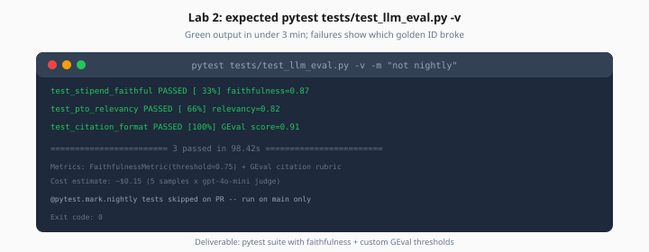

# Lab 2: DeepEval pytest Suite

> Week 6 Labs · [← README](README.md) · [DeepEval Theory](../theory/deepeval-pytest.md)

> **Work dir:** `~/ai-learning/week-06-work/`

**Estimated cost:** ~$0.15 per CI run (5 samples)

**Goal:** `pytest tests/test_llm_eval.py -v` passes with faithfulness and custom GEval thresholds.

When it works: green pytest output in <3 minutes; failures show which golden ID broke.



*Figure: Lab 2 deliverable — pytest suite with faithfulness and custom GEval thresholds.*

---

## Task

1. Create `tests/test_llm_eval.py` with ≥3 test cases
2. Use DeepEval metrics + one custom GEval rubric
3. Mark expensive tests `@pytest.mark.nightly` if >10 samples

### Example tests

```python
import pytest
from deepeval import assert_test
from deepeval.metrics import FaithfulnessMetric, AnswerRelevancyMetric, GEval
from deepeval.test_case import LLMTestCase

@pytest.mark.asyncio
async def test_stipend_faithful(rag_pipeline):
    result = await rag_pipeline("What is the equipment stipend?")
    test_case = LLMTestCase(
        input="What is the equipment stipend?",
        actual_output=result["answer"],
        retrieval_context=result["contexts"],
    )
    assert_test(test_case, [FaithfulnessMetric(threshold=0.75)])

def test_citation_format(rag_pipeline):
    citation_metric = GEval(
        name="CitationFormat",
        criteria="Answer cites source document when stating policy facts.",
        threshold=0.7,
    )
    # ... build test_case ...
    citation_metric.measure(test_case)
    assert citation_metric.score >= 0.7
```

### pytest.ini (optional)

```ini
[pytest]
markers =
    nightly: full golden set (slow)
asyncio_mode = auto
```

### Run

```bash
pytest tests/test_llm_eval.py -v -m "not nightly"
```

---

## Expected output

```
tests/test_llm_eval.py::test_stipend_faithful PASSED
tests/test_llm_eval.py::test_negative_refusal PASSED
tests/test_llm_eval.py::test_citation_format PASSED
======================== 3 passed in 92.4s ========================
```

---

## Acceptance

- [ ] ≥3 tests covering faithfulness, relevancy or refusal, custom rubric
- [ ] All pass locally
- [ ] Tests use golden IDs in failure messages
- [ ] Compare 5 samples: note RAGAS vs DeepEval score delta (±0.1 expected)

---

## Next

→ [Day 3](../daily/day-03.md) · [Lab 3](lab-03-promptfoo-regression.md)
