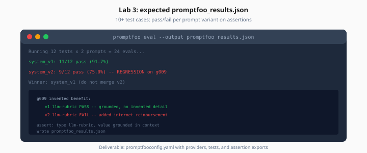

# Lab 3: Promptfoo Regression

> Week 6 Labs · [← README](README.md) · [Promptfoo Theory](../theory/promptfoo-regression.md)

> **Work dir:** `~/ai-learning/week-06-work/promptfoo/`

**Estimated cost:** $0.50–2 per eval run

**Goal:** `promptfooconfig.yaml` with ≥10 test cases; `promptfoo_results.json` with pass/fail per case.

When it works: `promptfoo eval` completes; JSON shows which prompt variant won on assertions.



*Figure: Lab 3 deliverable — promptfooconfig.yaml with assertions exported to promptfoo_results.json.*

---

## Task

1. Create `prompts/system_v1.txt` (baseline) and `prompts/system_v2.txt` (candidate)
2. Create `promptfooconfig.yaml` with providers, tests, assertions
3. Run eval and export results

### Directory layout

```
promptfoo/
├── promptfooconfig.yaml
├── prompts/
│   ├── system_v1.txt
│   └── system_v2.txt
└── tests/
    └── handbook_cases.yaml   # optional split
```

### Minimal config

```yaml
description: Eval Pipeline Studio — prompt regression

prompts:
  - file://prompts/system_v1.txt
  - file://prompts/system_v2.txt

providers:
  - openai:gpt-4o-mini

defaultTest:
  assert:
    - type: llm-rubric
      value: Answer is grounded in provided context only.

tests:
  - vars:
      question: "What is the equipment stipend?"
      context: "Equipment stipend: $500 annually..."
    assert:
      - type: contains
        value: "500"
  # ... 9 more cases from golden dataset ...
```

### Run

```bash
cd ~/ai-learning/week-06-work/promptfoo
promptfoo eval -c promptfooconfig.yaml -o ../reports/promptfoo_results.json
promptfoo view   # optional — local results UI
```

---

## Expected output

`reports/promptfoo_results.json` includes per-test:

```json
{
  "results": {
    "table": [
      {
        "prompt": "system_v1.txt",
        "vars": {"question": "..."},
        "success": true,
        "score": 1.0
      }
    ]
  },
  "stats": {
    "successes": 9,
    "failures": 1,
    "tokenUsage": {"total": 12400}
  }
}
```

Document: v1 vs v2 pass rate — pick winner or merge best rubric lines.

---

## Acceptance

- [ ] ≥10 test cases linked to golden IDs
- [ ] Mix `contains` and `llm-rubric` assertions
- [ ] Two prompt variants compared
- [ ] Results JSON exported to `reports/`

---

## Next

→ [Day 4](../daily/day-04.md) · [Lab 4](lab-04-llm-judge-calibration.md)
