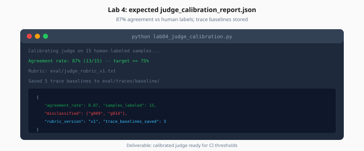

# Lab 4: LLM-as-Judge Calibration

> Week 6 Labs · [← README](README.md) · [Judge Theory](../theory/llm-as-judge-calibration.md)

> **Work dir:** `~/ai-learning/week-06-work/`

**Estimated cost:** $0.50–1.50 for 15 labeled samples

**Goal:** `judge_calibration_report.json` with ≥75% agreement vs human labels; trace baselines stored.

When it works: report shows agreement rate, misclassified samples, and rubric version used.



*Figure: Lab 4 deliverable — calibrated judge with trace baselines stored in eval/traces/baseline/.*

---

## Task

1. Create `eval/human_labels.json` — 15 samples with `good` / `bad` / `partial`
2. Implement `lab04_judge_calibration.py` — pointwise judge with rubric
3. Export `reports/judge_calibration_report.json`
4. Save ≥5 trace baselines to `eval/traces/baseline/`

### human_labels.json

```json
[
  {
    "golden_id": "g001",
    "human_label": "good",
    "notes": "Correct stipend amount with citation"
  },
  {
    "golden_id": "g009",
    "human_label": "bad",
    "notes": "Invented internet reimbursement"
  }
]
```

### Calibration script logic

```python
def agreement(human: str, score: float) -> bool:
    if human == "good":
        return score >= 0.75
    if human == "bad":
        return score <= 0.5
    if human == "partial":
        return 0.4 <= score <= 0.7
    return False
```

Tune rubric in `eval/judge_rubric_v1.txt` until agreement ≥ 75%.

### Trace baseline export

From Langfuse: Traces → Export JSON → save as `eval/traces/baseline/tr_g001.json`

Or construct manually from pipeline logs (span names, chunk IDs, duration).

### CLI

```bash
python lab04_judge_calibration.py \
  --labels eval/human_labels.json \
  --rubric eval/judge_rubric_v1.txt \
  --out reports/judge_calibration_report.json
```

---

## Expected output

```json
{
  "rubric_version": "v1",
  "judge_model": "gpt-4o-mini",
  "num_samples": 15,
  "agreement_rate": 0.87,
  "misclassified": [
    {"golden_id": "g012", "human": "partial", "judge_score": 0.88}
  ],
  "recommendation": "Add partial rubric: penalize missing citations"
}
```

---

## Acceptance

- [ ] 15 human labels from real pipeline outputs (not invented)
- [ ] Agreement ≥ 75% or documented rubric v2 with improvement
- [ ] Rubric frozen in Git
- [ ] ≥5 trace baselines in `eval/traces/baseline/`

---

## Next

→ [Day 5](../daily/day-05.md) · [Lab 5](lab-05-ci-eval-gate.md)
