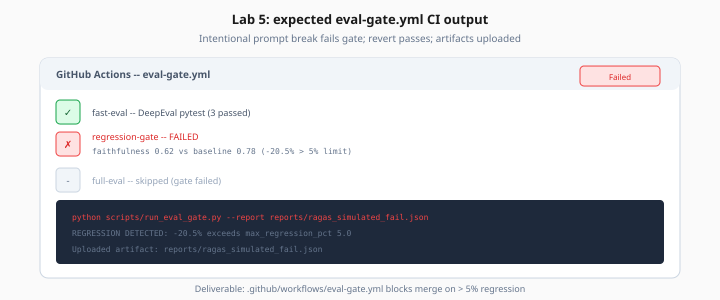

# Lab 5: CI Eval Gate — GitHub Actions

> Week 6 Labs · [← README](README.md) · [CI Theory](../theory/ci-cd-eval-gates.md)

> **Work dir:** `~/ai-learning/week-06-work/eval-pipeline-studio/`

**Estimated cost:** GitHub Actions minutes + ~$0.15–2 per run (API keys)

**Goal:** `.github/workflows/eval-gate.yml` blocks merge when faithfulness drops > 5% vs baseline.

When it works: intentional prompt break fails gate; revert passes; artifacts uploaded.



*Figure: Lab 5 deliverable — eval-gate.yml blocks merge when faithfulness drops more than 5% vs baseline.*

---

## Task

1. Create `scripts/run_eval_gate.py` — regression check (see theory)
2. Create `.github/workflows/eval-gate.yml` — fast + full jobs
3. Pin baseline in repo `.env.example` or `eval/baseline.json`
4. Test locally before pushing

### eval/baseline.json

```json
{
  "faithfulness": 0.78,
  "pinned_at": "2026-07-25",
  "golden_version": "golden_v1",
  "max_regression_pct": 5.0
}
```

### Local test

```bash
# Should pass
python scripts/run_eval_gate.py --report reports/ragas_baseline_report.json

# Simulate failure
python scripts/run_eval_gate.py --report reports/ragas_simulated_fail.json
echo $?   # expect 1
```

### Workflow secrets

In GitHub repo Settings → Secrets:

- `OPENAI_API_KEY`
- Optional: `LANGFUSE_PUBLIC_KEY`, `LANGFUSE_SECRET_KEY`

### Path filters (optional)

```yaml
on:
  pull_request:
    paths:
      - 'backend/**'
      - 'promptfoo/**'
      - 'tests/**'
      - 'eval/**'
```

---

## Expected output

GitHub Actions summary:

```
Faithfulness: 0.791 (baseline 0.780, floor 0.741)
Eval gate PASSED
```

On failure:

```
::error::Eval regression: 0.720 < 0.741
```

Artifacts: `eval-reports` zip with JSON files.

---

## Acceptance

- [ ] Workflow runs on PR and push to main
- [ ] Fast job: pytest DeepEval < 5 min
- [ ] Full job: RAGAS + regression gate on main
- [ ] Demonstrated one intentional fail + fix
- [ ] Reports uploaded as artifacts

---

## Next

→ [Day 6](../daily/day-06.md) · [Lab 6](lab-06-observability-traces.md) *(optional)*
