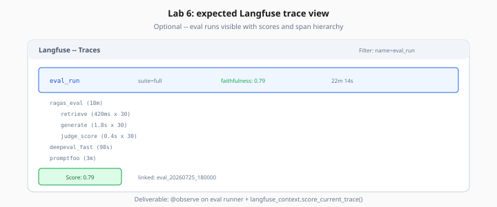

# Lab 6: Observability Traces — Langfuse / LangSmith (Optional)

> Week 6 Labs · [← README](README.md) · [Observability Theory](../theory/observability-eval-dashboards.md)

> **Work dir:** `~/ai-learning/week-06-work/`

**Optional — not required for Week 6 exit criteria.** Skip if behind; complete Labs 1–5 first.

**Goal:** Eval runs visible in Langfuse with scores; optional LangSmith comparison.

When it works: Langfuse project shows eval run traces with faithfulness scores and span hierarchy.



*Figure: Lab 6 deliverable (optional) — eval runs visible in Langfuse with @observe and score_current_trace.*

---

## Task

### Option A — Langfuse (default)

1. Wire `@observe` on eval runner and RAG pipeline
2. Attach scores after RAGAS run:

```python
from langfuse.decorators import observe, langfuse_context

@observe(name="eval_run")
async def run_eval_suite(suite: str):
    report = await run_ragas(...)
    langfuse_context.score_current_trace(
        name="faithfulness",
        value=report["metrics"]["faithfulness"],
    )
    return report
```

3. Verify traces at Langfuse UI → filter by `name=eval_run`

### Option B — LangSmith swap

1. Set env vars from `.env.example` (comment block)
2. Run same eval — compare trace UI
3. Write 5-bullet comparison in `reports/langsmith_vs_langfuse.md`

### Export for dashboard

```bash
python scripts/export_langfuse_traces.py --out reports/trace_export.json
```

---

## Expected output

- Langfuse dashboard with ≥3 eval run traces
- Each trace has child spans: `embed_query`, `retrieve`, `generate`, `ragas_judge`
- Score `faithfulness` attached to trace

---

## Acceptance (optional)

- [ ] OTel + Langfuse wired on eval-pipeline-studio
- [ ] Online 2% sampling implemented (or documented why deferred)
- [ ] `reports/dashboard_snapshot.json` exported

---

## Next

→ [Day 7](../daily/day-07.md) · [project/eval-pipeline-spec.md](../project/eval-pipeline-spec.md)
