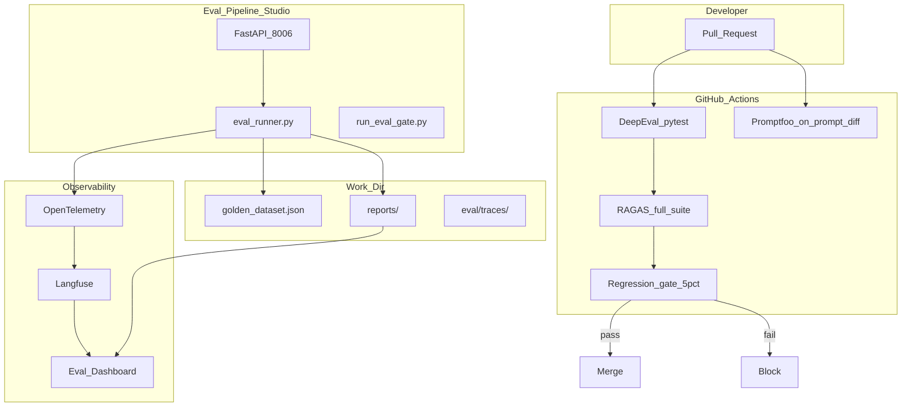

# Eval Pipeline Studio — Architecture

> Week 6 Project · [Overview](overview.md) · [Backend](backend.md)

## System diagram



## Folder structure (work path)

```
eval-pipeline-studio/
├── backend/
│   └── app/
│       ├── main.py
│       ├── eval/
│       │   ├── runner.py       # orchestrates L1–L3
│       │   ├── gate.py         # regression check
│       │   ├── ragas_runner.py
│       │   └── trace_diff.py
│       └── observability/
│           └── langfuse_setup.py
├── frontend/                   # minimal dashboard (Day 7)
│   └── src/
├── scripts/
│   ├── run_eval_gate.py
│   ├── run_full_eval.py
│   └── eval_agent_trajectory.py
└── .github/
    └── workflows/
        └── eval-gate.yml
```

Shared work dir (sibling):

```
~/ai-learning/week-06-work/
├── eval/
│   ├── golden_dataset.json
│   ├── baseline.json
│   └── traces/baseline/
├── promptfoo/
├── reports/
└── tests/
    └── test_llm_eval.py
```

## Layer execution order

| Suite | Layers | Trigger |
|-------|--------|---------|
| `fast` | DeepEval (5–10) | PR, API `/eval/run?suite=fast` |
| `prompt` | + Promptfoo | Prompt file diff |
| `full` | + RAGAS (30+) + gate | Merge main, nightly, API `suite=full` |
| `security` | Promptfoo red team | Weekly cron |
| `agent` | Trajectory eval | Agent graph change |

## Report flow

All runs write to `reports/` with naming:

```
reports/
├── ragas_baseline_report.json      # pinned baseline
├── full_eval_report.json           # capstone aggregate
├── promptfoo_results.json
├── judge_calibration_report.json
├── redteam_report.json
├── agent_trajectory_report.json
└── dashboard_snapshot.json
```

Each report includes: `run_id`, `git_sha`, `pipeline_version`, `suite`.

## Integration points

| Upstream | Integration |
|----------|-------------|
| Week 3 Doc Q&A Studio | RAG pipeline + golden dataset |
| Week 5 RAG service | Production-hardened target to eval |
| Week 4 Agent | Trajectory eval target |
| Langfuse | Traces + online scores |

## Next

→ [backend.md](backend.md) · [eval-pipeline-spec.md](eval-pipeline-spec.md)
