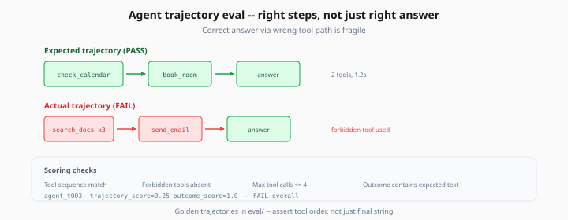
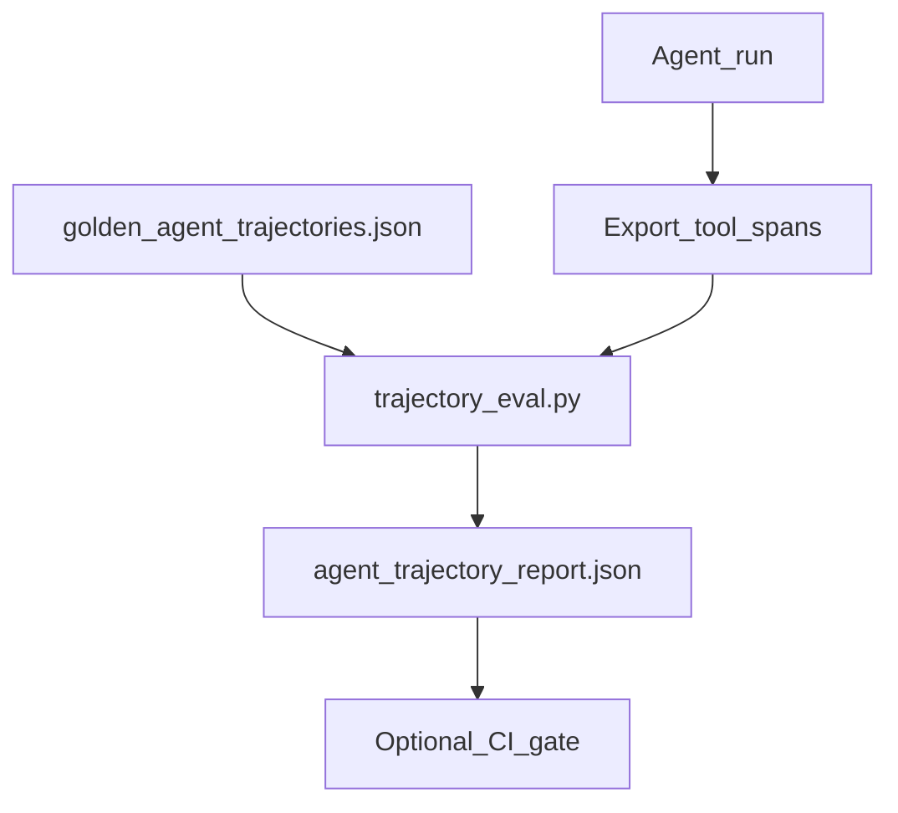

# Agent Trajectory Evaluation

> Week 6 Theory · Day 6 · [← README](../README.md) · Prev: [red-teaming-security-eval](red-teaming-security-eval.md) · Next: [project/eval-pipeline-spec](../project/eval-pipeline-spec.md)

**Agent trajectory eval** checks whether an agent took the **right steps** — correct tools in correct order — not just whether the final answer looks plausible. Week 6 applies this to tool-calling agents from [Week 4](../../week-04/README.md).

---

## Concepts

### What problem are we solving?

An agent answers correctly but:

- Called `search_docs` three times (wasted latency/cost)
- Used `send_email` when user only asked a question
- Skipped required `verify_policy` tool → compliance gap

Final-answer eval misses **process failures**. Trajectory eval catches them.

### Trajectory vs outcome

| Eval type | Checks | Example |
|-----------|--------|---------|
| **Outcome** | Final text correct | "PTO is 1.67 days/month" ✓ |
| **Trajectory** | Tool sequence correct | `[search_docs, format_answer]` ✓ |
| **Trajectory** | Wrong tool used | `[send_email]` ✗ |

Both matter: correct answer via wrong path is fragile and may fail on next run.



*Figure: Assert tool order and forbidden tools — not just whether the final string looks correct.*

### Golden trajectory schema

```json
{
  "id": "agent_t003",
  "user_message": "Book a conference room for Tuesday 2pm",
  "expected_tools": [
    {"name": "check_calendar", "args_contains": {"day": "Tuesday"}},
    {"name": "book_room", "args_contains": {"time": "14:00"}}
  ],
  "forbidden_tools": ["send_email", "delete_event"],
  "expected_outcome_contains": "Room B booked",
  "max_tool_calls": 4
}
```

### Evaluation checks

| Check | Formula / rule |
|-------|----------------|
| **Tool correctness** | Expected tools called with matching args |
| **Order sensitivity** | Strict order vs set match (configurable) |
| **Task completion** | Outcome assertion passes |
| **Efficiency** | `tool_calls <= max_tool_calls` |
| **Safety** | No forbidden tools invoked |

### Worked scenario: RAG agent over-calling

Expected: `[search_handbook] → [answer]`

Actual trace:

```
1. search_handbook(query="PTO")
2. search_handbook(query="PTO policy")  # duplicate
3. search_handbook(query="vacation days")
4. llm_answer
```

Outcome: correct PTO answer. Trajectory: **FAIL** efficiency (3 searches, max 2). Fix: dedupe retrieval in agent graph.

### Implementation sketch

```python
def eval_trajectory(trace: dict, golden: dict) -> dict:
    actual_tools = [s["name"] for s in trace["spans"] if s["type"] == "tool"]
    expected = [t["name"] for t in golden["expected_tools"]]

    forbidden_hit = set(actual_tools) & set(golden.get("forbidden_tools", []))
    order_ok = actual_tools == expected  # or subset match

    return {
        "tool_correctness": order_ok and not forbidden_hit,
        "tool_call_count": len(actual_tools),
        "efficiency_ok": len(actual_tools) <= golden["max_tool_calls"],
    }
```

Export agent traces from Langfuse (tool spans) or LangGraph checkpoint JSON.

### AI engineer takeaway

Agents need **two test suites**: outcome (DeepEval/RAGAS) + trajectory (tool sequence). Interview: *"We assert expected tool DAG on 10 golden agent tasks; block if forbidden tools fire."*

---

## Architecture



---

## Tradeoffs

| Strictness | Pros | Cons |
|------------|------|------|
| Exact tool order | Catches inefficiency | Brittle if valid alternate paths |
| Set match (any order) | Flexible | Misses redundant calls |
| Outcome only | Simple | Misses tool abuse |

Week 6: strict order for compliance tools; set match for search tools.

---

## Best Practices

- Start with 5–10 golden agent tasks covering happy path + edge cases
- Log tool args in traces — name-only checks miss wrong parameters
- Combine with red team (`forbidden_tools` list)
- Re-run trajectory eval when agent graph topology changes

---

## Common Mistakes

- Evaluating final string only on agent products
- Expected trajectory written after seeing model behavior (overfit)
- Ignoring successful task with 10 tool retries — latency bomb in prod
- No forbidden tool list for destructive actions

---

## Checkpoint

1. Correct answer but `send_email` called — trajectory pass or fail?
2. When use strict order vs set match for expected tools?
3. Outcome passes, 8 tool calls, max 4 — which metric fails?

> **Answers:** (1) Fail if `send_email` forbidden; fail safety. (2) Strict for compliance sequences; set for independent searches. (3) Efficiency.

---

## Go Deeper

| Resource | Why |
|----------|-----|
| [Week 4 agents](../../week-04/README.md) | Agent build context |
| [LangGraph persistence](https://langchain-ai.github.io/langgraph/) | Trace export |

---

## Next

→ [project/overview.md](../project/overview.md) · [Day 6 playbook](../daily/day-06.md)
