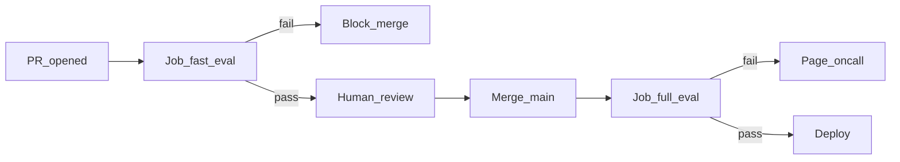

# CI/CD Eval Gates — GitHub Actions

> Week 6 Theory · Day 5 · [← README](../README.md) · Prev: [golden-datasets-trace-regression](golden-datasets-trace-regression.md) · Next: [observability-eval-dashboards](observability-eval-dashboards.md)

An **eval gate** is a CI job that **blocks merge** when quality metrics regress beyond a threshold. Week 6 wires Eval Pipeline Studio into **GitHub Actions** with a 5% faithfulness regression limit on the golden set.

---

## Concepts

### What problem are we solving?

Without automated gates, eval reports become PDFs nobody reads. The gate makes quality **non-negotiable** — same as unit test failures.

### Gate design decisions

| Decision | Week 6 choice | Alternative |
|----------|---------------|-------------|
| Primary metric | Faithfulness | Answer relevancy |
| Max regression | 5% vs pinned baseline | Absolute floor only |
| Fast path | DeepEval on PR | Full RAGAS every PR |
| Secrets | `OPENAI_API_KEY` in GitHub Secrets | Self-hosted runner with env |
| Artifacts | Upload `reports/*.json` | External S3 |

### Sample workflow

```yaml
name: Eval Gate

on:
  pull_request:
    branches: [main]
  push:
    branches: [main]

jobs:
  fast-eval:
    runs-on: ubuntu-latest
    steps:
      - uses: actions/checkout@v4
      - uses: actions/setup-python@v5
        with:
          python-version: "3.12"
      - run: pip install -r requirements.txt
      - name: DeepEval fast suite
        run: pytest tests/test_llm_eval.py -v -m "not nightly"
        env:
          OPENAI_API_KEY: ${{ secrets.OPENAI_API_KEY }}

  full-eval:
    if: github.event_name == 'push' && github.ref == 'refs/heads/main'
    runs-on: ubuntu-latest
    steps:
      - uses: actions/checkout@v4
      - uses: actions/setup-python@v5
        with:
          python-version: "3.12"
      - run: pip install -r requirements.txt
      - name: RAGAS + regression gate
        run: python scripts/run_eval_gate.py --suite full
        env:
          OPENAI_API_KEY: ${{ secrets.OPENAI_API_KEY }}
          EVAL_FAITHFULNESS_BASELINE: "0.78"
          EVAL_REGRESSION_MAX_PCT: "5.0"
      - uses: actions/upload-artifact@v4
        with:
          name: eval-reports
          path: reports/
```

### run_eval_gate.py (core logic)

```python
import json
import os
import sys

def main():
    baseline = float(os.environ["EVAL_FAITHFULNESS_BASELINE"])
    max_drop = float(os.environ.get("EVAL_REGRESSION_MAX_PCT", "5.0"))
    floor = baseline * (1 - max_drop / 100)

    report = json.load(open("reports/ragas_baseline_report.json"))
    current = report["metrics"]["faithfulness"]

    print(f"Faithfulness: {current:.3f} (baseline {baseline:.3f}, floor {floor:.3f})")

    if current < floor:
        print(f"::error::Eval regression: {current:.3f} < {floor:.3f}")
        sys.exit(1)

    print("Eval gate PASSED")

if __name__ == "__main__":
    main()
```

### Worked scenario: PR blocked

```
Faithfulness: 0.720 (baseline 0.780, floor 0.741)
::error::Eval regression: 0.720 < 0.741
```

PR author checks artifact → worst samples are multi-hop PTO questions → retrieval regression from chunk size change → fix or revert.

**Override policy (document in team):** baseline updates require `# eval-baseline-approved` from tech lead — not silent threshold changes.

### Fail messages developers understand

Bad: `Eval failed`

Good: `Faithfulness dropped 8.2% (0.72 vs baseline 0.78). See artifact eval-reports/ragas_baseline_report.json samples g014, g022.`

### AI engineer takeaway

Gate = **enforcement**. Interview: describe fast vs full jobs, pinned baseline, artifact uploads, and human override policy for intentional baseline bumps.

---

## Architecture



---

## Tradeoffs

| Strategy | Pros | Cons |
|----------|------|------|
| Block on PR | Earliest feedback | API cost; flaky judges annoy team |
| Block on main only | Cheaper PRs | Bad code reaches main briefly |
| Nightly only | Minimal CI friction | Late detection |
| 5% relative threshold | Scales with baseline | Small baseline → tiny absolute room |

---

## Best Practices

- `pytest -m "not nightly"` marker for expensive tests
- Cache pip deps; don't cache eval results (must be fresh)
- Upload reports even on failure — debug without re-run
- Separate workflow for Promptfoo `paths:` filter on prompt files

---

## Common Mistakes

- No secrets → silent skip or fake pass
- Flaky judge causes random failures → team disables workflow
- Baseline from one lucky run — use median of 3 runs
- Gate checks only on green main — PRs merge unevaluated

---

## Checkpoint

1. Baseline 0.80, max drop 5% — what faithfulness fails the gate?
2. Why run full RAGAS on push to main, not every PR?
3. What should the CI error message include?

> **Answers:** (1) Below 0.76. (2) Cost/time; fast layer catches most issues on PR. (3) Current score, baseline, floor, sample IDs or artifact link.

---

## Go Deeper

| Resource | Why |
|----------|-----|
| [project/ci-spec.md](../project/ci-spec.md) | Full CI spec |
| [Lab 5](../labs/lab-05-ci-eval-gate.md) | Hands-on gate |

---

## Next

→ [observability-eval-dashboards](observability-eval-dashboards.md) · [Lab 5](../labs/lab-05-ci-eval-gate.md)
