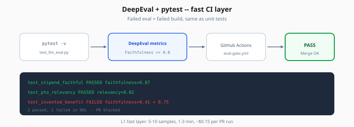
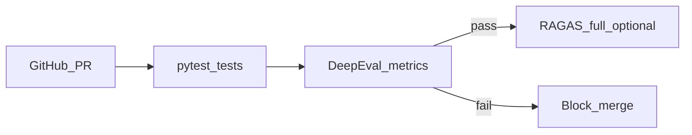

# DeepEval — pytest-Native LLM Tests

> Week 6 Theory · Day 2 · [← README](../README.md) · Prev: [ragas-metrics](ragas-metrics.md) · Next: [promptfoo-regression](promptfoo-regression.md)

**DeepEval** lets you write LLM quality checks as **pytest tests** — `assert faithfulness >= 0.8` — so eval runs in the same CI job as your unit tests. It is Week 6's **fast layer** before expensive full RAGAS sweeps.

---

## Concepts

### What problem are we solving?

RAGAS reports are great for baselines but awkward in CI:

- Full 30-sample run takes 10–15 minutes and costs dollars
- Developers want **instant feedback** on PRs like `pytest -v`

DeepEval bridges "ML eval" and "software engineering" — failed eval = failed build.



*Figure: L1 fast layer — pytest failures block the PR the same way unit test failures do.*

### Before / after

**Before (manual script):**

```bash
python run_eval.py
# engineer reads JSON, decides if OK, merges anyway
```

**After (DeepEval + pytest):**

```python
def test_handbook_stipend_faithful():
    result = rag_pipeline("What is the equipment stipend?")
    assert_metric(result, FaithfulnessMetric(threshold=0.8))
```

```bash
pytest tests/test_llm_eval.py -v
# FAILED test_handbook_stipend_faithful → PR blocked
```

### Core DeepEval patterns

| Pattern | Use when |
|---------|----------|
| **Built-in metrics** | Faithfulness, answer relevancy, hallucination |
| **GEval** | Custom rubric in plain English |
| **assert_test** | Batch cases from JSON fixture |
| **@pytest.mark.parametrize** | Same test, many golden pairs |

### GEval example (custom rubric)

```python
from deepeval.metrics import GEval
from deepeval.test_case import LLMTestCase

citation_metric = GEval(
    name="CitationFormat",
    criteria="Answer includes [doc_name p.N] citation matching retrieved source.",
    threshold=0.7,
)

test_case = LLMTestCase(
    input="What is the PTO accrual rate?",
    actual_output=answer,
    retrieval_context=chunks,
)
citation_metric.measure(test_case)
assert citation_metric.score >= 0.7
```

### Worked scenario: PR feedback in 90 seconds

Developer changes reranker `top_k` from 5 → 15.

```bash
pytest tests/test_llm_eval.py -v   # 5 samples, ~90s, ~$0.15
```

Output:

```
test_stipend_faithful PASSED
test_negative_refusal PASSED
test_multi_hop_pto FAILED  — faithfulness 0.61 < 0.75
```

Fix: high top_k added noise → revert or tune rerank threshold.

### CI integration

```yaml
# .github/workflows/eval-gate.yml (excerpt)
- name: Fast LLM eval
  run: pytest tests/test_llm_eval.py -v --maxfail=3
  env:
    OPENAI_API_KEY: ${{ secrets.OPENAI_API_KEY }}
```

Run **5–10 samples** on every PR; full RAGAS on merge to main (nightly acceptable).

### AI engineer takeaway

DeepEval = **unit tests for LLM behavior**. Interview: *"Fast DeepEval on PR; full RAGAS nightly; Promptfoo on prompt diffs."*

---

## Architecture



---

## Tradeoffs

| Tool | CI speed | RAG-specific | Custom rubrics |
|------|----------|--------------|----------------|
| DeepEval | Fast (subset) | Yes | GEval |
| RAGAS | Slow (full set) | Yes | Limited |
| Promptfoo | Medium | Partial | YAML assertions |
| Plain assert | Fastest | No | Manual |

---

## Best Practices

- Keep PR subset **≤10 cases** — pick high-signal + historically flaky samples
- Use `threshold` not exact scores — judges have variance
- Pin judge model in `.env` (`EVAL_JUDGE_MODEL=gpt-4o-mini`)
- Export `deepeval_results.json` as CI artifact for trend tracking

---

## Common Mistakes

- Testing LLM output with exact string match (`assert "500" in answer`) — brittle
- Same 50-sample run on every PR → slow CI, team disables gate
- No `@pytest.mark.skip` for expensive tests — use markers: `@pytest.mark.nightly`
- DeepEval without retrieval context → faithfulness metric meaningless

---

## Checkpoint

1. Why run DeepEval before full RAGAS in CI?
2. When would you use GEval vs built-in FaithfulnessMetric?
3. What should happen when `test_multi_hop_pto` fails on a PR?

> **Answers:** (1) Faster/cheaper feedback on PRs. (2) GEval for custom rubrics (citations, tone, format). (3) Block merge until faithfulness restored or test updated with justification.

---

## Go Deeper

| Resource | Why |
|----------|-----|
| [DeepEval docs](https://docs.confident-ai.com/) | Metrics + pytest integration |
| [Lab 2](../labs/lab-02-deepeval-tests.md) | Hands-on test suite |

---

## Next

→ [promptfoo-regression](promptfoo-regression.md) · [Day 3 playbook](../daily/day-03.md)
