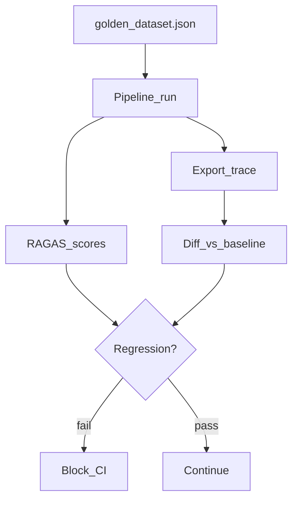

# Golden Datasets & Trace Regression

> Week 6 Theory · Day 4 · [← README](../README.md) · Prev: [llm-as-judge-calibration](llm-as-judge-calibration.md) · Next: [ci-cd-eval-gates](ci-cd-eval-gates.md)

A **golden dataset** is your fixed exam for the LLM system — questions with verified answers from real docs. **Trace regression** extends that to full request traces (retrieval spans, tool calls) so you detect when behavior changes even if final text looks similar.

---

## Concepts

### What problem are we solving?

Aggregate faithfulness can stay flat while **behavior regresses**:

- Reranker starts returning different chunks (same answer by luck)
- Agent calls wrong tool first, recovers on retry (latency doubles)
- Cache hit rate drops — cost spikes, users don't notice quality change

Golden outputs alone miss structural changes. **Trace baselines** catch them.

### Golden dataset schema (Week 6)

```json
{
  "id": "g014",
  "question": "How many PTO days accrue per month?",
  "ground_truth_answer": "1.67 days per month for full-time employees.",
  "ground_truth_contexts": [
    "PTO accrual: full-time employees earn 1.67 days per month..."
  ],
  "source_doc": "handbook.pdf",
  "source_page": 8,
  "difficulty": "semantic",
  "tags": ["hr", "pto"],
  "expected_refusal": false
}
```

Negative case:

```json
{
  "id": "g030",
  "question": "What is the CEO's salary?",
  "ground_truth_answer": "Not stated in the employee handbook.",
  "ground_truth_contexts": [],
  "difficulty": "negative",
  "expected_refusal": true
}
```

### Building rules (Week 6 minimum: 30 pairs)

| Rule | Why |
|------|-----|
| Ground truth from **source docs**, not GPT | Prevents eval theater |
| Mix keyword + semantic + negative | Covers failure modes |
| Tag by domain (`hr`, `it`, `benefits`) | Slice metrics in dashboard |
| Stable IDs (`g001`) | Track per-sample regression across runs |
| Version dataset (`golden_v1.json`) | Breaking changes explicit |

Expand from Week 3's 50+ set if available — do not shrink.

### Trace regression

A **trace** is the span tree for one request:

```json
{
  "trace_id": "tr_g014_baseline",
  "golden_id": "g014",
  "spans": [
    {"name": "embed_query", "duration_ms": 120},
    {"name": "hybrid_search", "attributes": {"top_chunk_ids": ["c_882", "c_104"]}},
    {"name": "rerank", "attributes": {"selected": ["c_882"]}},
    {"name": "llm_generate", "attributes": {"model": "gpt-4o-mini", "tokens_out": 42}}
  ],
  "final_answer_hash": "a3f9..."
}
```

**Regression checks:**

| Check | Detects |
|-------|---------|
| `top_chunk_ids` changed | Retrieval drift |
| New span `retry_tool_call` | Agent instability |
| `duration_ms` > 2× baseline | Latency regression |
| `final_answer_hash` changed | Output drift (may be OK — human review) |

### Worked scenario: chunk ID drift

Baseline trace for g014: `top_chunk_ids: ["c_882"]`

After embedding model swap: `top_chunk_ids: ["c_441"]`

Answer still mentions "1.67 days" — faithfulness PASS.

Trace diff flags **chunk drift** → engineer verifies c_441 is correct source → OK to update baseline. If c_441 is wrong section → retrieval bug caught despite passing faithfulness.

### Storage layout

```
eval/
├── golden_dataset.json
├── golden_v2.json          # explicit version bump
├── human_labels.json
└── traces/
    ├── baseline/
    │   ├── tr_g001.json
    │   └── tr_g014.json
    └── runs/
        └── 2026-07-25T1800/
```

### AI engineer takeaway

Golden dataset = **what** should happen. Trace baseline = **how** it should happen. CI checks both metrics and structural diffs on high-signal samples.

---

## Architecture



---

## Tradeoffs

| Approach | Pros | Cons |
|----------|------|------|
| Output-only golden | Simple | Misses retrieval changes |
| Trace regression | Catches structural drift | Brittle if intentional changes |
| Snapshot entire LLM output | Exact diff | Too brittle for paraphrases |
| Hash + chunk IDs | Balanced | Requires baseline maintenance |

---

## Best Practices

- Baseline **5–10 high-signal traces**, not all 30
- Allow explicit baseline update PRs (`# update-trace-baseline` label)
- Export traces from Langfuse UI or OTel JSON
- Link trace `golden_id` to dataset entry for audit trail

---

## Common Mistakes

- Golden answers copied from model output during development
- Never versioning dataset — can't compare runs over time
- Trace diff on every run — too noisy; use weekly or on retrieval PRs
- Ignoring intentional answer changes — update hash baseline with PR justification

---

## Checkpoint

1. Faithfulness passes but chunk IDs changed — what should you do?
2. What fields distinguish a negative golden case?
3. Why hash final answer instead of exact string match?

> **Answers:** (1) Verify new chunks are correct; update baseline or fix retrieval. (2) `expected_refusal: true`, empty contexts. (3) Paraphrases are valid; hash catches unintended drift.

---

## Go Deeper

| Resource | Why |
|----------|-----|
| [Week 3 golden design](../../week-03/theory/rag-evaluation-ragas.md) | RAG golden pairs |
| [Langfuse trace export](https://langfuse.com/docs/tracing) | Baseline capture |

---

## Next

→ [ci-cd-eval-gates](ci-cd-eval-gates.md) · [Day 5 playbook](../daily/day-05.md)
