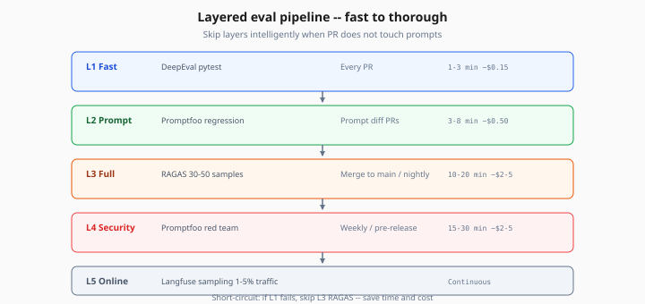
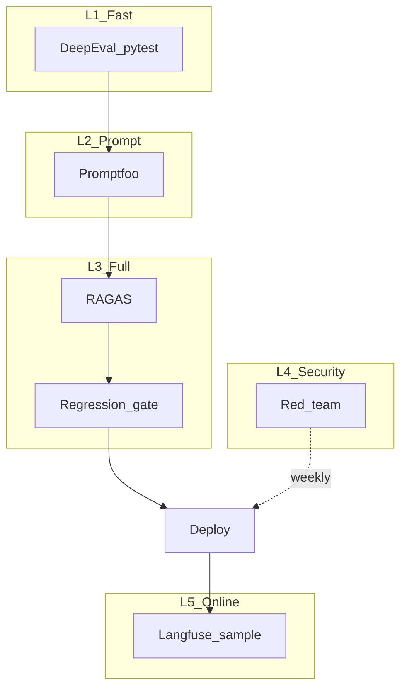

# Layered Eval Pipeline

> Week 6 Theory · Day 3 · [← README](../README.md) · Prev: [promptfoo-regression](promptfoo-regression.md) · Next: [llm-as-judge-calibration](llm-as-judge-calibration.md)

Production teams don't run one eval tool — they stack **layers** from cheap/fast to expensive/thorough. Week 6's **Eval Pipeline Studio** orchestrates RAGAS, DeepEval, and Promptfoo in a single pipeline with clear gates.

---

## Concepts

### What problem are we solving?

Running full RAGAS on 50 samples for every keystroke burns time and money. Running only `contains` checks misses hallucinations. You need **layers** that match signal vs cost.

### The three-layer model (Week 6 standard)

| Layer | Tool | Samples | When | Duration | Cost |
|-------|------|---------|------|----------|------|
| **L1 Fast** | DeepEval pytest | 5–10 | Every PR | 1–3 min | ~$0.15 |
| **L2 Prompt** | Promptfoo | 10–20 | Prompt/model diff PRs | 3–8 min | ~$0.50 |
| **L3 Full** | RAGAS | 30–50 | Merge to main / nightly | 10–20 min | ~$2–5 |
| **L4 Security** | Promptfoo red team | 10+ attacks | Weekly / pre-release | 15–30 min | ~$2–5 |
| **L5 Online** | Langfuse sampling | 1–5% traffic | Continuous | — | Variable |

Skip layers intelligently: no Promptfoo if PR doesn't touch prompts.



*Figure: Stack cheap/fast layers on every PR; run expensive RAGAS and red team on schedule or merge to main.*

### Worked scenario: Tuesday release

```
09:00  Dev opens PR — changes reranker only
09:02  L1 DeepEval (5 samples) — PASS
09:02  L2 Promptfoo — SKIPPED (no prompt diff)
09:05  Unit tests — PASS
09:05  Merge allowed

14:00  Merge to main triggers nightly
14:25  L3 RAGAS (30 samples) — faithfulness 0.79 (baseline 0.78) — PASS
02:00  L4 Red team (Sunday cron) — 2/12 injection cases FAIL — ticket opened
```

### Pipeline orchestrator (conceptual)

```python
# eval/runner.py — simplified
async def run_eval_suite(suite: str):
    if suite in ("fast", "full"):
        await run_deepeval(subset=10 if suite == "fast" else 30)
    if prompt_files_changed() or suite == "full":
        await run_promptfoo()
    if suite == "full":
        report = await run_ragas(samples=30)
        check_regression(report, baseline=0.78, max_drop_pct=5.0)
    export_to_langfuse(report)
```

### Mermaid: full pipeline



### Regression gate logic

```python
def check_regression(current: float, baseline: float, max_drop_pct: float = 5.0):
    floor = baseline * (1 - max_drop_pct / 100)
    if current < floor:
        raise EvalRegressionError(
            f"Faithfulness {current:.2f} below floor {floor:.2f} "
            f"(baseline {baseline:.2f}, max drop {max_drop_pct}%)"
        )
```

Example: baseline 0.78 → floor 0.741. Current 0.73 → **FAIL**.

### AI engineer takeaway

Interview diagram: draw L1–L3 left to right. Say: *"Fast tests on every PR; full RAGAS on main; red team weekly; Langfuse catches what golden set missed."*

---

## Tradeoffs

| Design | Pros | Cons |
|--------|------|------|
| All layers every PR | Maximum safety | CI 30+ min, team revolt |
| L1 only forever | Fast | Misses retrieval regressions |
| Nightly L3 only | Cheap PRs | Bad merge sits on main hours |
| Layered (Week 6) | Balanced | More moving parts to maintain |

---

## Best Practices

- One `run_eval_suite(suite="fast"|"full")` entry point — don't scatter scripts
- Artifact all reports to `reports/` with timestamp + git SHA
- Document skip rules in [ci-spec.md](../project/ci-spec.md)
- Align layer thresholds with business risk (healthcare → stricter gates)

---

## Common Mistakes

- Duplicating same 30 cases in DeepEval, Promptfoo, and RAGAS without subset strategy
- No baseline pin — gate compares to last run (noisy)
- Red team only once at launch, never again
- Layers run sequentially when L1 fail should short-circuit (don't run RAGAS if pytest fails)

---

## Checkpoint

1. Which layer runs on a PR that only changes Python retrieval code?
2. Baseline faithfulness 0.80, max drop 5% — what is the floor?
3. Why short-circuit L3 if L1 fails?

> **Answers:** (1) L1 DeepEval; L2 skipped unless prompts changed; L3 on merge/nightly. (2) 0.76. (3) Save cost/time; fix fast failures first.

---

## Go Deeper

| Resource | Why |
|----------|-----|
| [project/eval-pipeline-spec.md](../project/eval-pipeline-spec.md) | Eval Pipeline Studio spec |
| [ci-cd-eval-gates.md](ci-cd-eval-gates.md) | GitHub Actions wiring |

---

## Next

→ [llm-as-judge-calibration](llm-as-judge-calibration.md) · [Day 4 playbook](../daily/day-04.md)
